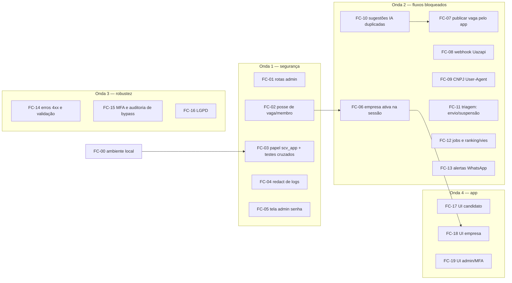

# Plano de correções — pós-testes de 2026-10-07

**Origem:** [`docs/relatorio-testes-2026-10-07.md`](relatorio-testes-2026-10-07.md) (os códigos S1, F2, U4… referem-se às linhas daquele relatório).
**Público:** Claude Code, Codex e Cursor (Composer/Grok) trabalhando em paralelo.
**Precedência:** `AGENTS.md` (proibições) > este plano > planos de referência.

> **Status (2026-10-07):** FC-01, FC-02 (checagens na aplicação + filtro por empresa no Prisma para vaga, membro e convite), FC-04 (redact da API) e FC-05 já estão feitos na branch `fix/correcoes-pos-testes`, com testes em `apps/api/test/fase6.match.test.ts` e `apps/mobile/src/admin/acao-admin.test.ts`. Ainda falta, de FC-02, estender o filtro `escopoTenant` aos demais repositórios Prisma; FC-03 garante isso via RLS.

---

## 1. Regras para todas as tarefas

1. **Branch:** `fix/fc-<nn>-<descricao>` a partir da `main` atualizada. Um PR por tarefa (FC).
2. **Commits:** Conventional Commits em pt-BR com o ID no título, ex.: `fix(api): exige vínculo da vaga em candidaturas (FC-03)`.
3. **Merge:** a autorização de merge automático vale só para o handoff das Fases 7–10. **Estes PRs são mergeados pelo Renato.** Nunca force-push na `main`.
4. **Pronto =** critérios de aceite atendidos, teste novo cobrindo o bug (falha antes, passa depois), `pnpm lint && pnpm typecheck && pnpm test && pnpm build` verdes, OpenAPI/contratos atualizados se a API mudar.
5. **Testes Prisma** (`prisma/test`) fazem `DROP SCHEMA`: rode-os **só** com `DATABASE_URL`/`MIGRATION_DATABASE_URL` apontando para um banco descartável (ex.: `scv_test`), nunca para `scv`.
6. **Sem segredos e sem PII** em código, fixtures e logs. Não ler nem copiar `.env`.
7. Migrações novas com timestamp crescente; nunca editar migração já aplicada.
8. PR descreve: o que muda, como testar, critérios de aceite, riscos, agente autor e modelo.

### Atribuição por tipo de trabalho

| Agente | Tarefas |
|--------|---------|
| **Claude Code** | Tenancy/RLS, autenticação/sessão, máquinas de estado da triagem, LGPD |
| **Codex** | Correções de backend delimitadas (500 → 4xx, jobs, integrações) |
| **Cursor (Composer/Grok)** | Telas do app, infra local, ajustes pequenos |

---

## 2. Ondas e paralelismo

- **FC-00** e **Onda 1** começam juntas. FC-03 depende de FC-00 (papel no compose).
- **FC-06** só depois de FC-02 (mesmos serviços: `candidaturas`, `vagas`, `match`).
- **FC-07** depois de FC-10 (a tela de perguntas depende do volume certo de sugestões).
- **FC-18** depois de FC-06 (telas de empresa dependem da empresa ativa).
- O restante pode rodar em paralelo; quando dois PRs tocarem o mesmo arquivo, o segundo faz rebase.

| Onda | Tarefas | Agentes em paralelo |
|------|---------|---------------------|
| 0/1 | FC-00, FC-01, FC-02, FC-04, FC-05 → FC-03 | Claude Code (FC-01, FC-02, FC-03), Codex (FC-04), Cursor (FC-00, FC-05) |
| 2 | FC-06…FC-13 | Claude Code (FC-06, FC-11), Codex (FC-08, FC-09, FC-10, FC-12, FC-13), Cursor (FC-07) |
| 3 | FC-14, FC-15, FC-16 | Codex (FC-14), Claude Code (FC-15, FC-16) |
| 4 | FC-17, FC-18, FC-19 | Cursor |

---

## 3. Briefs

### FC-00 — Ambiente local reproduzível

| Campo | Valor |
|-------|-------|
| **Agente** | Cursor (Composer/Grok) |
| **Branch** | `fix/fc-00-ambiente-local` |
| **Depende de** | — |
| **Estimativa** | M |
| **Itens** | I1, I2, I3, I4, I5, F11, falso positivo do gitleaks |

**Escopo**
- `infra/docker-compose.yml`: trocar `minio/minio:latest` por imagem disponível e fixada por versão; adicionar serviço de inicialização (ex.: `minio/mc` ou equivalente) que cria o bucket `scv-dev` de forma idempotente.
- Criar no compose o papel `scv_app` (não superuser, sem `BYPASSRLS`) via script de init do Postgres, e documentar `DATABASE_URL` (runtime, `scv_app`) vs `MIGRATION_DATABASE_URL` (migração, `scv`).
- `prisma/seed.ts`: gerar hash **bcrypt** real (mesma lib da API) para a senha de dev documentada, e preencher `emailConfirmadoEm`.
- Tratar env vazia como ausente: helper único (ex.: `envOu(nome, padrao)`) usado em `packages/llm/src/fabrica.ts`, `apps/api/src/configuracao.ts` e afins (`??` → helper).
- Allowlist do gitleaks para `docs/plano-sistema.md:257` (`.gitleaks.toml`).
- README/runbook: dependências do host (`ffmpeg`, `tesseract` + `por.traineddata`, `poppler`) e o problema do Expo reescrever `tsconfig.json`/apagar `expo-env.d.ts` (fixar config para que não aconteça, ou documentar).

**Aceite**
- [ ] `docker compose up -d` do zero sobe tudo e o bucket `scv-dev` existe sem passo manual.
- [ ] `pnpm db:seed` (ou comando equivalente) gera usuários que logam com a senha documentada.
- [ ] Com `LLM_MODELO=` vazio, sugestões de IA usam o modelo padrão.
- [ ] gitleaks passa na `main`.

---

### FC-01 — Rotas admin acessíveis a membros de empresa (S1)

| Campo | Valor |
|-------|-------|
| **Agente** | Claude Code |
| **Branch** | `fix/fc-01-rotas-admin` |
| **Depende de** | — |
| **Estimativa** | P |

**Contexto:** `GET /admin/auditoria` e `GET /admin/whatsapp/instancias` checam permissões que valem para qualquer membro ativo de empresa (`packages/domain/src/permissoes.ts`) e consultam com `{ isAdmin: true }`.

**Escopo**
- Rotas `admin/*` exigem `ADMIN_PLATAFORMA` com MFA verificado (guarda/decorador único para todas as rotas `admin/*`, não checagem por rota).
- Se a empresa precisar ver a própria auditoria/status, criar rota em `/empresas/:empresaId/...` com contexto de tenant (não reaproveitar `isAdmin`).
- Revisar todos os usos de `{ isAdmin: true }` fora de fluxos admin.

**Aceite**
- [ ] Membro de empresa recebe 403 em todas as rotas `admin/*` (teste HTTP iterando as rotas registradas).
- [ ] Admin sem MFA verificado recebe 403.

---

### FC-02 — Posse de vaga e de membro (S2, S3, S4, S5)

| Campo | Valor |
|-------|-------|
| **Agente** | Claude Code |
| **Branch** | `fix/fc-02-posse-vaga-membro` |
| **Depende de** | — |
| **Estimativa** | M |

**Escopo**
- `candidaturas.service.ts` (`daVaga`, `convidar`), `vagas.service.ts` (`obter`), `match.service.ts` e demais rotas `/vagas/:vagaId/*`: validar que a vaga pertence à empresa da sessão **antes** de trocar o contexto para `vaga.empresaId` (helper único, ex.: `exigirVagaDaEmpresa`).
- `repositorio/prisma.ts` `atualizarMembro` (e outros `update`/`delete` por `id`): filtrar por `empresaId` (`updateMany`/`where` composto) e devolver 404 se nada mudou.
- Teste de acesso cruzado para cada rota `/vagas/:vagaId/*` e de membros.

**Aceite**
- [ ] Empresa B recebe 404 ao listar candidaturas, convidar, ver detalhe ou ver sugestões da vaga da empresa A.
- [ ] Empresa B recebe 404 ao alterar/remover membro da empresa A.
- [ ] Os testes rodam também contra Postgres (após FC-03).

---

### FC-03 — RLS efetivo e testes cruzados contra Postgres (S7)

| Campo | Valor |
|-------|-------|
| **Agente** | Claude Code |
| **Branch** | `fix/fc-03-rls-scv-app` |
| **Depende de** | FC-00 |
| **Estimativa** | G |

**Escopo**
- API e workers conectam como `scv_app` em dev, CI e testes; migrações continuam com o papel de migração.
- Suíte HTTP de acesso cruzado rodando contra Postgres real (não só repositórios em memória), cobrindo todas as rotas com `empresaId`/`vagaId` e o caminho admin.
- Job da CI que roda essa suíte e falha se o papel de runtime for superuser ou tiver `BYPASSRLS`.
- Atualizar ADR 0002 se o procedimento mudar.

**Aceite**
- [ ] `select rolsuper, rolbypassrls from pg_roles where rolname = current_user` na API retorna `false, false`.
- [ ] Com as checagens de FC-02 removidas temporariamente, a suíte ainda bloqueia o acesso cruzado via RLS (registrar no PR).

---

### FC-04 — Segredos em logs (S8)

| Campo | Valor |
|-------|-------|
| **Agente** | Codex |
| **Branch** | `fix/fc-04-redact-logs` |
| **Estimativa** | P |

**Escopo:** incluir no `redact` do pino (`apps/api/src/app.module.ts`) `x-internal-token`, `x-reauth-token`, `x-webhook-secret`, `authorization`, `cookie` e `token` da Uazapi; mesmo tratamento nos workers.

**Aceite**
- [ ] Teste que faz requisição com esses headers e verifica que o log capturado não contém os valores.

---

### FC-05 — Tela admin envia senha como motivo (S6)

| Campo | Valor |
|-------|-------|
| **Agente** | Cursor (Composer/Grok) |
| **Branch** | `fix/fc-05-admin-reauth` |
| **Estimativa** | P |

**Escopo**
- `apps/mobile/app/(admin)/admin/verificacoes.tsx`: campo de senha separado (`secureTextEntry`) para a reautenticação; campo motivo só para o motivo; tratar erro de reautenticação com banner.
- Verificar se alguma auditoria já gravou senha como motivo no banco local e documentar no PR a limpeza (sem migração destrutiva).

**Aceite**
- [ ] Aprovar/rejeitar empresa pede senha em campo próprio e grava o motivo digitado.
- [ ] Teste do componente (ou do helper de ação) garante que a senha não vai no corpo da ação admin.

---

### FC-06 — Empresa ativa na sessão (F1)

| Campo | Valor |
|-------|-------|
| **Agente** | Claude Code |
| **Branch** | `fix/fc-06-empresa-ativa` |
| **Depende de** | FC-02 |
| **Estimativa** | M |

**Contexto:** login e refresh emitem token de visão EMPRESA com `empresaId: null` (`auth.service.ts`), quebrando rotas `/vagas/:id/*` que usam a empresa da sessão (sugestões de match, convidar) e a tela Membros (`/empresas//membros`).

**Escopo**
- Login/refresh/MFA: definir empresa ativa (última usada persistida ou, na falta, o único vínculo ativo) e manter no refresh.
- `PATCH /me/visao` persiste a empresa escolhida.
- App: `membros.tsx` e demais telas usam o mesmo fallback (`empresaAtivaId ?? empresas[0]`), idealmente centralizado num hook `useEmpresaAtiva`.

**Aceite**
- [ ] Após login de membro de empresa, `GET /vagas/:id/sugestoes-match` da própria vaga → 200.
- [ ] Após refresh, o token mantém a empresa ativa.
- [ ] Tela Membros carrega logo após o login.

---

### FC-07 — Publicar vaga pelo app (F2)

| Campo | Valor |
|-------|-------|
| **Agente** | Cursor (Composer/Grok) |
| **Branch** | `fix/fc-07-publicar-vaga-app` |
| **Depende de** | FC-10 |
| **Estimativa** | M |

**Escopo**
- `apps/mobile/app/(empresa)/empresa/vagas/[id]/index.tsx`: listar **todas** as etapas com perguntas (triagem WhatsApp e entrevista por voz), cada uma com adicionar/sugerir com IA/aceitar/descartar e contador "aprovadas X de N · pendentes Y".
- Desabilitar "Publicar" com motivo visível enquanto houver etapa incompleta.
- API: mensagem de `PERGUNTAS_INCOMPLETAS` informando a etapa e quantas faltam (ex.: `details` com contagem por etapa), refletida no contrato.

**Aceite**
- [ ] Teste E2E (ou de tela) cria vaga, define processo, completa as duas etapas e publica pelo app.
- [ ] Erro de publicação indica a etapa pendente.

---

### FC-08 — Webhook da Uazapi (F3)

| Campo | Valor |
|-------|-------|
| **Agente** | Codex |
| **Branch** | `fix/fc-08-webhook-uazapi` |
| **Estimativa** | M |

**Escopo**
- `packages/providers/src/uazapi-instancia.ts`: enviar o segredo ao registrar o webhook (header suportado pela Uazapi; se não houver, segredo na query/caminho, validado em tempo constante — registrar em ADR).
- `UAZAPI_WEBHOOK_SECRET` obrigatório quando `UAZAPI_*` estiver configurado (falha no boot).
- URL pública: `API_PUBLIC_URL` validada (não aceitar `localhost` fora de dev) e runbook para túnel em dev (ex.: cloudflared/ngrok).

**Aceite**
- [ ] Teste com fetch fake verifica que o registro do webhook inclui o segredo e a URL pública.
- [ ] Webhook com o segredo correto → 2xx; sem segredo → 401.

---

### FC-09 — CNPJ via BrasilAPI (F4)

| Campo | Valor |
|-------|-------|
| **Agente** | Codex |
| **Branch** | `fix/fc-09-cnpj-user-agent` |
| **Estimativa** | P |

**Escopo:** `packages/providers/src/cnpj.ts` envia `User-Agent` identificável e `Accept: application/json`; distinguir 403/429 (indisponível, com retry) de 404 (CNPJ inexistente).

**Aceite**
- [ ] Teste com fetch fake verifica os headers e o mapeamento 403/404/429.

---

### FC-10 — Sugestões de perguntas duplicadas (F5)

| Campo | Valor |
|-------|-------|
| **Agente** | Codex |
| **Branch** | `fix/fc-10-sugestoes-ia-duplicadas` |
| **Estimativa** | P |

**Escopo:** escolher um caminho só (síncrono **ou** job) para gerar sugestões; idempotência por etapa (não gerar novo lote se já há pendentes, ou substituir o lote); deduplicar enunciados quase iguais; limitar ao número de perguntas faltantes da etapa.

**Aceite**
- [ ] Uma chamada de "sugerir" gera no máximo `numeroPerguntas - aprovadas` sugestões (teste com LLM fake).

---

### FC-11 — Triagem: falha de envio e suspensão (F8, F9)

| Campo | Valor |
|-------|-------|
| **Agente** | Claude Code |
| **Branch** | `fix/fc-11-triagem-envio-suspensao` |
| **Estimativa** | M |

**Escopo**
- Falha no envio do convite não devolve 500: entrevista fica em estado de espera com reenvio agendado (retry com backoff), sem consumir tentativa.
- `registrarAceite` respeita `SUSPENSA_*`; esgotamento não marca `SEM_RESPOSTA` enquanto suspensa.
- Testes da máquina de estados para os dois casos.

**Aceite**
- [ ] Provider fake falhando → `POST iniciar` 202/409 explicativo e reenvio agendado.
- [ ] Entrevista suspensa não muda de estado ao receber aceite nem ao esgotar o prazo.

---

### FC-12 — Jobs e ranking/vies (F6, F7)

| Campo | Valor |
|-------|-------|
| **Agente** | Codex |
| **Branch** | `fix/fc-12-jobs-ranking-vies` |
| **Estimativa** | P |

**Escopo:** corrigir o job de encerrar inscrições para não remover o próprio job travado (usar `jobId` diferente para o agendamento ou não remover o job em execução); corrigir o 500 de `ranking/vies` e cobrir com teste Prisma.

**Aceite**
- [ ] Job de encerramento termina como *completed* (teste do worker).
- [ ] `GET ranking/vies` → 200 com vaga sem dados e com dados.

---

### FC-13 — Alertas de WhatsApp desconectado (F10)

| Campo | Valor |
|-------|-------|
| **Agente** | Codex |
| **Branch** | `fix/fc-13-alertas-whatsapp` |
| **Estimativa** | P |

**Escopo:** incluir os tipos de alerta de instância no filtro da central (`notificacoes-prisma.ts`) e no repositório em memória; teste nos dois.

**Aceite**
- [ ] Desconexão detectada pelo monitor aparece em `GET /notificacoes` da empresa.

---

### FC-14 — Erros e validação da API (V1–V8)

| Campo | Valor |
|-------|-------|
| **Agente** | Codex |
| **Branch** | `fix/fc-14-erros-validacao` |
| **Estimativa** | M |

**Escopo**
- Validação de UUID/enum nos parâmetros (pipe/Zod) → 400; Prisma `P2025` → 404; `P2002` → 409.
- Filtro global loga a exceção original (sem PII) com id de correlação.
- Regra: não remover/rebaixar o último admin da empresa (409).
- Exceção em entrevista concluída → 409; publicar vaga `FECHADA` → erro de estado correto; `completudeMin` em [0,1]; criar entrevista por voz exige triagem concluída.

**Aceite**
- [ ] Um teste por item V1–V8 com o status esperado.

---

### FC-15 — MFA e auditoria de bypass (S9, S10)

| Campo | Valor |
|-------|-------|
| **Agente** | Claude Code |
| **Branch** | `fix/fc-15-mfa-auditoria` |
| **Estimativa** | P |

**Escopo:** registrar o último passo TOTP usado por usuário e recusar reuso; auditar leituras com bypass de admin (quem, o quê, quando, motivo).

**Aceite**
- [ ] Mesmo código TOTP usado duas vezes → segunda tentativa 401.
- [ ] Leitura admin de dados de empresa gera evento de auditoria.

---

### FC-16 — LGPD (L1, L2, L3)

| Campo | Valor |
|-------|-------|
| **Agente** | Claude Code |
| **Branch** | `fix/fc-16-lgpd-exclusao` |
| **Estimativa** | M |

**Escopo**
- Exclusão apaga/anonimiza transcrições, áudios (S3) e embeddings do candidato; job assíncrono idempotente com relatório.
- Rota de áudio do admin devolve URL assinada de curta duração (nunca a chave).
- Agendar limpeza de dispositivos de push.
- L4/L5 (logout com access token válido; login sem e-mail confirmado): **decisão do Renato**, só documentar opções no PR.

**Aceite**
- [ ] Após exclusão, nenhuma linha de transcrição/embedding do candidato e nenhum objeto de áudio no bucket (teste com storage fake + Prisma).
- [ ] Resposta da rota de áudio admin não contém a chave S3.

---

### FC-17 — UI do candidato (U1, U2, U3, U7, U10)

| Campo | Valor |
|-------|-------|
| **Agente** | Cursor (Composer/Grok) |
| **Branch** | `fix/fc-17-ui-candidato` |
| **Estimativa** | M |

**Escopo**
- Candidaturas com título da vaga (incluir no DTO, sem score/posição).
- Currículo lista CVs existentes com status e permite confirmar um CV pendente.
- Detalhe de vaga com convite pendente mostra aceitar/recusar.
- Remover toggle duplicado de privacidade.
- `accessibilityLabel` em todos os `Campo`.

**Aceite**
- [ ] Testes de componente para candidaturas, currículo e detalhe com convite.
- [ ] Teste de ranking invisível continua verde.

---

### FC-18 — UI da empresa (U4, U5, U8, U9)

| Campo | Valor |
|-------|-------|
| **Agente** | Cursor (Composer/Grok) |
| **Branch** | `fix/fc-18-ui-empresa` |
| **Depende de** | FC-06 |
| **Estimativa** | M |

**Escopo**
- Candidatos e ranking com identificação do candidato permitida pela regra de privacidade (primeiro nome/alias) e completude em %.
- `useConsulta` não repete erros 4xx e mostra estado de erro.
- Seletores para senioridade e modelo; rótulos de prazo distintos.
- Formatar datas no fuso de Brasília.

**Aceite**
- [ ] Tela de sugestões com 403 mostra erro em até 1 tentativa.
- [ ] Testes de componente para ranking (percentual) e nova vaga (seletores).

---

### FC-19 — UI do admin e MFA (U6)

| Campo | Valor |
|-------|-------|
| **Agente** | Cursor (Composer/Grok) |
| **Branch** | `fix/fc-19-ui-admin-mfa` |
| **Depende de** | FC-05 |
| **Estimativa** | P |

**Escopo:** QR code para a URI `otpauth://` (manter o segredo copiável); avançar para a área correta após confirmar o código; ações suspender/reativar na lista de empresas usando o fluxo de reautenticação de FC-05.

**Aceite**
- [ ] Cadastro de MFA mostra QR e leva à área admin após confirmar.
- [ ] Admin suspende e reativa empresa pela tela (com senha e motivo).

---

## 4. Fora deste plano

- LiveKit real, agente de voz e score de voz real (Fase 8, já mapeados em `docs/STATUS.md`).
- `pnpm format:check` com 221 arquivos: fazer em PR isolado só de formatação, quando a fila de PRs estiver vazia, para não gerar conflitos.

## 5. Ao bater limite de uso

Registrar no PR: feito / falta / próximos passos. Outro agente continua na mesma branch.
