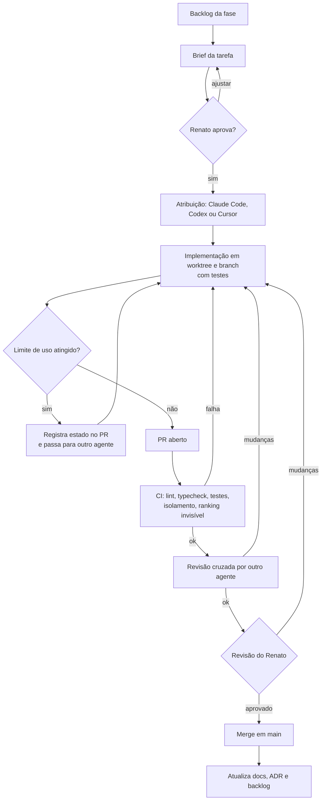

# Plano de Implementação Orquestrado — Sistema de Candidatura a Vagas

**Renato orquestra; Claude Code, Codex e Cursor codificam em paralelo**

*Autor: Renato Souza (Product Owner / Desenvolvimento)*

> Diagramas em Mermaid (renderizados pelo GitHub). Versões PNG de referência em [`diagramas/`](diagramas/).

# 1. Objetivo e premissas

Este documento define **como** o sistema descrito no *Plano Técnico e de Produto* ([`plano-sistema.md`](plano-sistema.md)) será implementado. Ele traduz o escopo em **10 fases**, com tarefas granulares (cada uma vira um brief), agente responsável, paralelismo, critérios de aceite, dependências e riscos.

**Modelo de trabalho**

- **Renato orquestra**: planeja, quebra as tarefas, revisa, aprova, faz o merge e decide as questões em aberto. Também executa configurações externas (contas, conta/servidor Uazapi e número de teste, lojas de apps, credenciais).
- A **codificação** é feita por **três agentes na máquina do Renato**: **Claude Code**, **Codex** e **Cursor**. Eles podem rodar como agentes e subagentes em paralelo, à vontade, para não depender do limite de uso de uma única ferramenta.
- **Premissa registrada**: o Renato falou "Cloud"; o termo foi interpretado como **Claude Code**.
- **Convenção do Cursor**: no Cursor, usar **sempre modelo próprio do Cursor (Composer ou Grok)**, nunca modelos de terceiros.
- **Alternância por limite**: se um agente bater o limite de uso, a tarefa passa para outro agente com o mesmo brief e a branch no estado atual. O contexto vive em arquivos, não na memória de um agente.

**Stack de referência** (do plano do sistema): backend **Node.js + NestJS + Prisma + PostgreSQL (pgvector)**, **Redis + BullMQ**, armazenamento **S3-compatível**, **app React Native único (Expo + Expo Router)** com as visões candidato, empresa e admin, **OCR local com Tesseract**, Whisper para a 1ª fase (local ou API: em aberto), **voz em tempo real via WebRTC/LiveKit** na 2ª fase, LLM atrás de `LlmProvider` e **WhatsApp via Uazapi com uma instância (número) por empresa** (padrão portado do SaaS sof, atrás de `WhatsappProvider`).

> Todas as estimativas deste documento são **relativas (P, M, G, GG)** e **são estimativas**: não há datas.

# 2. Princípios de orquestração

1. **Humano no comando**: nenhum agente faz merge em `main` nem acessa produção.
2. **Uma tarefa = um brief = uma branch = um PR**, com escopo pequeno e verificável.
3. **Contratos primeiro**: schema Prisma e OpenAPI aprovados antes da implementação paralela.
4. **Revisão cruzada**: o PR de um agente é revisado por outro agente e, por fim, pelo Renato.
5. **CI como juiz (gates de qualidade)**: lint, typecheck, testes, isolamento multi-tenant, teste de "ranking invisível" e build do app.
6. **Contexto em arquivos**: `AGENTS.md`, `CLAUDE.md`, `.cursor/rules`, ADRs e briefs no repositório.
7. **Paralelismo com fronteiras**: tarefas paralelas não editam os mesmos arquivos críticos; schema Prisma dividido em arquivos por domínio.
8. **Parar diante de decisão nova**: se a tarefa revelar decisão de arquitetura não prevista, o agente para e registra a questão no PR para o Renato decidir (vira ADR).

# 3. Papéis e uso dos agentes

> A divisão é uma **proposta** baseada no perfil de uso típico de cada ferramenta. As capacidades exatas devem ser conferidas na documentação atual de cada produto.

| Agente | Perfil de uso neste projeto | Exemplos |
|--------|-----------------------------|----------|
| **Claude Code** | Módulos de domínio complexos, arquitetura, refatorações amplas, redação de briefs e ADRs, revisão com foco em arquitetura | Tenancy/RLS, máquinas de estado, orquestração da triagem, agente de voz, score |
| **Codex** | Tarefas bem especificadas e independentes em paralelo, endpoints a partir do contrato, workers isolados, testes, CI, infraestrutura | CRUDs, jobs BullMQ, pipeline de áudio, testes de carga, scripts |
| **Cursor** (Composer ou Grok) | Telas do app React Native com iteração visual, integração ponta a ponta, depuração local, partes de backend próximas da UI, revisão linha a linha | Navegação por papel, telas de vaga/perfil/entrevista, central de notificações |
| **Renato** | Orquestração, decisões, revisão final, merge, configurações externas | ADRs, instância Uazapi, credenciais de push, provedores |

## 3.1 Paralelismo, subagentes e alternância

- Cada agente trabalha num **git worktree** próprio (`../wt-<id-da-tarefa>`), na branch da tarefa.
- Um agente pode disparar **subagentes** (por exemplo, um para testes e outro para implementação) dentro da mesma tarefa, desde que não escrevam nos mesmos arquivos.
- Limite inicial sugerido: uma ou duas tarefas por agente ao mesmo tempo, ajustado conforme a taxa de conflitos e de retrabalho.
- **Ao bater o limite de uso**: o agente atual registra no PR o estado ("feito / falta / próximos passos"), e outro agente continua a partir do mesmo brief e da mesma branch.
- Ordem de merge: schema → contratos → backend → app; rebase das branches dependentes após cada merge.

## 3.2 Matriz RACI por tipo de trabalho

R = executa, A = aprova, C = revisa/consultado, I = informado.

| Tipo de trabalho | Renato | Claude Code | Codex | Cursor |
|------------------|:-:|:-:|:-:|:-:|
| Brief de tarefa / ADR | A | R | C | C |
| Schema Prisma e migrações | A | R | R | C |
| Contrato OpenAPI | A | R | C | C |
| Módulos críticos (auth, tenancy, estados, voz) | A | R | C | C |
| Endpoints e workers bem delimitados | A | C | R | C |
| Telas do app | A | C | I | R |
| Testes e CI | A | C | R | C |
| Configurações externas (Uazapi, push, provedores) | R/A | I | I | I |
| Merge em `main` | R/A | — | — | — |

# 4. Preparação do repositório para agentes

## 4.1 Estrutura do monorepo

```text
sistema-candidatura-vagas/
  apps/
    api/             # NestJS (API REST + webhook Uazapi)
    workers/         # processos BullMQ (OCR, STT, IA, WhatsApp, prazos, notificações)
    voice-agent/     # agente de voz da 2ª fase (participante das salas LiveKit)
    mobile/          # app React Native único (Expo Router): (candidato), (empresa), (admin)
  packages/
    contracts/       # OpenAPI, tipos gerados, schemas Zod compartilhados
    domain/          # regras puras: score, máquinas de estado, política de retry, cronômetro
    providers/       # interfaces e adapters: WhatsappProvider (Uazapi), SttProvider, LlmProvider, OcrProvider
    config/          # eslint, tsconfig, prettier
  prisma/schema/     # schema Prisma dividido por domínio (identidade, vagas, candidatos, entrevistas, notificações)
  docs/              # planos, ADRs, briefs
  infra/             # docker-compose (postgres+pgvector, redis, minio, livekit), IaC
  AGENTS.md  CLAUDE.md  .cursor/rules/
```

## 4.2 Arquivos de contexto

| Arquivo | Conteúdo |
|---------|----------|
| `AGENTS.md` | Visão do produto, stack, comandos, convenções, regras de multi-tenant ("toda query de tabela com `empresaId` passa pelo contexto de tenant"), regra "DTO do candidato nunca expõe score", proibições (segredos, migrações já aplicadas), definição de pronto |
| `CLAUDE.md` | Aponta para `AGENTS.md` + fluxo esperado (brief → plano → código → testes → resumo do PR) |
| `.cursor/rules/*` | Aponta para `AGENTS.md` + regras de UI (design system, grupos de rota por papel, `usePermissao`) + **lembrete: usar Composer ou Grok** |
| `docs/adr/` | Decisões (voz, STT, instância Uazapi por empresa, pesos etc.) |
| `docs/briefs/` | Um brief por tarefa (modelo na §6) |

## 4.3 Convenções

- Branches `feat/f<fase>-<id>-<descricao>` (ex.: `feat/f7-06-retry-triagem`); Conventional Commits em pt-BR.
- PR com: o que muda, como testar, critérios de aceite atendidos, riscos, **agente autor** e **modelo usado** (no Cursor: Composer ou Grok).
- Segredos só em `.env` local e no cofre; agentes usam credenciais de **desenvolvimento** (instância Uazapi de teste, LLM com cota baixa).

# 5. Fluxo de trabalho por tarefa



# 6. Modelo de brief

```markdown
# F<n>-<id> — <Título>
Agente: <Claude Code | Codex | Cursor (Composer/Grok) | Renato>   Revisor: <...>
Paralelo com: <IDs>   Depende de: <IDs / externos>   Estimativa: <P|M|G>
## Contexto (link para a seção do plano do sistema)
## Escopo
## Fora do escopo
## Arquivos/módulos esperados
## Critérios de aceite (verificáveis)
- [ ] ...
## Testes esperados
## LGPD / observabilidade (trilhas transversais)
```

# 7. Fases de implementação

## 7.1 Grafo de dependências

```mermaid
flowchart TD
  F1["1. Setup do repo e ambientes"] --> F2["2. Modelo de dados"]
  F2 --> F3["3. Auth e papéis"]
  F3 --> F4["4. CRUD de vagas, perguntas e prazo"]
  F3 --> F5["5. Perfil do candidato com OCR local"]
  F4 --> F6["6. Candidatura e notificações"]
  F5 --> F6
  F6 --> F7["7. Entrevista WhatsApp (Uazapi)"]
  F6 --> F8["8. Entrevista IA por voz"]
  POC["8.1 POC de latência de voz"] -.-> F8
  F1 -.-> POC
  F3 -. "instância Uazapi por empresa" .-> F7
  F7 --> F9["9. Ranqueamento"]
  F8 --> F9
  F9 --> F10["10. Multiprocesso"]
  LGPD["Trilha LGPD"] -.-> F3
  LGPD -.-> F10
  OBS["Trilha observabilidade"] -.-> F1
  OBS -.-> F10
```



- Fases 4 e 5 podem rodar **em paralelo** depois da 3.
- Fases 7 e 8 podem rodar **em paralelo** depois da 6.
- A **POC de latência de voz (8.1)** começa logo após a Fase 1, em paralelo às demais.
- A conta Uazapi e um número de teste (Renato) ficam prontos na Fase 1; a conexão do WhatsApp de cada empresa entra no onboarding da Fase 3 e é usada pela Fase 7.

## 7.2 Tabela-resumo

| Fase | Objetivo | Estimativa | Agentes principais | Tarefas (CC / CX / CU / RS) |
|------|----------|:-:|--------------------|:-:|
| 1 | Setup do repo e ambientes | M | Claude Code, Codex, Cursor | 3 / 4 / 2 / 2 |
| 2 | Modelo de dados | M | Claude Code, Codex, Cursor | 4 / 3 / 3 / 1 |
| 3 | Auth e papéis (inclui WhatsApp da empresa) | G | Claude Code, Codex, Cursor | 4 / 5 / 5 / 1 |
| 4 | CRUD de vagas com perguntas e prazo | G | Claude Code, Codex, Cursor | 4 / 4 / 4 / 1 |
| 5 | Perfil do candidato com OCR local | M | Claude Code, Codex, Cursor | 3 / 3 / 3 / 0 |
| 6 | Candidatura e notificações | G | Claude Code, Codex, Cursor | 3 / 4 / 4 / 1 |
| 7 | Entrevista WhatsApp (Uazapi, número da empresa) | G | Claude Code, Codex, Cursor | 5 / 4 / 4 / 3 |
| 8 | Entrevista IA por voz em tempo real | GG | Claude Code, Codex, Cursor | 4 / 5 / 4 / 2 |
| 9 | Ranqueamento | M | Claude Code, Codex, Cursor | 3 / 3 / 3 / 1 |
| 10 | Multiprocesso | G | Claude Code, Codex, Cursor | 3 / 3 / 3 / 1 |
| **Total** | | | | **36 / 38 / 35 / 13** |

CC = Claude Code, CX = Codex, CU = Cursor, RS = Renato. A contagem é de tarefas, não de esforço. A distribuição entre os três agentes é equilibrada (36 / 38 / 35 tarefas).

## 7.3 Fase 1 — Setup do repo e ambientes (Estimativa: M)

**Objetivo:** repositório, ambientes e esteira prontos para os três agentes trabalharem em paralelo com segurança.

**Dependências:** nenhuma interna. Externas: conta de nuvem, GitHub, conta/servidor Uazapi e um número de teste.

| ID | Tarefa | Agente | Paralelo | Depende de |
|----|--------|--------|:-:|------------|
| F1-01 | Monorepo (pnpm + Turborepo), configs TS/ESLint/Prettier, estrutura de pastas da §4.1 | Claude Code | A | — |
| F1-02 | `AGENTS.md`, `CLAUDE.md`, modelos de PR e de brief, `docs/adr/0001` | Claude Code | B | F1-01 |
| F1-03 | `.cursor/rules` (UI, grupos de rota, convenção Composer/Grok) | Cursor | B | F1-01 |
| F1-04 | `infra/docker-compose`: Postgres + pgvector, Redis, MinIO, LiveKit dev, Mailpit; `.env.example` | Codex | B | F1-01 |
| F1-05 | CI (GitHub Actions): lint, typecheck, testes, migrações em banco efêmero, build do app, varredura de segredos | Codex | B | F1-01 |
| F1-06 | Esqueleto NestJS (health, config, logger pino, OpenTelemetry base) e entrypoint de workers BullMQ + Bull Board | Codex | B | F1-01 |
| F1-07 | Esqueleto do app Expo (Expo Router, providers, design system base, i18n pt-BR) | Cursor | B | F1-01 |
| F1-08 | IaC base dos ambientes (dev/staging), cofre de segredos | Claude Code | C | F1-04 |
| F1-09 | Dependabot/renovate, proteção da branch `main`, CODEOWNERS | Codex | C | F1-05 |
| F1-10 | Criar contas de nuvem/GitHub/Sentry; proteger a `main` | Renato | A | — |
| F1-11 | **Contratar/configurar a conta Uazapi** (servidor, `admintoken` no cofre) e separar um número de teste para staging, já em aquecimento | Renato | A | — |

**Paralelismo:** A (F1-01, F1-10, F1-11) → B (F1-02 a F1-07 simultâneas, um worktree cada) → C.

**Critérios de aceite**

- `pnpm install && pnpm lint && pnpm test && pnpm build` passam na raiz e na CI.
- `docker compose up` sobe todos os serviços com healthchecks verdes.
- App abre no simulador com a tela inicial; API responde `/health`.
- PR de teste com segredo falso é bloqueado pela CI.

**Riscos:** configuração divergente entre agentes (mitigação: `AGENTS.md` como fonte única); demora na conta Uazapi (mitigação: começar já).

## 7.4 Fase 2 — Modelo de dados (Estimativa: M)

**Objetivo:** schema completo do plano do sistema (§5), com isolamento multi-tenant no banco e seeds para todos os papéis.

**Dependências:** Fase 1.

| ID | Tarefa | Agente | Paralelo | Depende de |
|----|--------|--------|:-:|------------|
| F2-01 | ADR do modelo multi-tenant (coluna `empresaId` + RLS + bypass só para admin com MFA) | Claude Code | A | F1 |
| F2-02 | Aprovar o ADR de multi-tenant | Renato | A | F2-01 |
| F2-03 | Schema `identidade`: Usuario, Empresa, VerificacaoEmpresa, MembroEmpresa, AuditoriaAcesso | Claude Code | B | F2-02 |
| F2-04 | Schema `vagas`: Vaga (prazoInscricoes, inscricoesEncerradasEm, pausa/fechamento, pesosRanking), Habilidade, VagaHabilidade, ProcessoSeletivo (tempoPadraoPorPergunta, politicaRetry), Etapa, Pergunta (tempoLimiteSegundos), EtapaPergunta | Codex | B | F2-02 |
| F2-05 | Schema `candidatos`: Candidato (linkedinUrl), CandidatoHabilidade, Curriculo, Consentimento | Cursor | B | F2-02 |
| F2-06 | Schema `entrevistas`: Candidatura, Entrevista (unicidade candidatura+etapa), SessaoVoz, Resposta (audioUrl, transcricao, duracaoSegundos, statusTranscricao, tempoUsado, expirou, parcial), MensagemWhatsapp, InstanciaWhatsapp, Avaliacao, Score, HistoricoStatus | Claude Code | B | F2-02 |
| F2-07 | Schema `notificacoes`: Notificacao, PreferenciaNotificacao, DispositivoPush, SugestaoMatch | Codex | B | F2-02 |
| F2-08 | Políticas RLS em SQL, extensão Prisma de tenant e bypass do admin | Claude Code | C | F2-03..F2-07 |
| F2-09 | Seeds: catálogo de habilidades, empresas em todos os estados de verificação, usuários de todos os papéis (inclusive com dois papéis) | Cursor | C | F2-03..F2-07 |
| F2-10 | Testes de migração e testes base de isolamento (acesso cruzado e bypass do admin) | Codex | C | F2-08 |
| F2-11 | Diagrama ER em `docs/` gerado a partir do schema | Cursor | C | F2-03..F2-07 |

**Paralelismo:** os cinco arquivos de schema (F2-03..F2-07) rodam em paralelo, porque o schema está dividido por domínio.

**Critérios de aceite**

- `prisma migrate dev` aplica do zero; seeds rodam sem erro.
- Teste: usuário da empresa A não lê dados da empresa B (0 linhas pela RLS); sessão de admin com MFA lê dados de ambas.
- Campos obrigatórios das decisões presentes (prazo da vaga, tempos por pergunta, campos de resposta, notificações, auditoria, instância WhatsApp).
- Timestamps em `timestamptz` (UTC).

**Riscos:** conflitos de relação entre arquivos de schema (mitigação: F2-06 integra e revisa); RLS mal configurada (mitigação: testes F2-10 obrigatórios na CI).

## 7.5 Fase 3 — Auth e papéis (Estimativa: G)

**Objetivo:** autenticação, papéis e navegação por papel no app único, auto-cadastro com verificação da empresa, **conexão do WhatsApp da empresa (instância Uazapi por QR)**, admin com MFA e auditoria.

**Dependências:** Fase 2. Externas: fonte de dados de CNPJ (Q5), política de revisão manual (Q6) e conta Uazapi (F1-11).

| ID | Tarefa | Agente | Paralelo | Depende de |
|----|--------|--------|:-:|------------|
| F3-01 | Decidir a fonte de validação de CNPJ e a política de revisão manual de empresas | Renato | A | — |
| F3-02 | Auth core: cadastro, login, refresh rotativo, logout, recuperação, confirmação de e-mail, `GET /me` | Claude Code | A | F2 |
| F3-03 | RBAC: guards, decorators de permissão e matriz de permissões como código | Claude Code | B | F3-02 |
| F3-04 | MFA TOTP obrigatório para admin, códigos de recuperação, reautenticação em ações sensíveis | Codex | B | F3-02 |
| F3-05 | Auto-cadastro de empresa + confirmação de e-mail e de domínio (e-mail no domínio ou DNS TXT) | Codex | B | F3-02 |
| F3-06 | Validação de CNPJ (dígitos + adapter da fonte cadastral, job assíncrono) | Codex | C | F3-01, F3-05 |
| F3-07 | Estados da empresa (PENDENTE, VERIFICADA, REJEITADA, SUSPENSA), fila de revisão do admin e bloqueio de publicação sem verificação | Claude Code | C | F3-05 |
| F3-08 | Auditoria: interceptor, `AuditoriaAcesso` append-only, registro de acessos a áudios/transcrições e de ações administrativas | Codex | C | F3-03 |
| F3-09 | Telas de auth, MFA, onboarding e cadastro/status de verificação da empresa | Cursor | B | F3-02 |
| F3-10 | Navegação por papel: grupos `(candidato)`, `(empresa)` e `(admin)`, troca de visão, `usePermissao`, cache segmentado por empresa | Cursor | B | F3-02 |
| F3-11 | Telas do admin: fila de verificação, empresas, auditoria | Cursor | C | F3-07, F3-08 |
| F3-12 | Membros da empresa: convite de recrutador/avaliador após o cadastro | Cursor | C | F3-07 |
| F3-13 | Suíte de testes da matriz de permissões (Admin × Empresa × Candidato) e bypass auditado | Claude Code | D | F3-03..F3-08 |
| F3-14 | Adapter Uazapi, parte de **instâncias** (portada do sof, sem alterar o repo do sof): `/instance/init`, `/instance/connect`, `/instance/status`, `/instance/disconnect`, `/webhook`; `InstanciaWhatsapp` por empresa com id/token **cifrados**; endpoints `/empresas/{id}/whatsapp/*` | Codex | C | F3-05 |
| F3-15 | Etapa do onboarding **Conectar WhatsApp da empresa**: exibir QR, acompanhar status, número e última conexão; banner nas vagas quando desconectada; visão das instâncias no admin | Cursor | D | F3-14 |

**Critérios de aceite**

- Empresa recém-cadastrada fica `PENDENTE` e **não consegue publicar**; após as checagens (e a revisão, se exigida) fica `VERIFICADA`.
- Admin sem MFA não acessa `(admin)` nem rotas `/admin/*`.
- Todo acesso de admin a áudio/transcrição gera registro de auditoria (verificado por teste).
- Usuário com papéis de candidato e empresa troca de visão no mesmo app; usuário só candidato recebe 403 nas rotas de empresa.
- A empresa entra na plataforma apenas por auto-cadastro; não existe fluxo de convite de empresa.
- A empresa conecta o próprio WhatsApp lendo o QR da sua instância Uazapi; empresa e admin veem o status (conectada/desconectada, última conexão); o token da instância fica cifrado no banco.

**Riscos:** fonte de CNPJ indisponível ou paga (mitigação: adapter + revisão manual como fallback); complexidade de papéis no app (mitigação: testes E2E por papel); empresa adiar a conexão do WhatsApp (mitigação: etapa destacada no onboarding e bloqueio da 1ª fase com alerta).

## 7.6 Fase 4 — CRUD de vagas com perguntas e prazo (Estimativa: G)

**Objetivo:** ciclo de vida completo da vaga: cadastro, habilidades, processo com perguntas exigidas/sugeridas por IA, tempo por pergunta, política de retry, prazo obrigatório, pausar, retomar, fechar e prorrogar.

**Dependências:** Fase 3. Decisões: Q4 (LLM), Q11–Q14 (regras de vaga, com padrões provisórios).

| ID | Tarefa | Agente | Paralelo | Depende de |
|----|--------|--------|:-:|------------|
| F4-01 | Contrato OpenAPI de vagas, processo, perguntas e ciclo de vida | Claude Code | A | F3 |
| F4-02 | Decidir o LLM inicial e os padrões provisórios de Q11–Q14 | Renato | A | — |
| F4-03 | CRUD de vaga + habilidades requeridas (nível, peso, obrigatória) | Codex | B | F4-01 |
| F4-04 | Processo seletivo: etapas, número de perguntas (padrão 5), `tempoPadraoPorPergunta`, override `tempoLimiteSegundos`, `politicaRetry` com padrões sugeridos | Codex | B | F4-01 |
| F4-05 | Perguntas exigidas pela empresa + banco de perguntas | Cursor | B | F4-01 |
| F4-06 | `LlmProvider`, prompts versionados e sugestão de perguntas por IA conforme o perfil da vaga (completa só as faltantes) | Claude Code | B | F4-01, F4-02 |
| F4-07 | Máquina de estados da vaga: publicar (exige prazo futuro e empresa verificada), prorrogar, pausar, retomar, fechar (motivo obrigatório); estado `INSCRICOES_ENCERRADAS` | Claude Code | B | F4-01 |
| F4-08 | Encerramento automático das inscrições: job atrasado, checagem na API e varredura de reconciliação; UTC no banco, America/Sao_Paulo na exibição | Codex | C | F4-07 |
| F4-09 | Efeitos de pausar/fechar: interface de eventos `VagaPausada`/`VagaRetomada`/`VagaFechada` consumida pelas fases 6–8 (EM_ESPERA, ENCERRADA_VAGA_FECHADA, suspensão de retries) | Claude Code | C | F4-07 |
| F4-10 | Lista pública de vagas: só `PUBLICADA` com prazo futuro; sai da lista/match ao pausar, encerrar inscrições ou fechar | Codex | C | F4-07 |
| F4-11 | Telas da empresa: criar/editar vaga, habilidades, perguntas, aprovação de sugestões da IA, tempos por pergunta, prazo, pausar/retomar/fechar/prorrogar | Cursor | C | F4-03..F4-07 |
| F4-12 | Telas do candidato: lista e detalhe de vagas com prazo em horário de Brasília | Cursor | C | F4-10 |
| F4-13 | Testes do ciclo de vida da vaga (publicar sem prazo falha; expiração encerra a entrada; pausada e fechada saem da lista) | Cursor | D | F4-07..F4-10 |

**Critérios de aceite**

- Publicar vaga sem `prazoInscricoes` retorna erro; rascunho sem prazo é aceito.
- Com o relógio simulado após o prazo: a vaga vira `INSCRICOES_ENCERRADAS`, some da lista e a API recusa candidaturas mesmo se o job não rodar.
- Uma etapa com 5 perguntas (2 exigidas + 3 sugeridas pela IA e aprovadas) é publicada; a precedência do tempo (EtapaPergunta → Pergunta → Processo) é respeitada.
- Fechar sem motivo falha; pausar e retomar devolvem a vaga ao estado anterior.

**Riscos:** confusão entre fuso e UTC (mitigação: testes com datas fixas em America/Sao_Paulo); sugestões de IA fracas (mitigação: aprovação humana obrigatória).

Decisões provisórias de Q4 e Q11–Q14: [ADR 0004](adr/0004-vagas-llm.md), revisáveis pelo Renato. O `LlmProvider` ficou em `packages/llm` (`@scv/llm`) para a Fase 5 reutilizar.

## 7.7 Fase 5 — Perfil do candidato com OCR local Tesseract (Estimativa: M)

**Objetivo:** perfil completo do candidato, habilidades, campo de LinkedIn e currículo com extração nativa + OCR local (Tesseract), sem OCR em nuvem.

**Dependências:** Fase 3 (pode rodar em paralelo com a Fase 4).

| ID | Tarefa | Agente | Paralelo | Depende de |
|----|--------|--------|:-:|------------|
| F5-01 | API de perfil e habilidades do candidato; campo `linkedinUrl` com validação de formato, sem integração | Codex | A | F3 |
| F5-02 | Upload por URL pré-assinada, validação de tipo/tamanho, antivírus | Codex | A | F3 |
| F5-03 | Worker de extração de texto nativo (PDF com camada de texto, DOCX) | Claude Code | A | F3 |
| F5-04 | Worker de OCR com **Tesseract local** (imagem Docker própria, rasterização, pré-processamento, `por+eng`, OCR só nas páginas sem texto) | Claude Code | A | F3 |
| F5-05 | Extração estruturada por LLM (JSON Schema) e normalização de habilidades no catálogo | Claude Code | B | F5-03, F5-04 |
| F5-06 | Consentimentos do candidato (termos, WhatsApp, áudio, gravação de voz, IA): API e telas | Cursor | A | F3 |
| F5-07 | Telas: perfil, upload, revisão dos dados extraídos, habilidades, LinkedIn, privacidade/visibilidade para match | Cursor | B | F5-01, F5-02 |
| F5-08 | Fixtures de CVs (PDF texto, PDF escaneado, imagem, DOCX) e testes de qualidade do OCR | Codex | B | F5-04 |
| F5-09 | Exportação/exclusão dos dados do candidato (trilha LGPD) | Cursor | B | F5-01 |

**Critérios de aceite**

- PDF com texto **não** passa pelo OCR; PDF escaneado e imagem passam pelo Tesseract local.
- Nenhuma chamada a serviço de OCR externo (verificado por teste/inspeção de dependências).
- Dados extraídos só vão para o perfil após confirmação do candidato.
- `linkedinUrl` inválido é rejeitado; nenhuma chamada ao LinkedIn.

**Riscos:** qualidade do OCR em layouts complexos (mitigação: pré-processamento + edição manual); peso da imagem Docker do Tesseract (mitigação: worker dedicado).

## 7.8 Fase 6 — Candidatura (match + direta) e notificações push + central (Estimativa: G)

**Objetivo:** as duas formas de candidatura, a máquina de estados da candidatura e as notificações para a empresa (candidato novo e match forte), com push e central in-app.

**Dependências:** Fases 4 e 5. Externas: credenciais APNs/FCM.

| ID | Tarefa | Agente | Paralelo | Depende de |
|----|--------|--------|:-:|------------|
| F6-01 | Configurar credenciais de push (APNs, FCM) no Expo; decidir Q17 (visibilidade para match) | Renato | A | — |
| F6-02 | `CandidaturaStateMachine` com todos os estados (inclui EM_ESPERA, ENCERRADA_VAGA_FECHADA, abandonos, SEM_RESPOSTA) e consumo dos eventos de vaga da F4-09 | Claude Code | A | F4, F5 |
| F6-03 | Candidatura direta: unicidade vaga+candidato, checagem de inscrições abertas, consentimentos; DTO do candidato sem score | Codex | B | F6-02 |
| F6-04 | Embeddings (pgvector, HNSW) e job de match vaga → candidatos e candidato → vagas | Claude Code | B | F6-02 |
| F6-05 | Convites de match: convidar, aceitar, recusar, expirar ao encerrar as inscrições | Codex | C | F6-04 |
| F6-06 | Serviço de notificações: tipos `CANDIDATO_NOVO` e `MATCH_FORTE`, limiar configurável, `chaveDedup`, agrupamento anti-spam, preferências, nada para vagas pausadas/fechadas | Claude Code | B | F6-02 |
| F6-07 | Push: `DispositivoPush`, Expo Push (FCM/APNs), registro e limpeza de tokens | Cursor | B | F6-01 |
| F6-08 | E-mail opcional (adapter) | Codex | C | F6-06 |
| F6-09 | Central de notificações in-app e tela de preferências | Cursor | C | F6-06 |
| F6-10 | Telas do candidato: candidatar-se, convites, vagas recomendadas, minhas candidaturas (só status/fase) | Cursor | C | F6-03, F6-05 |
| F6-11 | Telas da empresa: candidatos por vaga, sugestões de match, convidar | Cursor | C | F6-04 |
| F6-12 | Testes: dedup e agrupamento, nenhuma notificação para vaga pausada/fechada, convite expira no prazo | Codex | D | F6-05..F6-09 |

**Critérios de aceite**

- Candidatura duplicada para a mesma vaga é rejeitada; candidatura após o prazo é rejeitada.
- Match acima do limiar gera **uma** notificação `MATCH_FORTE` por vaga+candidato; 10 candidaturas em sequência viram um resumo agrupado.
- Vaga pausada ou fechada não gera notificações à empresa.
- Push chega em dispositivo real (iOS e Android) e aparece na central in-app.

**Riscos:** excesso de notificações (mitigação: agrupamento e preferências); entrega de push variável (mitigação: central in-app como fonte de verdade).

## 7.9 Fase 7 — Entrevista WhatsApp via Uazapi (texto/áudio, transcrição, retry, tentativa consumida/abandono) (Estimativa: G)

**Objetivo:** 1ª fase completa: o bot envia as perguntas por texto **pelo número (instância Uazapi) da empresa dona da vaga**, o candidato responde por áudio, o áudio é baixado, armazenado, transcrito e avaliado pela IA. Inclui retry automático antes de qualquer eliminação e a regra de tentativa consumida/abandono.

**Dependências:** Fase 6 e instâncias por empresa (F3-14, F3-15). Externas: conta Uazapi (F1-11) e instância de teste conectada; decisões Q2, Q7, Q8, Q19 e Q21.

| ID | Tarefa | Agente | Paralelo | Depende de |
|----|--------|--------|:-:|------------|
| F7-01 | **Configurar a instância Uazapi de teste** em staging (empresa piloto): criação, conexão por QR, segredo do webhook, URL do webhook por instância, limites de envio iniciais | Renato | A | F1-11, F3-14 |
| F7-02 | Decidir o STT (Q2) e a **política final de retry** (Q7), partindo dos valores sugeridos; decidir Q8 e Q19 | Renato | A | — |
| F7-03 | **Portar/adaptar o adapter Uazapi do sof**, parte de **mensagens**, para `packages/providers` (`WhatsappProvider` + `UazapiProvider`: `/send/text`, `/send/menu`, `/send/media`, `/message/download`), complementando a parte de instâncias da F3-14, sem alterar o repo do sof; `FakeWhatsappProvider` para testes | Codex | A | F3-14 |
| F7-04 | Webhook `/webhooks/whatsapp/uazapi/{instanciaId}`: segredo (`x-webhook-secret`) + token da instância, normalização do payload, ignorar mensagens enviadas pela API/grupos, dedup por id (Redis + índice único), enfileiramento | Codex | B | F7-03 |
| F7-05 | Monitoramento das instâncias de todas as empresas: job de status, **alerta à empresa e ao admin** na desconexão, **pausa de envios e retries daquela empresa sem consumir tentativas**, ressincronização do webhook e retomada após a reconexão por QR | Cursor | B | F7-03 |
| F7-16 | **Roteamento por empresa**: webhook → instância → empresa → entrevista ativa do candidato naquela empresa; envio da 1ª fase **sempre pela instância da empresa dona da vaga**; **bloqueio de iniciar a 1ª fase sem instância conectada** (candidatura aguarda com alerta à empresa) | Claude Code | B | F7-04 |
| F7-06 | Orquestrador da triagem: estados (§8.5.4, incluindo SUSPENSA_INSTANCIA), pergunta atual, lock por entrevista, uma conversa ativa por candidato em cada empresa, **marco de início = primeira resposta** | Claude Code | B | F7-04, F7-16 |
| F7-07 | **Retry**: jobs atrasados no BullMQ, tentativas/intervalo/prazo total, horário comercial (America/Sao_Paulo), **cadência humana e rate limit por instância**, estados RETRY_N e SEM_RESPOSTA, congelamento na pausa, cancelamento no fechamento | Claude Code | C | F7-06 |
| F7-08 | **Tentativa consumida/abandono**: prazo de inatividade após o início → ABANDONADA com avaliação parcial; unicidade candidatura+fase; aviso de tentativa única no convite | Codex | C | F7-06 |
| F7-09 | Pipeline de áudio: `/message/download` → S3 → ffmpeg (OGG/Opus → WAV 16 kHz) → `SttProvider` (Whisper) → `statusTranscricao`, `duracaoSegundos`, confiança | Codex | B | F7-03 |
| F7-10 | Avaliação da resposta transcrita por IA (rubrica, evidências, versão do prompt) | Claude Code | C | F7-09 |
| F7-11 | Tratamentos: resposta em texto (padrão de Q8), mídia inválida, vários áudios, áudio curto, opt-out "PARAR", mensagens com identificação da vaga | Cursor | C | F7-06 |
| F7-12 | Verificação do número do candidato (método conforme Q21: OTP por SMS ou confirmação no primeiro contato pela instância da empresa) + opt-in no app | Cursor | B | F7-03 |
| F7-13 | Telas da empresa: acompanhamento da triagem (estado, retries, áudio, transcrição, nota, revisão) | Cursor | C | F7-09, F7-10 |
| F7-14 | Testes com relógio simulado: retry nos horários certos, pausa congela, timeout × resposta simultânea, webhook duplicado, instância desconectada não consome tentativas | Claude Code | D | F7-07, F7-08 |
| F7-15 | Teste ponta a ponta com o número real em staging (roteiro guiado, volume baixo) | Renato | D | F7-01..F7-14 |

**Critérios de aceite**

- O candidato recebe o convite **pelo número da empresa dona da vaga**, responde 5 perguntas por áudio e a entrevista fica `CONCLUIDA` com áudios no S3, transcrições e notas.
- Sem resposta: os retries saem nos intervalos configurados, só no horário comercial, e depois a entrevista vira `SEM_RESPOSTA` (sem reprovação automática).
- Após a primeira resposta, nenhuma nova tentativa é possível; inatividade além do prazo → `ABANDONADA` com avaliação parcial.
- Vaga pausada congela os retries; vaga fechada os cancela.
- Instância de uma empresa desconectada gera alerta à empresa e ao admin; envios e retries daquela empresa ficam pausados até a reconexão por QR, sem consumir tentativas; outras empresas seguem normalmente.
- Sem instância conectada, a empresa não consegue iniciar a 1ª fase (bloqueio verificado por teste).
- Mensagem recebida na instância da empresa A nunca é roteada para entrevista da empresa B (teste de isolamento).
- O mesmo evento de webhook entregue duas vezes gera uma única resposta.
- Envios respeitam o rate limit por instância (verificado em teste).
- Nenhum envio sem opt-in registrado.

**Riscos:** **bloqueio/banimento do número** por ser API não oficial, **isolado por empresa** (mitigação: aquecimento, cadência humana, rate limit por instância, opt-in, orientação para número dedicado); desconexão da instância (mitigação: monitoramento + alertas + reconexão por QR pela empresa); qualidade da transcrição (mitigação: limiar de confiança → revisão humana).

## 7.10 Fase 8 — Entrevista IA por voz em tempo real (Estimativa: GG)

**Objetivo:** 2ª fase por voz em tempo real no app (WebRTC), com a IA seguindo as perguntas definidas, limite de tempo por pergunta, reconexão na mesma sessão, tentativa consumida, gravação e transcrição completas.

**Dependências:** Fase 6 (F8-01 pode começar logo após a Fase 1). Decisões: Q3, Q9, Q10.

| ID | Tarefa | Agente | Paralelo | Depende de |
|----|--------|--------|:-:|------------|
| F8-01 | **POC de latência** (começa cedo, em paralelo às fases 2–6): comparar STT streaming → LLM → TTS streaming × speech-to-speech, local × gerenciado, sobre LiveKit; medir p50/p95 por etapa contra o orçamento de ~1 s | Claude Code | A | F1 |
| F8-02 | Decidir a arquitetura de voz (Q3) com base na POC; ADR | Renato | A | F8-01 |
| F8-03 | Infra LiveKit (self-hosted ou gerenciado, conforme ADR), emissão de token de sala de curta duração, egress de gravação para S3 | Codex | B | F8-02 |
| F8-04 | Agente de voz (`apps/voice-agent`): entrada na sala, VAD, turnos, barge-in, pipeline em streaming | Claude Code | B | F8-02 |
| F8-05 | Roteiro da entrevista: perguntas definidas, follow-ups limitados ao tema, guardrails contra perguntas indevidas | Codex | B | F8-02 |
| F8-06 | **Cronômetro por pergunta no servidor**: padrão do processo + override; follow-ups contam no tempo; aviso antes de expirar; ao expirar, encerramento educado, `Resposta.parcial`, `expirou`, `tempoUsado`; sem eliminação automática | Codex | C | F8-04 |
| F8-07 | Sessão e tentativa: aviso e aceite, unicidade candidatura+fase, saída voluntária → ABANDONADA, **janela curta de reconexão na mesma sessão**, retomada de onde parou, bloqueio de início com vaga pausada | Claude Code | C | F8-04 |
| F8-08 | Transcrição completa por pergunta e pós-processamento (fila `voz-pos-sessao`) | Codex | C | F8-03, F8-04 |
| F8-09 | Avaliação pós-entrevista por pergunta (rubrica, evidências, flags de expiração/parcial) | Claude Code | D | F8-08 |
| F8-10 | Tela de entrevista por voz no app: SDK LiveKit, indicador de tempo, aviso de expiração, estado de reconexão, botão encerrar com confirmação | Cursor | C | F8-03 |
| F8-11 | Pré-checagem de microfone/rede/permissões e tela de aceite com consentimento de gravação | Cursor | B | F8-02 |
| F8-12 | Tela da empresa: player da gravação, transcrição por pergunta, notas e revisão humana | Cursor | D | F8-08, F8-09 |
| F8-13 | Teste de carga de sessões simultâneas e fila de admissão | Codex | D | F8-03..F8-07 |
| F8-14 | Ferramenta de exceção manual por queda involuntária (se Q10 for aprovada), com auditoria | Cursor | D | F8-07 |
| F8-15 | Teste com usuários reais em redes variadas (4G, Wi-Fi fraco) e decisão sobre Q9 | Renato | D | F8-10 |

**Critérios de aceite**

- Latência percebida p50 abaixo de ~1 s no ambiente de staging (meta da POC; valores por etapa registrados).
- A IA faz exatamente as perguntas definidas, na ordem, com follow-ups apenas dentro do tempo da pergunta.
- Ao expirar o tempo, a IA encerra educadamente, salva a resposta com `expirou = true` e avança; nenhuma eliminação automática.
- Fechar o app consome a tentativa (ABANDONADA); uma queda de rede menor que a janela reconecta na mesma sessão e continua de onde parou.
- Uma segunda tentativa para a mesma candidatura e fase é rejeitada pelo backend.
- Gravação completa e transcrição completa disponíveis para empresa/admin (acesso auditado).

**Riscos:** latência acima da meta (mitigação: POC cedo e opção speech-to-speech); custo por minuto (mitigação: cotas e componentes locais); variação de dispositivos e redes (mitigação: pré-checagem e testes em campo).

## 7.11 Fase 9 — Ranqueamento (Estimativa: M)

**Objetivo:** score composto com todos os dados do MVP (perfil, habilidades, currículo, LinkedIn, 1ª e 2ª fases), pesos por vaga, explicabilidade, revisão humana e ranking invisível ao candidato.

**Dependências:** Fases 7 e 8 (os componentes de perfil, habilidades, CV e LinkedIn podem começar após a Fase 6). Decisões: Q15, Q16.

| ID | Tarefa | Agente | Paralelo | Depende de |
|----|--------|--------|:-:|------------|
| F9-01 | Aprovar os pesos padrão e o limiar de match forte (Q15); encaminhar Q16 (LGPD art. 20) | Renato | A | — |
| F9-02 | Componentes de score em `packages/domain`: perfil, habilidades, currículo, LinkedIn (presença), triagem, voz | Claude Code | A | F6 |
| F9-03 | Dados ausentes, renormalização, completude, tratamento de abandono/expiração/SEM_RESPOSTA | Claude Code | B | F9-02 |
| F9-04 | Pesos configuráveis por vaga (soma 100, validação) e tela de ajuste | Cursor | A | F4 |
| F9-05 | Recálculo por eventos com debounce por vaga e versionamento do score | Codex | B | F9-02 |
| F9-06 | Explicabilidade (`Score.explicacao`) e revisão humana substituindo a nota da IA | Codex | B | F9-02 |
| F9-07 | **Ranking invisível ao candidato**: DTOs com lista branca e **teste automatizado** que percorre todos os endpoints do papel CANDIDATO procurando campos de score/posição | Codex | B | F6 |
| F9-08 | Tela de ranking (empresa dona e admin) com explicação por componente e filtros | Cursor | C | F9-05, F9-06 |
| F9-09 | Relatórios de viés: distribuição de notas, concordância IA × humano, efeito das expirações (trilha LGPD) | Cursor | C | F9-06 |
| F9-10 | Revisão de viés nos prompts de avaliação (remoção de atributos sensíveis) | Claude Code | C | F9-06 |

**Critérios de aceite**

- Score calculado com os 6 componentes; sem as fases, renormaliza e mostra a completude.
- Alterar os pesos da vaga recalcula o ranking; revisão humana altera o score.
- O teste de ranking invisível falha se qualquer DTO do candidato contiver `score*`, `posicao`, `ranking`, `percentil` ou `totalCandidatos` (validado com um campo injetado de propósito).
- O candidato vê apenas status/fase da candidatura.

**Riscos:** pesos mal calibrados (mitigação: padrões como sugestão, ajuste no piloto); vazamento por endpoint novo (mitigação: teste roda em toda a CI).

## 7.12 Fase 10 — Multiprocesso (concorrência, isolamento, escala, testes de carga) (Estimativa: G)

**Objetivo:** garantir vários processos, vagas e empresas simultâneos e candidatos em vários processos, com isolamento, concorrência correta e escala.

**Dependências:** Fase 9.

| ID | Tarefa | Agente | Paralelo | Depende de |
|----|--------|--------|:-:|------------|
| F10-01 | Suíte completa de isolamento multi-tenant (todas as rotas e filas) + bypass do admin auditado | Claude Code | A | F9 |
| F10-02 | Testes de concorrência: retry × resposta, pausa × sessão em curso, fechamento × entrevista, webhooks duplicados | Codex | A | F9 |
| F10-03 | Cotas e rate limits por tenant (API, IA, envios por instância Uazapi, sessões de voz) | Claude Code | A | F9 |
| F10-04 | Autoscaling de workers, agentes de voz e servidor de mídia por fila/sessões | Codex | B | F10-03 |
| F10-05 | Testes de carga (k6) com muitas empresas, vagas e candidatos em vários processos ao mesmo tempo | Codex | B | F10-04 |
| F10-06 | Candidato em vários processos: triagens de empresas diferentes em paralelo (números diferentes), uma por vez dentro da mesma empresa, uma sessão de voz por vez, UX da lista de candidaturas | Cursor | A | F9 |
| F10-07 | Painéis de capacidade e alertas (filas, sessões, instância Uazapi, custo de IA) | Cursor | B | F10-03 |
| F10-08 | Hardening e revisão de segurança (threat model, OWASP, revisão de segredos e de acesso do admin) | Claude Code | C | F10-01..F10-05 |
| F10-09 | Runbooks (reconexão da instância, fila travada, latência de voz) e checklist do piloto | Cursor | C | F10-07 |
| F10-10 | Go/no-go do piloto | Renato | D | todas |

**Critérios de aceite**

- Teste de carga com múltiplas empresas e processos simultâneos sem perda de mensagens, sem estados inconsistentes e com latência de voz dentro da meta definida na POC.
- Acesso cruzado entre empresas retorna 403/404 em 100% das rotas testadas.
- Cotas por tenant aplicadas, sem afetar outros tenants.
- O candidato em 3 processos simultâneos recebe as triagens em sequência, com a vaga identificada em cada mensagem.

**Riscos:** gargalo no STT/voz (mitigação: pools dedicados, fila de admissão); limites de envio da instância de uma empresa com muitas vagas (mitigação: cadência, distribuição no horário comercial, alerta à empresa).

# 8. Trilhas transversais

## 8.1 LGPD

| Item | Fase |
|------|:-:|
| Modelo de consentimento e versões dos termos | 2, 5 |
| Auditoria de acesso (admin e empresa) a áudios/transcrições | 3 |
| Opt-in de WhatsApp e opt-out "PARAR" | 5, 7 |
| Consentimento de gravação da entrevista por voz | 8 |
| Ranking invisível e encaminhamento do art. 20 | 9 |
| Exportação/exclusão de dados e expurgo por retenção (Q18) | 5, 10 |
| Revisão de contratos de provedores (LLM, STT, voz, Uazapi) | 7, 8 |

## 8.2 Observabilidade

| Item | Fase |
|------|:-:|
| Logs estruturados sem PII, OpenTelemetry, Sentry | 1 |
| Métricas de filas e jobs atrasados | 1, 4 |
| Métricas de OCR (tempo, confiança, nativo × OCR) | 5 |
| Métricas de notificações (entregues, agrupadas, falhas de push) | 6 |
| Métricas de WhatsApp por empresa (envios, retries, SEM_RESPOSTA, abandonos, **status da instância Uazapi**) | 3, 7 |
| Latência de voz por etapa (p50/p95), quedas, reconexões, expirações | 8 |
| Painéis de capacidade e alertas | 10 |

# 9. Decisões em aberto e fase que bloqueiam

| # | Decisão | Quem decide | Bloqueia |
|---|---------|-------------|:-:|
| Q2 | STT da 1ª fase: Whisper local × API | Renato | Fase 7 (F7-09) |
| Q3 | Arquitetura de voz: pipeline × speech-to-speech, local × gerenciado, LiveKit self-hosted × gerenciado | Renato (com a POC) | Fase 8 (F8-03, F8-04) |
| Q4 | Provedor/modelo de LLM | Renato | Fase 4 (F4-06) |
| Q5 | Fonte de dados para validação de CNPJ | Renato | Fase 3 (F3-06) |
| Q6 | Política de revisão manual de empresas | Renato | Fase 3 (F3-07) |
| Q7 | Política final de retry da 1ª fase | Renato | Fase 7 (F7-07) |
| Q8 | Resposta em texto na triagem | Renato | Fase 7 (F7-11) |
| Q9 | Janela de reconexão e pausa do cronômetro na queda | Renato | Fase 8 (F8-07) |
| Q10 | Exceção manual por queda involuntária | Renato | Fase 8 (F8-14) |
| Q11 | Reabrir inscrições após o prazo | Renato | Fase 4 (F4-07) |
| Q12 | Congelar o prazo durante a pausa (padrão: não) | Renato | Fase 4 (F4-07) |
| Q13 | Duração máxima de pausa | Renato | Fase 4 (F4-07) |
| Q14 | Reabertura de vaga fechada | Renato | Fase 4 (F4-07) |
| Q15 | Pesos padrão e limiar de match forte | Renato | Fase 9 (limiar provisório na 6) |
| Q16 | LGPD art. 20 sem expor o ranking | Renato + jurídico | Fase 9 |
| Q17 | Visibilidade para match: opt-in × opt-out | Renato | Fase 6 (F6-04) |
| Q18 | Prazos de retenção | Renato + jurídico | Trilha LGPD (antes do piloto) |
| Q19 | Avanço da 1ª para a 2ª fase: automático × manual | Renato | Fase 7 |
| Q20 | Hospedagem/região e GPU | Renato | Fase 1 (F1-08) / Fase 8 |
| Q21 | Verificação do WhatsApp do candidato sem número da plataforma | Renato | Fase 7 (F7-12) |
| I1 | Gerenciador do monorepo (assumido: pnpm + Turborepo) | Renato | Fase 1 |
| I2 | Política de revisão: toda PR com revisão cruzada + Renato, ou PRs pequenas só com o Renato | Renato | Fase 1 |

Decisão já tomada (fora desta lista): **um número/instância Uazapi por empresa**, conectado pela própria empresa no onboarding (F3-14, F3-15).

# 10. Qualidade e revisão

## 10.1 Definição de pronto

- Critérios de aceite do brief atendidos e marcados no PR.
- Testes adicionados (unidade para regras de domínio, integração para endpoints, E2E para fluxos críticos).
- OpenAPI e cliente TS atualizados quando a API muda.
- Sem segredos e sem PII em logs; migrações com plano de rollback.
- Gates obrigatórios da CI verdes: isolamento multi-tenant e ranking invisível.

## 10.2 Checklist do revisor cruzado

| Área | Verificação |
|------|-------------|
| Multi-tenant | Consultas passam pelo contexto de tenant? Há teste de acesso cruzado? Bypass só para admin e auditado? |
| Permissões | Guards corretos para Admin × Empresa × Candidato? A UI não é a única barreira? |
| Ranking | Algum DTO do candidato expõe score, posição ou totais? |
| Assíncrono | Jobs idempotentes? Retries respeitam horário comercial, cadência, pausa e fechamento? |
| Tentativa única | Unicidade candidatura+fase? Abandono e reconexão corretos? |
| Tempo | Datas em UTC no banco e America/Sao_Paulo na interface? Cronômetro no servidor? |
| IA | Saída validada por schema? Versão de prompt registrada? Conteúdo do usuário delimitado? |
| WhatsApp | Envio só com opt-in? Sai pela instância da empresa dona da vaga? Rate limit por instância? Dedup e roteamento do webhook por instância? |
| LGPD | Consentimento verificado? Dados sensíveis fora dos prompts? |

## 10.3 Testes com provedores externos

- Provedores atrás de interfaces (`WhatsappProvider`, `SttProvider`, `LlmProvider`, `OcrProvider`, provedor de voz) com implementações *fake*.
- Fixtures: CVs variados, áudios OGG/Opus, payloads de webhook da Uazapi anonimizados, gravações curtas.
- Relógio simulado para prazos, retries, horário comercial e cronômetro.

# 11. Segurança no uso dos agentes

- Agentes trabalham apenas com credenciais de desenvolvimento/staging; **sem credenciais de produção**.
- Token da instância Uazapi de teste, chaves de LLM, STT e voz com cotas baixas e rotação; `admintoken` da Uazapi apenas no cofre.
- Dados reais de candidatos nunca viram fixture.
- Comandos destrutivos (reset de banco, force push) só com confirmação do Renato.
- Dependências novas revisadas (licença, manutenção, vulnerabilidades).
- No Cursor, apenas modelos próprios (Composer ou Grok).

# 12. Métricas do processo (sugeridas)

| Métrica | Uso |
|---------|-----|
| Tarefas e PRs por agente; aprovação na primeira revisão | Equilibrar a distribuição |
| Rodadas de revisão por PR | Melhorar briefs e `AGENTS.md` |
| Trocas de agente por limite de uso | Planejar paralelismo e reserva de capacidade |
| Falhas de CI e conflitos de merge por ciclo | Calibrar o paralelismo |
| Bugs pós-merge por módulo | Reforçar testes |

> Não há metas numéricas pré-definidas; os números servem para comparar ciclos.

# 13. Riscos do processo

| Risco | Mitigação |
|-------|-----------|
| Agentes divergem de convenções | `AGENTS.md` como fonte única, revisão cruzada, lint estrito |
| Conflitos por edição paralela | Worktrees, schema dividido por domínio, ordem de merge |
| Limite de uso de um agente trava a fase | Alternância com handoff registrado no PR; distribuição equilibrada |
| Código plausível, mas incorreto, em áreas críticas | Claude Code + revisão do Renato + testes obrigatórios |
| Testes "de fachada" | O revisor verifica asserções relevantes |
| Dependência de decisões externas (Uazapi, push, CNPJ) | Tarefas do Renato no início de cada fase; padrões provisórios documentados |
