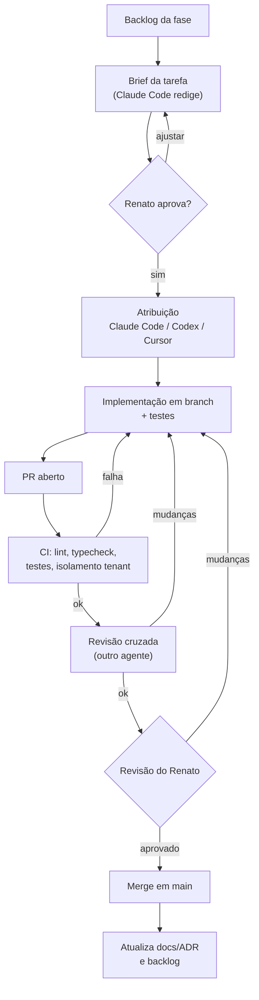
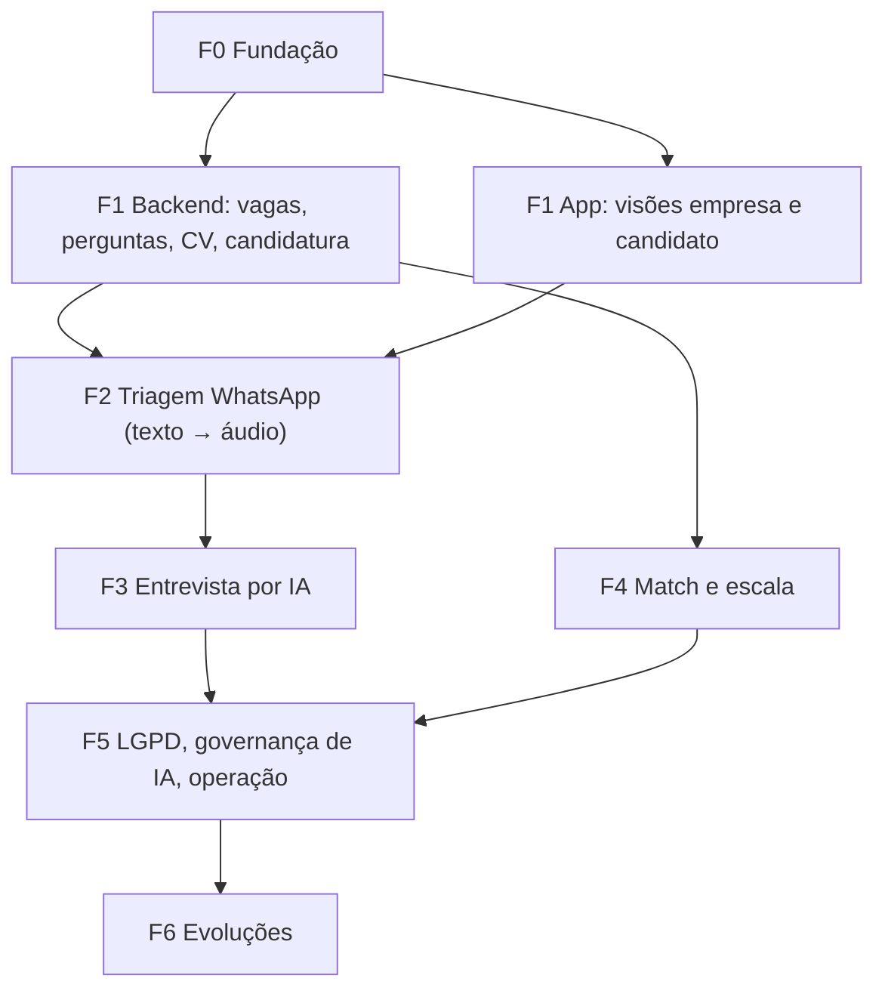
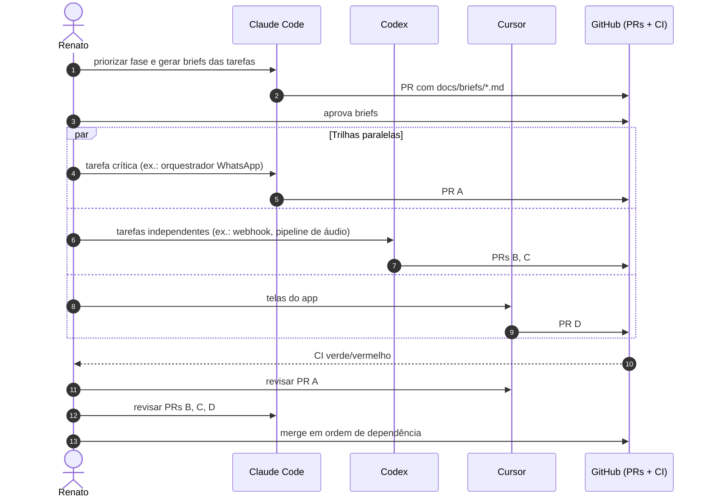

# Plano de Implementação Orquestrado — Sistema de Candidatura a Vagas

**Desenvolvimento com agentes de código: Claude Code, Codex e Cursor**

*Autor: Renato Souza (Product Owner / Desenvolvimento)*

> Diagramas em Mermaid (renderizados pelo GitHub). Versões PNG de referência em [`diagramas/`](diagramas/).

# 1. Objetivo

Este documento define **como** o sistema descrito no *Plano Técnico e de Produto* ([`plano-sistema.md`](plano-sistema.md)) será implementado usando três agentes de código de forma coordenada — **Claude Code**, **Codex** e **Cursor** — com o Renato como orquestrador e revisor final. Ele não redefine o escopo do produto; traduz as fases do plano do sistema em épicos, tarefas, responsáveis (agente principal e agente revisor), dependências, critérios de aceite e regras de trabalho.

**Stack de referência** (decidida no plano do sistema): backend **Node.js + NestJS + Prisma + PostgreSQL (pgvector)**, **Redis + BullMQ**, armazenamento **S3-compatível**, **app React Native único (Expo + Expo Router)** com as visões empresa e candidato, OCR local, Whisper para transcrição (local ou API — decisão em aberto), LLM via camada de abstração e **WhatsApp Business** (Cloud API ou Twilio).

# 2. Princípios de orquestração

1. **Humano no comando**: o Renato define prioridades, aprova especificações e faz o merge final. Nenhum agente faz merge em `main` nem acessa produção.
2. **Uma tarefa = uma branch = um PR**: escopo pequeno e verificável; PRs grandes são quebrados.
3. **Especificação antes de código**: cada tarefa tem um *brief* (contexto, escopo, fora do escopo, critérios de aceite, arquivos afetados).
4. **Contratos primeiro**: schema Prisma e contrato OpenAPI são definidos e aprovados antes da implementação paralela de backend e app.
5. **Revisão cruzada**: o PR de um agente é revisado por outro agente (e pelo Renato) antes do merge.
6. **CI como juiz**: lint, typecheck, testes unitários/integração, testes de isolamento multi-tenant e build do app precisam passar.
7. **Contexto compartilhado em arquivos**: regras e decisões vivem no repositório (não na memória de um agente).
8. **Paralelismo só com fronteiras claras**: tarefas paralelas não podem editar os mesmos arquivos críticos (schema, contratos, módulos de auth/tenancy) ao mesmo tempo.

# 3. Papéis das ferramentas

> A divisão abaixo é uma **proposta** baseada no perfil de uso típico de cada ferramenta; capacidades e limites específicos devem ser conferidos na documentação atual de cada produto antes de fixar o processo.

| Ferramenta | Papel principal | Melhor uso neste projeto | Evitar |
|------------|-----------------|--------------------------|--------|
| **Claude Code** | Agente "arquiteto/implementador" no terminal | Scaffolding do monorepo, módulos de domínio complexos (tenancy, máquina de estados, orquestração WhatsApp, entrevista IA), refatorações amplas, escrita de briefs e ADRs, revisão de PRs com foco em arquitetura | Tarefas pequenas de UI que pedem iteração visual rápida |
| **Codex** | Agente "executor em paralelo" | Tarefas bem especificadas e independentes executadas em paralelo (CRUDs, endpoints a partir do contrato OpenAPI, testes, migrações simples, workers isolados, scripts), geração de testes e correção de falhas de CI | Tarefas com decisões de arquitetura em aberto ou que tocam arquivos compartilhados críticos |
| **Cursor** | IDE com agente, edição interativa | Telas do app React Native (iteração visual), ajustes finos, integração ponta a ponta, depuração local, revisão linha a linha de PRs, manutenção das regras do projeto | Grandes tarefas autônomas sem acompanhamento |
| **Renato** | Orquestrador | Prioridade, aprovação de briefs/contratos, decisões em aberto, revisão final e merge | — |

## 3.1 Matriz RACI por tipo de trabalho

R = executa, A = aprova, C = consultado/revisa, I = informado.

| Tipo de trabalho | Renato | Claude Code | Codex | Cursor |
|------------------|:-:|:-:|:-:|:-:|
| Brief de tarefa / ADR | A | R | I | C |
| Schema Prisma e migrações estruturais | A | R | C | C |
| Contrato OpenAPI | A | R | C | C |
| Endpoints CRUD a partir do contrato | A | C | R | I |
| Módulos críticos (auth, tenancy, RLS, state machine) | A | R | C (testes) | C |
| Workers (OCR, STT, IA, WhatsApp) | A | R (orquestração) | R (workers isolados) | C |
| Telas do app RN | A | C | I | R |
| Testes automatizados | A | C | R | C |
| Revisão de PR | A | C | C | C |
| Merge em `main` | R/A | — | — | — |

# 4. Preparação do repositório para agentes

## 4.1 Estrutura do monorepo

```text
sistema-candidatura-vagas/
  apps/
    api/                 # NestJS (API + webhooks)
    workers/             # processos BullMQ (pode ser o mesmo código da api com entrypoint distinto)
    mobile/              # app React Native único (Expo Router)
  packages/
    contracts/           # OpenAPI + tipos gerados + schemas Zod compartilhados
    domain/              # regras puras (score, máquina de estados) testáveis
    config/              # eslint, tsconfig, prettier
  prisma/                # schema.prisma e migrações
  docs/                  # planos, ADRs, briefs
    adr/
    briefs/
  infra/                 # docker-compose (postgres, redis, minio), IaC
  AGENTS.md              # regras comuns a todos os agentes
  CLAUDE.md              # instruções específicas do Claude Code (aponta para AGENTS.md)
  .cursor/rules/         # regras do Cursor (apontam para AGENTS.md)
```

## 4.2 Arquivos de contexto

| Arquivo | Conteúdo |
|---------|----------|
| `AGENTS.md` | Visão do produto em 10 linhas, stack, comandos (`pnpm dev`, `pnpm test`, `pnpm lint`), convenções de código, regras de multi-tenant ("toda query de tabela com `empresaId` passa pelo contexto de tenant"), proibições (não commitar segredos, não alterar migrações já aplicadas, não editar `prisma/schema.prisma` fora de tarefas de schema), definição de pronto |
| `CLAUDE.md` | Referência ao `AGENTS.md` + fluxo esperado (ler brief → plano → implementar → testes → resumo do PR) |
| `.cursor/rules/*` | Referência ao `AGENTS.md` + regras de UI (design system, navegação por grupos `(candidato)`/`(empresa)`, uso de `usePermissao`) |
| `docs/adr/NNNN-*.md` | Decisões de arquitetura (ex.: provedor WhatsApp, STT local × API) |
| `docs/briefs/<ID>.md` | Brief de cada tarefa (modelo na §6) |

## 4.3 Convenções

- Branches: `feat/<fase>-<id>-<descricao>`, `fix/...`, `chore/...` (ex.: `feat/f2-wa-03-webhook-audio`).
- Commits: Conventional Commits em pt-BR (ex.: `feat(whatsapp): recebe áudio do webhook e grava no S3`).
- PR: template com *O que muda*, *Como testar*, *Critérios de aceite atendidos*, *Riscos*, *Agente autor*.
- Trabalho paralelo local com **git worktrees** (um diretório por agente/tarefa) para evitar conflito de arquivos.
- Segredos apenas em `.env` local (fora do git) e no cofre do ambiente; agentes usam chaves de **sandbox** (WhatsApp de teste, LLM com cota baixa).

# 5. Fluxo de trabalho por tarefa



**Regras do fluxo:**

- O agente autor anexa ao PR: resumo, decisões tomadas, testes adicionados e pendências.
- O revisor cruzado usa um checklist (§8.2) e comenta no PR; não reescreve o PR inteiro.
- Se a tarefa revelar uma decisão de arquitetura não prevista, o agente **para** e registra a questão no PR para o Renato decidir (vira ADR).

# 6. Modelo de brief de tarefa

```markdown
# <ID> — <Título>
Fase: F<n>   Agente principal: <Claude Code|Codex|Cursor>   Revisor: <...>
Depende de: <IDs>
## Contexto
<trecho relevante do plano do sistema, com link para a seção>
## Escopo
- ...
## Fora do escopo
- ...
## Arquivos/módulos esperados
- apps/api/src/modules/<...>
## Critérios de aceite
- [ ] ...
- [ ] Testes: <unitários/integração/E2E esperados>
## Observações de segurança/LGPD
- ...
```

# 7. Plano por fase

> Tamanhos relativos (P, M, G) são **estimativas** a refinar; não há datas fixas. As fases correspondem às do plano do sistema (§13).

## 7.1 Grafo de dependências entre fases e trilhas



## 7.2 Fase 0 — Fundação

| ID | Tarefa | Principal | Revisor | Depende | Tam. | Critério de aceite |
|----|--------|-----------|---------|---------|:-:|--------------------|
| F0-01 | Monorepo (pnpm/turbo), configs TS/ESLint/Prettier, `AGENTS.md`, `CLAUDE.md`, `.cursor/rules` | Claude Code | Cursor | — | M | `pnpm lint/test/build` rodam na raiz |
| F0-02 | `infra/docker-compose` (Postgres+pgvector, Redis, MinIO) e `.env.example` | Codex | Claude Code | F0-01 | P | `docker compose up` sobe tudo; healthchecks ok |
| F0-03 | CI (lint, typecheck, testes, migrações em banco efêmero, build do app) | Codex | Claude Code | F0-01 | M | PR de exemplo passa/falha corretamente |
| F0-04 | Schema Prisma base: `Usuario`, `Empresa`, `MembroEmpresa`, papéis | Claude Code | Codex | F0-01 | M | Migração aplicada; seed com usuário de dois papéis |
| F0-05 | Auth (cadastro, login, refresh, logout) + `GET /me` + `PATCH /me/visao` | Claude Code | Codex | F0-04 | M | Testes de integração dos endpoints |
| F0-06 | `TenantGuard`, extensão Prisma de tenant, RLS no Postgres | Claude Code | Cursor | F0-05 | G | Suíte de isolamento: acesso cruzado retorna 403/404 |
| F0-07 | Contrato OpenAPI inicial + geração do cliente TS em `packages/contracts` | Claude Code | Codex | F0-05 | P | Cliente gerado compila no app |
| F0-08 | App Expo: providers, grupos `(auth)`, `(onboarding)`, `(candidato)`, `(empresa)`, `trocar-visao`, `usePermissao`, cache por empresa | Cursor | Claude Code | F0-07 | G | Usuário com dois papéis alterna visões; usuário só candidato não acessa `(empresa)` |
| F0-09 | BullMQ base (conexão, fila de exemplo, Bull Board), logs estruturados, OpenTelemetry básico | Codex | Claude Code | F0-02 | M | Job de exemplo processado e rastreado |

## 7.3 Fase 1 — MVP Empresa + Candidato

| ID | Tarefa | Principal | Revisor | Depende | Tam. | Critério de aceite |
|----|--------|-----------|---------|---------|:-:|--------------------|
| F1-01 | Schema: Vaga, Habilidade, VagaHabilidade, Candidato, CandidatoHabilidade, Curriculo, ProcessoSeletivo, Etapa, Pergunta, EtapaPergunta, Candidatura, HistoricoStatus, Consentimento, Score | Claude Code | Codex | F0-06 | M | Migração + seed de catálogo de habilidades |
| F1-02 | Contrato OpenAPI da Fase 1 | Claude Code | Cursor | F1-01 | P | Aprovado pelo Renato antes de F1-03..F1-10 |
| F1-03 | CRUD de vagas + habilidades da vaga + publicação | Codex | Claude Code | F1-02 | M | Testes de integração; validações de publicação |
| F1-04 | Processo seletivo, etapas, perguntas exigidas, banco de perguntas | Codex | Claude Code | F1-02 | M | Nº de perguntas por etapa respeitado (padrão 5) |
| F1-05 | Camada `LlmProvider` + versionamento de prompts + sugestão de perguntas (fila `ia-perguntas`) | Claude Code | Codex | F1-04 | M | Sugestões em JSON validado; completa apenas as faltantes |
| F1-06 | Perfil do candidato, habilidades, campo LinkedIn (somente URL) | Codex | Cursor | F1-02 | P | Validação da URL; sem chamadas externas |
| F1-07 | Upload de CV (URL pré-assinada), pipeline `cv-processamento`: texto nativo, OCR local, extração por LLM, normalização de habilidades | Claude Code | Codex | F1-05 | G | CV escaneado de teste gera dados para revisão; nada salvo sem confirmação |
| F1-08 | Candidatura direta + consentimentos + `CandidaturaStateMachine` | Claude Code | Codex | F1-03 | M | Transições inválidas rejeitadas; histórico gravado |
| F1-09 | Score de habilidades (S_hab) em `packages/domain` + job `ranking` + explicação | Codex | Claude Code | F1-08 | M | Testes de unidade com casos de borda (obrigatória ausente, renormalização) |
| F1-10 | Telas empresa: vagas, editor de habilidades, processo/perguntas, aprovação de sugestões, ranking | Cursor | Claude Code | F1-03..F1-05, F1-09 | G | Fluxo 6.1 ponta a ponta no app |
| F1-11 | Telas candidato: lista/detalhe de vagas, perfil, upload e revisão do CV, habilidades, candidaturas | Cursor | Claude Code | F1-06..F1-08 | G | Fluxos 6.2 e 6.4 ponta a ponta |
| F1-12 | Testes E2E por papel (app) e de isolamento para os novos módulos | Codex | Cursor | F1-10, F1-11 | M | Suíte verde na CI |

## 7.4 Fase 2 — Triagem por WhatsApp (bot envia texto, candidato responde por áudio)

| ID | Tarefa | Principal | Revisor | Depende | Tam. | Critério de aceite |
|----|--------|-----------|---------|---------|:-:|--------------------|
| F2-01 | ADR: provedor WhatsApp (Cloud API × Twilio) e STT (local × API) | Claude Code | Renato | F1 | P | ADRs aprovados |
| F2-02 | Schema: Entrevista, Resposta (audioUrl, transcricao, duracaoSegundos, statusTranscricao, confianca), MensagemWhatsapp | Claude Code | Codex | F2-01 | P | Migração aplicada |
| F2-03 | Adapter `WhatsappProvider` (envio de template, texto, botões; download de mídia) com implementação de sandbox/mocks | Claude Code | Codex | F2-01 | M | Testes com mock do provedor |
| F2-04 | Webhook: verificação, assinatura, dedup por `waMessageId`, enfileiramento | Codex | Claude Code | F2-03 | M | Webhook duplicado não duplica resposta |
| F2-05 | Orquestrador da entrevista (estado por candidato, pergunta atual, lock por entrevista, serialização por telefone) | Claude Code | Cursor | F2-02, F2-04 | G | Fluxo 6.5 com 5 perguntas em ambiente de teste |
| F2-06 | Pipeline de áudio: download, S3, ffmpeg (OGG/Opus → WAV 16 kHz), Whisper, status de transcrição | Codex | Claude Code | F2-02 | M | Áudio de amostra transcrito; falha → `FALHOU` + retentativa |
| F2-07 | Avaliação da resposta transcrita por IA (rubrica, evidências) | Claude Code | Codex | F2-06 | M | Avaliação com schema validado e versão de prompt |
| F2-08 | Regras: resposta em texto, mídia inválida, múltiplos áudios, opt-out "PARAR" | Claude Code | Codex | F2-05 | M | Casos cobertos por testes |
| F2-09 | Lembretes, timeouts, pausa, expiração e retomada (jobs atrasados) | Codex | Claude Code | F2-05 | M | Timeout e resposta simultâneos não corrompem estado |
| F2-10 | Verificação de número (OTP) e opt-in no app | Cursor | Codex | F2-03 | P | Sem opt-in, triagem não inicia |
| F2-11 | Telas empresa: acompanhamento da triagem (status, áudio, transcrição, nota, revisão) | Cursor | Claude Code | F2-07 | M | Avaliador ouve áudio via URL pré-assinada |
| F2-12 | Teste ponta a ponta com número de teste real (manual guiado) | Renato + Cursor | — | F2-01..F2-11 | P | Roteiro de teste executado e registrado |

## 7.5 Fase 3 — Entrevista conduzida por IA

| ID | Tarefa | Principal | Revisor | Depende | Tam. | Critério de aceite |
|----|--------|-----------|---------|---------|:-:|--------------------|
| F3-01 | Orquestrador da entrevista IA (perguntas definidas, follow-ups limitados, guardrails, sessão retomável) | Claude Code | Codex | F2 | G | Não sai das perguntas definidas; retoma após sair do app |
| F3-02 | Endpoints `/entrevistas/{id}/iniciar`, `/mensagens` | Codex | Claude Code | F3-01 | P | Contrato atualizado e testado |
| F3-03 | Avaliação consolidada com evidências + revisão humana por resposta | Claude Code | Codex | F3-01 | M | Nota humana substitui a da IA no score |
| F3-04 | Score composto com renormalização e completude | Codex | Claude Code | F3-03 | M | Testes de unidade do cálculo |
| F3-05 | Tela de chat da entrevista (candidato) | Cursor | Claude Code | F3-02 | M | Fluxo 6.6 no app |
| F3-06 | Tela de revisão do avaliador e ranking composto | Cursor | Claude Code | F3-03, F3-04 | M | Ranking recalcula após revisão |
| F3-07 | Suíte de avaliação de prompts (casos de teste de respostas fortes/fracas) | Codex | Claude Code | F3-03 | M | Regressão de prompts detectada na CI |

## 7.6 Fases 4, 5 e 6

| ID | Tarefa | Principal | Revisor | Tam. |
|----|--------|-----------|---------|:-:|
| F4-01 | Embeddings (pgvector, HNSW) e job `match` | Claude Code | Codex | M |
| F4-02 | Sugestões, convites e vagas recomendadas (API) | Codex | Claude Code | M |
| F4-03 | Telas de match (empresa e candidato) e visibilidade do perfil | Cursor | Claude Code | M |
| F4-04 | Cotas/rate limits por tenant, autoscaling de workers, testes de carga multiprocesso | Claude Code | Codex | G |
| F5-01 | Exportação/exclusão de dados e expurgo por retenção (banco, S3) | Claude Code | Codex | M |
| F5-02 | Auditoria de acessos a dados sensíveis | Codex | Claude Code | P |
| F5-03 | Relatórios IA × humano, distribuição de notas, avaliação cega | Codex | Cursor | M |
| F5-04 | Observabilidade completa, alertas, painéis | Codex | Claude Code | M |
| F5-05 | Revisão de segurança assistida (threat model, checklist OWASP) + pentest externo | Claude Code + Renato | — | M |
| F6-xx | Evoluções (voz na entrevista, web para recrutadores, integrações) — briefs criados sob demanda | a definir | a definir | — |

# 8. Qualidade e revisão

## 8.1 Definição de pronto (DoD)

- Critérios de aceite do brief atendidos e marcados no PR.
- Testes adicionados (unidade para regras de domínio; integração para endpoints; E2E para fluxos de tela críticos).
- Contrato OpenAPI e cliente TS atualizados quando há mudança de API.
- Sem segredos, PII em logs ou `console.log` esquecidos.
- Migrações reversíveis ou com plano de rollback descrito.
- Documentação/ADR atualizada quando houver decisão.

## 8.2 Checklist do revisor cruzado

| Área | Verificação |
|------|-------------|
| Multi-tenant | Toda consulta a tabela com `empresaId` passa pelo contexto de tenant? Há teste de acesso cruzado? |
| Permissões | Guards de papel corretos? A UI não é a única barreira? |
| Assíncrono | Jobs idempotentes (`jobId` determinístico)? Retentativa com backoff? |
| Concorrência | Lock/controle otimista em transições de estado? |
| IA | Saída validada por schema? Versão de prompt registrada? Conteúdo do usuário delimitado no prompt? |
| LGPD | Consentimento verificado antes de contato/processamento? Dados sensíveis fora dos prompts? |
| Testes | Casos de borda cobertos? Testes determinísticos (sem chamada real a LLM/WhatsApp)? |

## 8.3 Estratégia de testes com IA e WhatsApp

- Provedores externos atrás de interfaces (`LlmProvider`, `WhatsappProvider`, `SttProvider`, `OcrProvider`) com implementações *fake* para testes.
- Fixtures: CVs de exemplo (PDF texto, PDF escaneado, imagem), áudios OGG/Opus curtos, payloads de webhook reais anonimizados.
- Testes de prompt separados da suíte principal (executados sob demanda ou em job dedicado, com cota).

# 9. Orquestração do dia a dia



- **Cadência sugerida**: início de ciclo com briefs; trilhas paralelas; ciclo de revisão; merge; retrospectiva curta registrando o que funcionou com cada agente (ajustar `AGENTS.md`).
- **Limite de paralelismo**: começar com poucas tarefas simultâneas (ex.: uma por agente) e ampliar conforme a taxa de conflitos e de retrabalho observada.
- **Ordem de merge**: schema → contratos → backend → app; rebase das branches dependentes após cada merge.

# 10. Segurança no uso dos agentes

- Agentes trabalham apenas em ambientes de desenvolvimento/sandbox; **sem credenciais de produção**.
- Chaves de LLM, WhatsApp e S3 de teste com cotas baixas e rotação periódica.
- Dados reais de candidatos nunca são usados como fixture; usar dados sintéticos ou anonimizados.
- Comandos destrutivos (reset de banco, force push) somente com confirmação do Renato.
- Revisão de dependências novas adicionadas por agentes (licença, manutenção, vulnerabilidades).

# 11. Métricas do processo (sugeridas)

| Métrica | Uso |
|---------|-----|
| PRs por agente e taxa de aprovação na primeira revisão | Ajustar a alocação de tarefas |
| Retrabalho (rodadas de revisão por PR) | Melhorar briefs e `AGENTS.md` |
| Falhas de CI por PR | Qualidade da execução |
| Conflitos de merge por ciclo | Calibrar paralelismo |
| Bugs pós-merge por módulo | Reforçar testes onde necessário |

> Não há metas numéricas pré-definidas; os valores servem para comparação entre ciclos.

# 12. Riscos e mitigação

| Risco | Mitigação |
|-------|-----------|
| Agentes divergem de convenções | `AGENTS.md` único como fonte; revisão cruzada com checklist; lint estrito |
| Conflitos por edição paralela | Worktrees, fronteiras de arquivos por tarefa, ordem de merge definida |
| Código plausível mas incorreto (ex.: tenancy) | Testes de isolamento obrigatórios; módulos críticos com Claude Code + revisão do Renato |
| Testes "de fachada" gerados por agentes | Revisor verifica asserções relevantes; cobertura em regras de domínio |
| Vazamento de segredos | `.env` fora do git, varredura de segredos na CI |
| Custo de uso dos agentes e das APIs | Cotas, priorização de tarefas, fakes nos testes |
| Dependência de uma ferramenta | Briefs e contexto em arquivos permitem trocar o agente de uma tarefa |

# 13. Questões em aberto

| # | Questão |
|---|---------|
| I1 | Gerenciador de monorepo (pnpm workspaces + Turborepo ou Nx)? |
| I2 | Onde rodar o CI (GitHub Actions é o padrão assumido) e como fornecer Postgres/Redis efêmeros? |
| I3 | Quais agentes poderão abrir PRs diretamente no GitHub e quais trabalham só localmente? |
| I4 | Política de revisão: toda PR exige revisão cruzada de agente + Renato, ou PRs pequenas só do Renato? |
| I5 | Ambiente de staging para testes com WhatsApp real (número de teste) e STT local com CPU/GPU? |
| I6 | Decisões herdadas do plano do sistema (provedor WhatsApp, STT, LLM, OCR) — precisam estar resolvidas antes de F2/F1-07 |
