# Plano Técnico e de Produto — Sistema de Candidatura a Vagas com IA

**Recrutamento com triagem por WhatsApp (texto e áudio) e entrevista por voz em tempo real conduzida por IA**

*Autor: Renato Souza (Product Owner / Desenvolvimento)*

> Diagramas em Mermaid (renderizados pelo GitHub). Versões PNG de referência em [`diagramas/`](diagramas/).

# 1. Visão geral e objetivos

## 1.1 Contexto

Plataforma de recrutamento com IA em um **único aplicativo React Native** (sem builds separados). Empresa, candidato e admin da plataforma usam o mesmo app; a visão exibida depende dos papéis do usuário logado.

- **Visão da empresa**: auto-cadastro com verificação, cadastro de vagas com prazo de inscrições obrigatório, habilidades requeridas, processo seletivo com perguntas (exigidas pela empresa ou sugeridas por IA) e limite de tempo por pergunta, pausar/fechar vaga, acompanhamento das fases, notificações e ranking dos candidatos.
- **Visão do candidato**: lista de vagas, perfil, upload de currículo com OCR local, campo de link do LinkedIn, habilidades, candidatura (direta ou por convite de match) e acompanhamento **apenas do status/fase** das próprias candidaturas.
- **Visão do admin da plataforma**: verificação de empresas, suporte, auditoria e acesso total (inclusive áudios e transcrições), sempre auditado.

O processo seletivo padrão tem duas fases automatizadas:

1. **1ª fase — Triagem via WhatsApp (Uazapi)**: o bot envia as perguntas **por mensagem de texto** e o candidato responde **por áudio** (mensagens de voz). O contato é exclusivamente por mensagens. Os áudios são transcritos e avaliados pela IA. Se o candidato não responder ao convite, há **retry automático** antes de qualquer eliminação.
2. **2ª fase — Entrevista por voz em tempo real com IA, dentro do app**: a IA conversa com o candidato por voz (WebRTC), seguindo as perguntas definidas para a vaga (geralmente 5), com **limite de tempo por pergunta**.

Em ambas as fases vale a regra de **tentativa única**: a tentativa iniciada conta como usada.

## 1.2 Objetivos

| # | Objetivo | Indicador sugerido |
|---|----------|--------------------|
| O1 | Reduzir o esforço manual de triagem | Tempo do recrutador por candidato triado |
| O2 | Padronizar a avaliação técnica | % de candidaturas avaliadas com as mesmas perguntas, tempos e rubricas |
| O3 | Ranking explicável e justo | 100% dos scores com detalhamento por componente; revisão humana registrada |
| O4 | Transparência ao candidato sem expor concorrência | Status/fase sempre atualizados; zero exposição de score/posição |
| O5 | Suportar muitos processos simultâneos | Processos e sessões de voz ativos sem degradação |
| O6 | Conformidade com LGPD | Consentimentos registrados; auditoria de acessos; retenção aplicada |

> As metas numéricas dos indicadores serão definidas pelo Renato após o piloto; este documento não assume valores.

## 1.3 Fora do escopo nesta versão

- Integração real com o LinkedIn (apenas o campo de link é armazenado).
- OCR em serviços de nuvem (o OCR é local, com Tesseract).
- Contato com o candidato por telefonia; a 1ª fase usa apenas mensagens do WhatsApp.
- Contratação, admissão e folha de pagamento.
- Builds separados do app por perfil.

# 2. Personas, papéis e permissões

## 2.1 Personas

| Persona | Papel técnico | Descrição |
|---------|---------------|-----------|
| **Admin da plataforma** | `ADMIN_PLATAFORMA` (global) | Time do Renato. Verifica empresas, dá suporte, audita e tem acesso total, inclusive a áudios e transcrições de qualquer empresa. MFA obrigatório |
| **Admin da empresa** | `ADMIN_EMPRESA` (por empresa) | Responsável que fez o auto-cadastro da empresa; gerencia membros e configurações |
| **Recrutador** | `RECRUTADOR` (por empresa) | Cria vagas e perguntas, acompanha fases, pausa/fecha vagas |
| **Avaliador** | `AVALIADOR` (por empresa) | Avalia candidatos das vagas atribuídas; revisão humana |
| **Candidato** | `CANDIDATO` (global) | Perfil, currículo, candidaturas e entrevistas |

Em permissões, "empresa" significa os membros da empresa dona da vaga, conforme o papel de cada um.

## 2.2 Modelo de papéis no app único

- Um **Usuário** tem conta única. Pode ter `CANDIDATO` (com perfil de candidato), vínculos `MembroEmpresa` com papéis em uma ou mais empresas e, para o time interno, `ADMIN_PLATAFORMA`.
- O app mostra a visão conforme os papéis: grupos de rotas `(candidato)`, `(empresa)` e `(admin)`. Quem tem mais de um papel troca de visão no próprio app.
- O backend valida papel, empresa ativa e status da empresa em **toda** requisição; a interface só reflete as permissões.

## 2.3 Matriz de permissões (Admin × Empresa × Candidato)

| Recurso / ação | Admin plataforma | Empresa (dona da vaga) | Candidato |
|----------------|:-:|:-:|:-:|
| Aprovar/rejeitar/suspender verificação de empresa | ✔ | — | — |
| Auto-cadastrar empresa | — | ✔ (qualquer usuário autenticado; vira ADMIN_EMPRESA) | — |
| Gerenciar membros da empresa | ✔ | ✔ (ADMIN_EMPRESA) | — |
| Criar/editar vaga, perguntas, tempos, prazo | ✔ | ✔ (RECRUTADOR+) | — |
| Publicar vaga | ✔ | ✔ somente se empresa **VERIFICADA** | — |
| Pausar/retomar/fechar vaga | ✔ | ✔ (RECRUTADOR+) | — |
| Ver vagas publicadas e aceitando inscrições | ✔ | ✔ | ✔ |
| Editar o próprio perfil, CV, habilidades, LinkedIn | — | — | ✔ |
| Candidatar-se / aceitar convite de match | — | — | ✔ |
| Ver status/fase da própria candidatura | — | — | ✔ |
| Ver score, posição e componentes do ranking | ✔ (todas as empresas) | ✔ (só vagas próprias) | **✘ nunca** |
| Ver respostas, áudios, gravações e transcrições | ✔ (todas, **auditado**) | ✔ (só vagas próprias, auditado) | ✘ de terceiros; os próprios via exportação LGPD |
| Revisão humana de notas | ✔ | ✔ (AVALIADOR+) | — |
| Configurar WhatsApp/IA/notificações do tenant | ✔ | ✔ (ADMIN_EMPRESA) | — |
| Conectar/reconectar o WhatsApp da empresa (QR da instância Uazapi) | ✔ (apoio) | ✔ (ADMIN_EMPRESA) | — |
| Ver status da instância WhatsApp | ✔ (todas) | ✔ (a própria) | — |
| Exceção manual de tentativa (queda involuntária) | em aberto (§18) | em aberto (§18) | — |
| Consultar trilha de auditoria | ✔ | ✔ (eventos da própria empresa) | — |

## 2.4 Regras do admin da plataforma

- **Bypass do isolamento multi-tenant somente para admin**: a política de Row-Level Security permite leitura cruzada apenas quando a sessão tem `app.is_admin = true`, definido pelo backend após validar o papel `ADMIN_PLATAFORMA` **e** o MFA da sessão.
- **Auditoria de todo acesso do admin** a áudios, gravações e transcrições: quem, quando, qual recurso, de qual empresa e motivo informado. Acessos da empresa a esses dados também são auditados.
- **MFA obrigatório para admin** (TOTP com códigos de recuperação); sessões de admin mais curtas e reautenticação para ações sensíveis.
- O admin navega no mesmo app, no grupo `(admin)`; não há app separado.

# 3. Requisitos funcionais

## 3.1 Empresa: auto-cadastro e verificação

| ID | Requisito |
|----|-----------|
| RF-EV01 | Usuário autenticado faz o **auto-cadastro** da empresa: razão social, nome fantasia, CNPJ, site/domínio, endereço, telefone e dados do **responsável** (nome, cargo, e-mail corporativo) |
| RF-EV02 | **Confirmação de e-mail** do responsável por link/código |
| RF-EV03 | **Confirmação de domínio**: e-mail do responsável no domínio declarado (padrão) ou registro DNS TXT (alternativa) |
| RF-EV04 | **Validação de CNPJ**: dígitos verificadores, situação cadastral ativa e razão social em fonte de dados cadastrais (provedor em aberto, §18) |
| RF-EV05 | **Revisão manual opcional pelo admin**: configurável (sempre, só quando alguma checagem falhar, ou nunca) |
| RF-EV06 | Estados: `PENDENTE` → `VERIFICADA` / `REJEITADA`; `VERIFICADA` ↔ `SUSPENSA` |
| RF-EV07 | **Sem verificação não publica vagas**: pendente/rejeitada só cria rascunhos; suspensa tem vagas pausadas automaticamente |
| RF-EV08 | Após o cadastro, o admin da empresa convida membros (recrutador/avaliador); a empresa em si nunca entra por convite |
| RF-EV09 | **Conectar o WhatsApp da empresa**: etapa do onboarding em que a própria empresa conecta o seu número lendo o **QR da instância Uazapi** criada para ela; o status da instância (conectada/desconectada, última conexão) fica visível para a empresa e para o admin. Sem instância conectada, a empresa pode publicar vagas, mas **não consegue iniciar a 1ª fase** (bloqueio com alerta) |

## 3.2 Visão da empresa

| ID | Requisito |
|----|-----------|
| RF-E01 | Cadastro de vaga: título, descrição, senioridade, modelo (remoto/híbrido/presencial), localidade, contrato, faixa salarial (opcional), benefícios, posições |
| RF-E02 | **Prazo de inscrições obrigatório** para publicar (`prazoInscricoes`); rascunho pode ficar sem prazo. Ao expirar, a entrada de candidaturas é encerrada automaticamente (§7) |
| RF-E03 | Habilidades requeridas do catálogo (linguagens, plataformas de cloud, bancos, frameworks, ferramentas, soft skills) com nível mínimo, peso e flag obrigatória/desejável |
| RF-E04 | Processo seletivo por vaga: Triagem WhatsApp → Entrevista por voz com IA → Revisão humana (etapas configuráveis) |
| RF-E05 | **Número de perguntas** por etapa definido por quem cria a vaga (padrão: **5**) |
| RF-E06 | Perguntas **exigidas pela empresa** antecipadamente (enunciado, rubrica, peso) |
| RF-E07 | Perguntas **sugeridas por IA** conforme o perfil da vaga (ex.: vaga de arquiteto → perguntas de arquitetura); o recrutador aceita, edita ou descarta |
| RF-E08 | **Limite de tempo por pergunta** na 2ª fase: padrão do processo (`tempoPadraoPorPergunta`) + override por pergunta (`tempoLimiteSegundos`) |
| RF-E09 | **Política de retry** da 1ª fase configurável por processo (tentativas, intervalo, prazo total, horário comercial), com padrão sugerido |
| RF-E10 | **Pausar**, **retomar** e **fechar** vaga (fechar exige motivo); **prorrogar** o prazo de inscrições antes de expirar |
| RF-E11 | Duas formas de candidatura: **candidatura direta** pela vaga e **fluxo de match** (o sistema sugere candidatos e a empresa convida) |
| RF-E12 | Acompanhamento das fases por vaga: status de cada entrevista, retry, abandono, transcrições, gravações e notas |
| RF-E13 | **Ranking** por vaga com score composto, explicação por componente e revisão humana |
| RF-E14 | **Notificações**: candidato novo e match forte sugerido pela IA (push + central in-app, e-mail opcional), com preferências |

## 3.3 Visão do candidato

| ID | Requisito |
|----|-----------|
| RF-C01 | Lista de vagas **publicadas e aceitando inscrições** (filtros: habilidade, senioridade, modelo, localidade), com prazo exibido em America/Sao_Paulo |
| RF-C02 | Perfil: dados pessoais, contato, WhatsApp verificado, localidade, disponibilidade, resumo, experiências, formação, idiomas |
| RF-C03 | **Upload de currículo** (PDF, DOCX, imagem) com extração de texto nativo e **OCR local (Tesseract)** para escaneados/imagens; dados sugeridos revisados pelo candidato |
| RF-C04 | **Campo de link do LinkedIn** (apenas URL validada; sem integração) |
| RF-C05 | Cadastro de habilidades (nível, anos de experiência), com sugestões do CV |
| RF-C06 | Candidatar-se diretamente, aceitar/recusar convites de match e desistir |
| RF-C07 | Consentimentos: contato por WhatsApp, processamento de áudio, **gravação da entrevista por voz**, avaliação por IA |
| RF-C08 | Ver **apenas status e fase** das próprias candidaturas, prazos e pendências. **Nunca** score, posição, número de concorrentes ou percentil |
| RF-C09 | Fazer a 2ª fase por **voz em tempo real** no app, com pré-checagem de microfone/rede e aviso e aceite da tentativa única |
| RF-C10 | Exportar e excluir dados; controlar a visibilidade do perfil para o match |

## 3.4 Visão do admin

| ID | Requisito |
|----|-----------|
| RF-A01 | Fila de verificação de empresas; aprovar, rejeitar (com motivo), suspender e reativar |
| RF-A02 | Acesso a qualquer vaga, candidatura, áudio, gravação e transcrição, com motivo e auditoria |
| RF-A03 | Consulta da trilha de auditoria e relatórios de uso |
| RF-A04 | Pausar/fechar vagas de qualquer empresa (moderação), com motivo |
| RF-A05 | Configurações globais (catálogo de habilidades, textos padrão do bot, limites) e **visão de todas as instâncias Uazapi das empresas** (status, histórico de desconexões, apoio à reconexão por QR) |

## 3.5 Requisitos não funcionais

| ID | Requisito |
|----|-----------|
| RNF01 | Multi-tenant com isolamento por empresa; bypass apenas para admin, auditado |
| RNF02 | Processamento assíncrono com retentativa e idempotência (OCR, transcrição, IA, WhatsApp, notificações) |
| RNF03 | Entrevista por voz com latência percebida de resposta **abaixo de ~1 s** (meta, §8.6.3) |
| RNF04 | Datas armazenadas em **UTC** e exibidas em **America/Sao_Paulo** |
| RNF05 | Rastreabilidade de toda avaliação de IA (modelo, versão do prompt, entradas) |
| RNF06 | LGPD: consentimento, minimização, retenção, direitos do titular |
| RNF07 | Acessibilidade e pt-BR no app |

# 4. Arquitetura

## 4.1 Visão de componentes

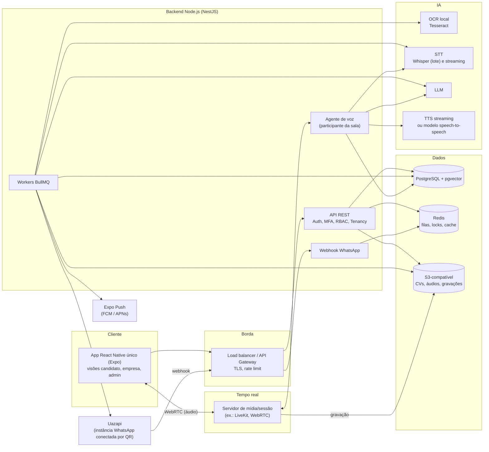
```mermaid
flowchart LR
  subgraph Cliente
    APP["App React Native único (Expo)<br/>visões candidato, empresa, admin"]
  end
  subgraph Borda
    GW["Load balancer / API Gateway<br/>TLS, rate limit"]
  end
  subgraph Backend["Backend Node.js (NestJS)"]
    API["API REST<br/>Auth, MFA, RBAC, Tenancy"]
    WH["Webhook WhatsApp"]
    WK["Workers BullMQ"]
    VA["Agente de voz<br/>(participante da sala)"]
  end
  subgraph Midia["Tempo real"]
    LK["Servidor de mídia/sessão<br/>(ex.: LiveKit, WebRTC)"]
  end
  subgraph Dados
    PG[("PostgreSQL + pgvector")]
    RD[("Redis<br/>filas, locks, cache")]
    S3[("S3-compatível<br/>CVs, áudios, gravações")]
  end
  subgraph IA
    OCR["OCR local<br/>Tesseract"]
    STT["STT<br/>Whisper (lote) e streaming"]
    LLM["LLM"]
    TTS["TTS streaming<br/>ou modelo speech-to-speech"]
  end
  WA["Uazapi<br/>(instância WhatsApp conectada por QR)"]
  PUSH["Expo Push<br/>(FCM / APNs)"]
  APP --> GW --> API
  APP <-- "WebRTC (áudio)" --> LK
  LK <--> VA
  WA -- webhook --> GW --> WH
  API --> PG
  API --> RD
  API --> S3
  WH --> RD
  WK --> PG
  WK --> S3
  WK --> OCR
  WK --> STT
  WK --> LLM
  WK --> WA
  WK --> PUSH
  VA --> STT
  VA --> LLM
  VA --> TTS
  VA --> PG
  LK -- gravação --> S3
```

## 4.2 Stack e justificativa

| Camada | Escolha | Justificativa |
|--------|---------|---------------|
| App | **React Native (Expo) em app único**, Expo Router, TanStack Query, Zustand, React Hook Form + Zod, SDK cliente do LiveKit | Um código para iOS/Android; grupos de rota por papel; WebRTC via SDK |
| Backend | **Node.js + NestJS** (TypeScript) | Módulos por domínio, guards para RBAC/tenancy, integração com BullMQ |
| ORM | **Prisma** (schema em múltiplos arquivos por domínio) | Migrações versionadas e tipagem; arquivos separados reduzem conflitos entre agentes |
| Banco | **PostgreSQL + pgvector** | JSONB, Row-Level Security, busca vetorial para o match |
| Filas | **Redis + BullMQ** | Retentativa, backoff, **jobs atrasados** (retry, prazos, timeouts), prioridade |
| Arquivos | **S3-compatível** (S3, R2, MinIO) | CVs, áudios e gravações; URLs pré-assinadas; ciclo de vida |
| OCR | **Tesseract local** (por + eng), após extração de texto nativo de PDF/DOCX | Dados sensíveis não saem da infraestrutura; sem OCR em nuvem |
| STT da 1ª fase | **Whisper**: local (faster-whisper/whisper.cpp) ou API (**decisão em aberto**) | Qualidade em pt-BR; a opção local mantém coerência com o OCR local |
| Voz em tempo real | **WebRTC** com servidor de mídia (ex.: **LiveKit**) + agente de voz; pipeline STT streaming → LLM → TTS streaming **ou** modelo speech-to-speech realtime (**decisão em aberto**) | Baixa latência, VAD, barge-in, gravação (§8.6) |
| LLM | Abstração `LlmProvider` | Troca de provedor/modelo sem tocar no domínio; prompts versionados |
| WhatsApp | **Uazapi** (mesmo provedor do SaaS sof), atrás da interface `WhatsappProvider` | Padrão já validado no sof: instância conectada por QR, envio de texto/mídia/menu, webhook de mensagens recebidas (inclusive áudio) e download de mídia; a interface permite trocar de provedor no futuro (§4.6) |
| Áudio | **ffmpeg** | OGG/Opus → WAV 16 kHz mono; duração |
| Push | **Expo Push** (FCM/APNs) + central in-app; e-mail opcional | Notificações à empresa e ao candidato |
| Observabilidade | OpenTelemetry, pino, Prometheus/Grafana ou equivalente, Sentry | §15 |

## 4.3 Módulos do backend

| Módulo | Responsabilidade |
|--------|------------------|
| `auth` | Cadastro, login, refresh, recuperação, **MFA (TOTP)** |
| `tenancy` | Empresa ativa, guards, contexto RLS, bypass do admin |
| `empresas` | **Auto-cadastro e verificação** (e-mail, domínio, CNPJ, revisão manual), estados |
| `membros` | Vínculos e convites de membros da empresa |
| `admin` | Fila de verificação, moderação, acesso auditado |
| `auditoria` | Registro de acessos sensíveis e ações administrativas |
| `vagas` | CRUD e **máquina de estados da vaga** (prazo, pausa, fechamento, prorrogação) |
| `habilidades` | Catálogo e normalização |
| `processos` | Processo seletivo, etapas, perguntas, **tempos por pergunta**, **política de retry** |
| `candidatos` | Perfil, habilidades, LinkedIn, consentimentos |
| `curriculos` | Upload, extração nativa, **OCR Tesseract**, extração estruturada |
| `candidaturas` | Direta, convites de match, máquina de estados, unicidade |
| `whatsapp` | `WhatsappProvider` + `UazapiProvider` (portado do sof), instâncias, webhook, monitoramento de conexão, cadência/rate limit |
| `triagem-whatsapp` | 1ª fase: envio de texto, recebimento de áudio, retry, abandono |
| `entrevista-voz` | 2ª fase: sessões, tokens, agente de voz, cronômetro por pergunta, reconexão |
| `avaliacao` | Avaliação por IA, rubricas, revisão humana |
| `ranking` / `match` | Score composto, pesos, explicação, embeddings |
| `notificacoes` | Notificações, preferências, dispositivos, agrupamento |
| `lgpd` | Exportação, exclusão, retenção |

## 4.4 Filas (BullMQ)

| Fila | Jobs |
|------|------|
| `cv-processamento` | Extração de texto nativo, OCR Tesseract, extração estruturada, embedding |
| `ia-perguntas` | Sugestão de perguntas para a vaga |
| `whatsapp-saida` / `whatsapp-entrada` | Envio de texto/menu pela instância Uazapi (com rate limit e cadência humana); processamento de webhooks (ordenado por conversa) |
| `whatsapp-instancias` | Monitoramento periódico do status das instâncias (`/instance/status`), alerta de desconexão e ressincronização do webhook |
| `triagem-retry` | **Jobs atrasados** do retry do convite e do prazo de inatividade |
| `audio-transcricao` | Download, ffmpeg, Whisper |
| `ia-avaliacao` | Avaliação de respostas e consolidação de entrevistas |
| `voz-pos-sessao` | Finalização da gravação, transcrição completa, avaliação |
| `vagas-prazos` | **Encerramento das inscrições** no prazo |
| `vagas-efeitos` | Efeitos de pausar/retomar/fechar (suspender/retomar jobs, notificar, transições) |
| `ranking` / `match` | Recálculo com debounce; sugestões |
| `notificacoes` | Push, central in-app, e-mail; agrupamento |
| `lgpd-retencao` | Expurgo periódico |

## 4.5 App único: estrutura, navegação e controle de acesso

```text
app/
  _layout.tsx                 # providers: auth, query, tema, i18n, notificações
  (auth)/                     # login, cadastro, recuperação, MFA
  (onboarding)/               # "Quero me candidatar" / "Cadastrar minha empresa"
  (candidato)/                # guard: papel CANDIDATO
    _layout.tsx               # tabs: Vagas | Candidaturas | Notificações | Perfil
    vagas/, candidaturas/     # candidaturas mostram só status e fase
    entrevista-voz/[id].tsx   # 2ª fase: pré-checagem, aceite, sala de voz
    perfil/                   # dados, currículo, habilidades, LinkedIn, privacidade
  (empresa)/                  # guard: MembroEmpresa na empresa ativa
    _layout.tsx               # tabs: Vagas | Candidatos | Notificações | Empresa
    cadastro-empresa/, verificacao/
    vagas/[id]/               # editar, perguntas, ranking, fases
    candidaturas/[id].tsx     # áudios, gravação, transcrições, notas
  (admin)/                    # guard: ADMIN_PLATAFORMA + MFA
    verificacoes/, empresas/, auditoria/, vagas/
  trocar-visao.tsx
```

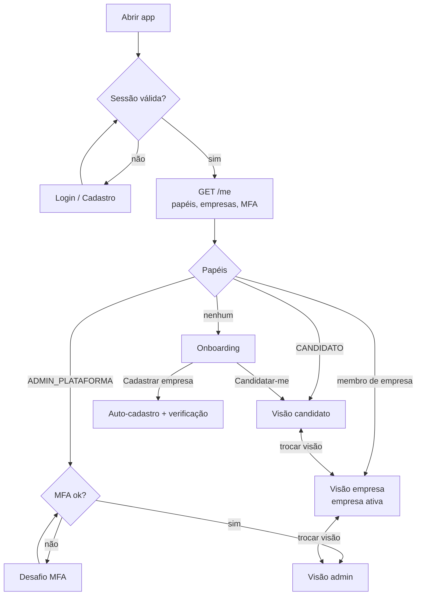
```mermaid
flowchart TD
  A[Abrir app] --> B{Sessão válida?}
  B -- não --> L["Login / Cadastro"]
  L --> B
  B -- sim --> C["GET /me<br/>papéis, empresas, MFA"]
  C --> D{Papéis}
  D -- ADMIN_PLATAFORMA --> M{MFA ok?}
  M -- não --> MF["Desafio MFA"]
  MF --> M
  M -- sim --> ADM["Visão admin"]
  D -- CANDIDATO --> CAND["Visão candidato"]
  D -- membro de empresa --> EMP["Visão empresa<br/>empresa ativa"]
  D -- nenhum --> ON["Onboarding"]
  ON -- "Cadastrar empresa" --> CE["Auto-cadastro + verificação"]
  ON -- "Candidatar-me" --> CAND
  CAND <-- "trocar visão" --> EMP
  EMP <-- "trocar visão" --> ADM
```

- `GET /me` retorna papéis globais, vínculos por empresa (com o status de verificação), status do MFA e visão preferida.
- Header `X-Empresa-Id` nas rotas da visão empresa; o backend valida vínculo e status.
- Layouts de grupo redirecionam quem não tem o papel; `usePermissao()` oculta ações. **O backend é a barreira de segurança.**
- Cache do TanStack Query segmentado por visão e empresa.
- Deep links (convite de match, entrevista, notificação) abrem a visão correta.

## 4.6 Integração WhatsApp via Uazapi

**Decisão:** a integração de WhatsApp usa a **Uazapi**, o mesmo provedor do SaaS sof do Renato, reaproveitando o padrão já implementado lá (`whatsapp-api.service.ts`, `whatsapp.controller.ts`, `uazapi-text.ts`/`uazapi-menu.ts`, `account-whatsapp.controller.ts`). O código é portado/adaptado para este repositório; o repositório do sof não é alterado.

| Aspecto | Padrão (baseado no sof) |
|---------|-------------------------|
| Instância | **Uma instância Uazapi por empresa** (um número de WhatsApp por empresa). A plataforma cria a instância com o `admintoken` (`/instance/init`) no onboarding da empresa e guarda o **token de instância cifrado**; a própria empresa conecta o aparelho por **QR code** ou código de pareamento (`/instance/connect`); status por `/instance/status`; desconexão por `/instance/disconnect` |
| Envio | Sempre pelo **número da empresa dona da vaga**: `/send/text` (perguntas, lembretes), `/send/menu` (botões como "Começar" / "Agora não", com fallback para resposta numérica), `/send/media` quando necessário; autenticação pelo header `token` da instância da empresa |
| Recebimento e roteamento | Webhook configurado em cada instância (`/webhook`, eventos `messages`, excluindo mensagens enviadas pela própria API e de grupos) apontando para `/webhooks/whatsapp/uazapi/{instanciaId}` com segredo compartilhado (`x-webhook-secret`). O backend identifica a **instância → empresa** pela URL e confere o token do payload; a mensagem é roteada para a entrevista ativa daquele candidato **naquela empresa** |
| Áudio | Webhook com `messageType` de áudio → `/message/download` com o id da mensagem para obter o arquivo (link ou base64) → S3 → ffmpeg → transcrição no `SttProvider` (Whisper local ou API, decisão em aberto). A transcrição embutida da Uazapi existe, mas não é a opção padrão, para manter o controle do STT e o armazenamento do áudio |
| Dedup | A Uazapi pode entregar eventos em pares: dedup por id da mensagem (Redis + índice único no banco), em vez do cache em memória usado no sof, porque aqui há várias instâncias de API/workers |
| Interface | `WhatsappProvider` (`enviarTexto`, `enviarMenu`, `baixarMidia`, `statusInstancia`, `conectarInstancia`, `normalizarWebhook`) com `UazapiProvider` como implementação e `FakeWhatsappProvider` para testes; trocar de provedor no futuro não muda o domínio |
| Gestão de instância | Na visão empresa (`(empresa)/whatsapp`): conectar por QR, ver status, última conexão e histórico de desconexões, desconectar/trocar número. Na visão admin (`(admin)/whatsapp`): todas as instâncias, com filtro por status, e apoio à reconexão |
| Monitoramento | Job periódico consulta `/instance/status` de cada instância; ao detectar desconexão, **alerta a empresa e o admin** (push, central in-app, e-mail), **pausa os retries e envios daquela empresa** sem consumir tentativas dos candidatos (o tempo desconectado não conta no prazo) e, após a reconexão por QR, ressincroniza o webhook e retoma os envios com a cadência normal |
| Cadência | Regras próprias da plataforma: **rate limiting por instância (por empresa)**, atraso aleatório entre mensagens, distribuição dos envios no horário comercial e rampa de aquecimento para números novos |
| Consentimento | **Opt-in obrigatório (LGPD)** antes de qualquer mensagem; opt-out com "PARAR" respeitado imediatamente |

Por ser uma **API não oficial**, há risco de bloqueio/banimento do número. Como cada empresa usa o próprio número, **o risco fica isolado por empresa**: um bloqueio afeta só as triagens daquela empresa. As mitigações estão em §17.

# 5. Modelo de dados

## 5.1 Diagrama ER

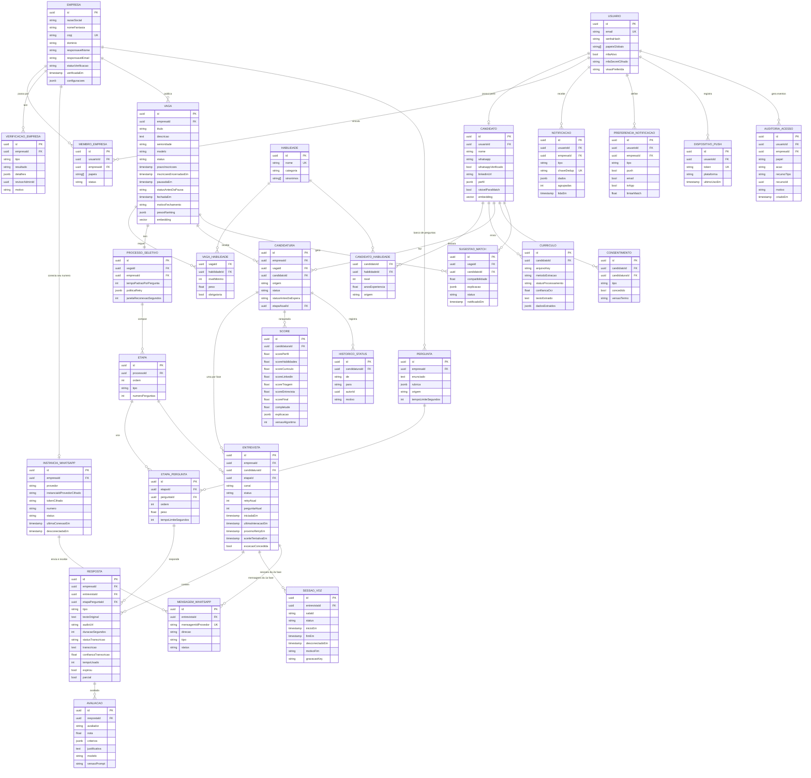
```mermaid
erDiagram
  USUARIO ||--o| CANDIDATO : "possui perfil"
  USUARIO ||--o{ MEMBRO_EMPRESA : vincula
  EMPRESA ||--o{ MEMBRO_EMPRESA : tem
  EMPRESA ||--o{ VERIFICACAO_EMPRESA : "passa por"
  EMPRESA ||--o| INSTANCIA_WHATSAPP : "conecta seu numero"
  EMPRESA ||--o{ VAGA : publica
  EMPRESA ||--o{ PERGUNTA : "banco de perguntas"
  VAGA ||--o{ VAGA_HABILIDADE : requer
  HABILIDADE ||--o{ VAGA_HABILIDADE : ""
  CANDIDATO ||--o{ CANDIDATO_HABILIDADE : declara
  HABILIDADE ||--o{ CANDIDATO_HABILIDADE : ""
  CANDIDATO ||--o{ CURRICULO : envia
  VAGA ||--|| PROCESSO_SELETIVO : tem
  PROCESSO_SELETIVO ||--o{ ETAPA : compoe
  ETAPA ||--o{ ETAPA_PERGUNTA : usa
  PERGUNTA ||--o{ ETAPA_PERGUNTA : ""
  CANDIDATO ||--o{ CANDIDATURA : faz
  VAGA ||--o{ CANDIDATURA : recebe
  CANDIDATURA ||--o{ ENTREVISTA : "uma por fase"
  ETAPA ||--o{ ENTREVISTA : ""
  ENTREVISTA ||--o{ RESPOSTA : contem
  ENTREVISTA ||--o{ SESSAO_VOZ : "sessoes da 2a fase"
  ENTREVISTA ||--o{ MENSAGEM_WHATSAPP : "mensagens da 1a fase"
  INSTANCIA_WHATSAPP ||--o{ MENSAGEM_WHATSAPP : "envia e recebe"
  ETAPA_PERGUNTA ||--o{ RESPOSTA : responde
  RESPOSTA ||--o{ AVALIACAO : avaliada
  CANDIDATURA ||--o{ SCORE : ranqueada
  CANDIDATURA ||--o{ HISTORICO_STATUS : registra
  CANDIDATO ||--o{ CONSENTIMENTO : concede
  VAGA ||--o{ SUGESTAO_MATCH : gera
  CANDIDATO ||--o{ SUGESTAO_MATCH : ""
  USUARIO ||--o{ NOTIFICACAO : recebe
  USUARIO ||--o{ PREFERENCIA_NOTIFICACAO : define
  USUARIO ||--o{ DISPOSITIVO_PUSH : registra
  USUARIO ||--o{ AUDITORIA_ACESSO : "gera eventos"

  USUARIO {
    uuid id PK
    string email UK
    string senhaHash
    string[] papeisGlobais
    bool mfaAtivo
    string mfaSecretCifrado
    string visaoPreferida
  }
  EMPRESA {
    uuid id PK
    string razaoSocial
    string nomeFantasia
    string cnpj UK
    string dominio
    string responsavelNome
    string responsavelEmail
    string statusVerificacao
    timestamp verificadaEm
    jsonb configuracoes
  }
  VERIFICACAO_EMPRESA {
    uuid id PK
    uuid empresaId FK
    string tipo
    string resultado
    jsonb detalhes
    uuid revisorAdminId
    string motivo
  }
  MEMBRO_EMPRESA {
    uuid id PK
    uuid usuarioId FK
    uuid empresaId FK
    string[] papeis
    string status
  }
  VAGA {
    uuid id PK
    uuid empresaId FK
    string titulo
    text descricao
    string senioridade
    string modelo
    string status
    timestamp prazoInscricoes
    timestamp inscricoesEncerradasEm
    timestamp pausadaEm
    string statusAntesDaPausa
    timestamp fechadaEm
    string motivoFechamento
    jsonb pesosRanking
    vector embedding
  }
  HABILIDADE {
    uuid id PK
    string nome UK
    string categoria
    string[] sinonimos
  }
  VAGA_HABILIDADE {
    uuid vagaId FK
    uuid habilidadeId FK
    int nivelMinimo
    float peso
    bool obrigatoria
  }
  CANDIDATO {
    uuid id PK
    uuid usuarioId FK
    string nome
    string whatsapp
    bool whatsappVerificado
    string linkedinUrl
    jsonb perfil
    bool visivelParaMatch
    vector embedding
  }
  CANDIDATO_HABILIDADE {
    uuid candidatoId FK
    uuid habilidadeId FK
    int nivel
    float anosExperiencia
    string origem
  }
  CURRICULO {
    uuid id PK
    uuid candidatoId FK
    string arquivoKey
    string metodoExtracao
    string statusProcessamento
    float confiancaOcr
    text textoExtraido
    jsonb dadosExtraidos
  }
  PROCESSO_SELETIVO {
    uuid id PK
    uuid vagaId FK
    uuid empresaId FK
    int tempoPadraoPorPergunta
    jsonb politicaRetry
    int janelaReconexaoSegundos
  }
  ETAPA {
    uuid id PK
    uuid processoId FK
    int ordem
    string tipo
    int numeroPerguntas
  }
  PERGUNTA {
    uuid id PK
    uuid empresaId FK
    text enunciado
    jsonb rubrica
    string origem
    int tempoLimiteSegundos
  }
  ETAPA_PERGUNTA {
    uuid id PK
    uuid etapaId FK
    uuid perguntaId FK
    int ordem
    float peso
    int tempoLimiteSegundos
  }
  CANDIDATURA {
    uuid id PK
    uuid empresaId FK
    uuid vagaId FK
    uuid candidatoId FK
    string origem
    string status
    string statusAntesDaEspera
    uuid etapaAtualId FK
  }
  ENTREVISTA {
    uuid id PK
    uuid empresaId FK
    uuid candidaturaId FK
    uuid etapaId FK
    string canal
    string status
    int retryAtual
    int perguntaAtual
    timestamp iniciadaEm
    timestamp ultimaInteracaoEm
    timestamp proximoRetryEm
    timestamp aceiteTentativaEm
    bool excecaoConcedida
  }
  SESSAO_VOZ {
    uuid id PK
    uuid entrevistaId FK
    string salaId
    string status
    timestamp inicioEm
    timestamp fimEm
    timestamp desconectadoEm
    string motivoFim
    string gravacaoKey
  }
  RESPOSTA {
    uuid id PK
    uuid empresaId FK
    uuid entrevistaId FK
    uuid etapaPerguntaId FK
    string tipo
    text textoOriginal
    string audioUrl
    int duracaoSegundos
    string statusTranscricao
    text transcricao
    float confiancaTranscricao
    int tempoUsado
    bool expirou
    bool parcial
  }
  INSTANCIA_WHATSAPP {
    uuid id PK
    uuid empresaId FK
    string provedor
    string instanciaIdProvedorCifrado
    string tokenCifrado
    string numero
    string status
    timestamp ultimaConexaoEm
    timestamp desconectadaEm
  }
  MENSAGEM_WHATSAPP {
    uuid id PK
    uuid entrevistaId FK
    string mensagemIdProvedor UK
    string direcao
    string tipo
    string status
  }
  AVALIACAO {
    uuid id PK
    uuid respostaId FK
    string avaliador
    float nota
    jsonb criterios
    text justificativa
    string modelo
    string versaoPrompt
  }
  SCORE {
    uuid id PK
    uuid candidaturaId FK
    float scorePerfil
    float scoreHabilidades
    float scoreCurriculo
    float scoreLinkedin
    float scoreTriagem
    float scoreEntrevista
    float scoreFinal
    float completude
    jsonb explicacao
    int versaoAlgoritmo
  }
  HISTORICO_STATUS {
    uuid id PK
    uuid candidaturaId FK
    string de
    string para
    uuid autorId
    string motivo
  }
  CONSENTIMENTO {
    uuid id PK
    uuid candidatoId FK
    uuid candidaturaId FK
    string tipo
    bool concedido
    string versaoTermo
  }
  SUGESTAO_MATCH {
    uuid id PK
    uuid vagaId FK
    uuid candidatoId FK
    float compatibilidade
    jsonb explicacao
    string status
    timestamp notificadoEm
  }
  NOTIFICACAO {
    uuid id PK
    uuid usuarioId FK
    uuid empresaId FK
    string tipo
    string chaveDedup UK
    jsonb dados
    int agrupadas
    timestamp lidaEm
  }
  PREFERENCIA_NOTIFICACAO {
    uuid id PK
    uuid usuarioId FK
    uuid empresaId FK
    string tipo
    bool push
    bool email
    bool inApp
    float limiarMatch
  }
  DISPOSITIVO_PUSH {
    uuid id PK
    uuid usuarioId FK
    string token UK
    string plataforma
    timestamp ultimoUsoEm
  }
  AUDITORIA_ACESSO {
    uuid id PK
    uuid usuarioId FK
    uuid empresaId FK
    string papel
    string acao
    string recursoTipo
    uuid recursoId
    string motivo
    timestamp criadoEm
  }
```

## 5.2 Notas sobre entidades e campos-chave

| Entidade / campo | Nota |
|------------------|------|
| `Empresa.statusVerificacao` | `PENDENTE`, `VERIFICADA`, `REJEITADA`, `SUSPENSA` |
| `VerificacaoEmpresa.tipo` | `EMAIL`, `DOMINIO`, `CNPJ`, `REVISAO_MANUAL`; histórico de cada checagem |
| `Vaga.status` | `RASCUNHO`, `PUBLICADA`, `PAUSADA`, `INSCRICOES_ENCERRADAS`, `FECHADA` |
| `Vaga.prazoInscricoes` | Obrigatório para publicar; armazenado em **UTC** (`timestamptz`) e exibido em **America/Sao_Paulo** |
| `Vaga.inscricoesEncerradasEm` | Momento real do encerramento automático (UTC) |
| `Vaga.statusAntesDaPausa` | Permite retomar para o estado anterior |
| `ProcessoSeletivo.tempoPadraoPorPergunta` | Segundos; padrão do processo para a 2ª fase |
| `ProcessoSeletivo.politicaRetry` | JSON: tentativas, intervalo, prazo total, horário comercial, prazo de inatividade |
| `Pergunta.tempoLimiteSegundos` | Override da pergunta (banco de perguntas); `EtapaPergunta.tempoLimiteSegundos` permite override por vaga. Precedência: EtapaPergunta → Pergunta → Processo |
| `Entrevista.status` | Ver §8.5.4 (1ª fase) e §8.6.5 (2ª fase) |
| `Entrevista.iniciadaEm` | **Marco de início**: na 1ª fase, a primeira resposta do candidato; na 2ª fase, o início da primeira sessão após o aceite |
| Unicidade de `Entrevista` | `UNIQUE (candidaturaId, etapaId)`: uma única tentativa por candidatura e fase |
| `Resposta.tipo` | `AUDIO_WHATSAPP`, `TEXTO_WHATSAPP`, `VOZ_TEMPO_REAL` |
| `Resposta.tempoUsado` / `expirou` | Tempo efetivo da pergunta (inclui follow-ups) e flag de expiração |
| `Resposta.parcial` | Resposta incompleta (expirada, abandonada ou desconectada) |
| `SessaoVoz` | Cada conexão; a reconexão dentro da janela reaproveita a mesma sessão |
| `Score` | Componentes e explicação; aparece **somente** em DTOs da empresa e do admin |
| `Notificacao.chaveDedup` | Ex.: `MATCH_FORTE:{vagaId}:{candidatoId}`, para evitar repetição |
| `AuditoriaAcesso` | Imutável (append-only), com retenção própria |
| `InstanciaWhatsapp` | **Uma por empresa** (`empresaId` único e obrigatório); provedor `UAZAPI`; id e token da instância **cifrados**; `numero`; `status` `AGUARDANDO_QR`, `CONECTADA`, `DESCONECTADA`; `ultimaConexaoEm`, `desconectadaEm` |

# 6. Empresa: auto-cadastro e verificação

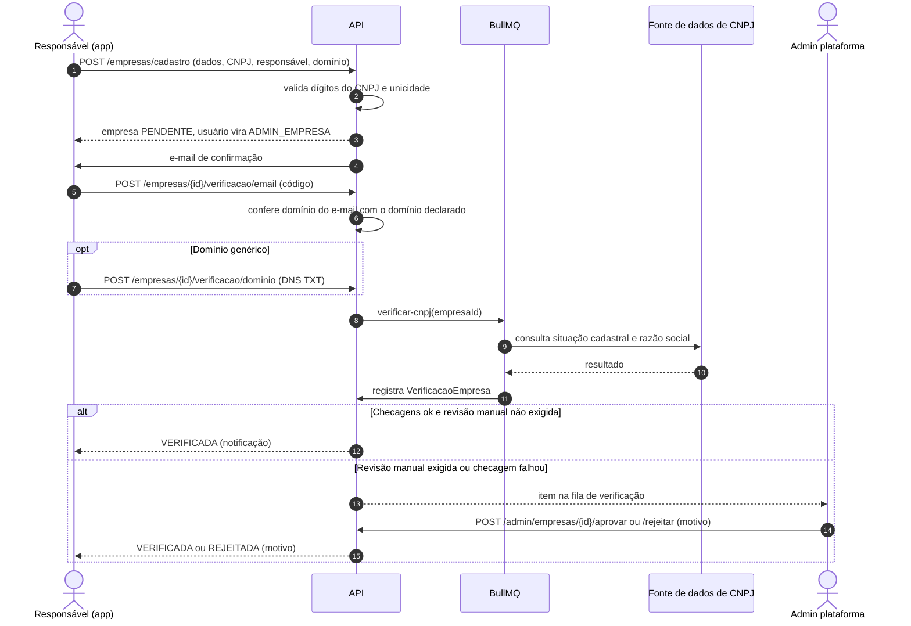
```mermaid
sequenceDiagram
  autonumber
  actor U as Responsável (app)
  participant API as API
  participant Q as BullMQ
  participant CN as Fonte de dados de CNPJ
  actor AD as Admin plataforma
  U->>API: POST /empresas/cadastro (dados, CNPJ, responsável, domínio)
  API->>API: valida dígitos do CNPJ e unicidade
  API-->>U: empresa PENDENTE, usuário vira ADMIN_EMPRESA
  API->>U: e-mail de confirmação
  U->>API: POST /empresas/{id}/verificacao/email (código)
  API->>API: confere domínio do e-mail com o domínio declarado
  opt Domínio genérico
    U->>API: POST /empresas/{id}/verificacao/dominio (DNS TXT)
  end
  API->>Q: verificar-cnpj(empresaId)
  Q->>CN: consulta situação cadastral e razão social
  CN-->>Q: resultado
  Q->>API: registra VerificacaoEmpresa
  alt Checagens ok e revisão manual não exigida
    API-->>U: VERIFICADA (notificação)
  else Revisão manual exigida ou checagem falhou
    API-->>AD: item na fila de verificação
    AD->>API: POST /admin/empresas/{id}/aprovar ou /rejeitar (motivo)
    API-->>U: VERIFICADA ou REJEITADA (motivo)
  end
```

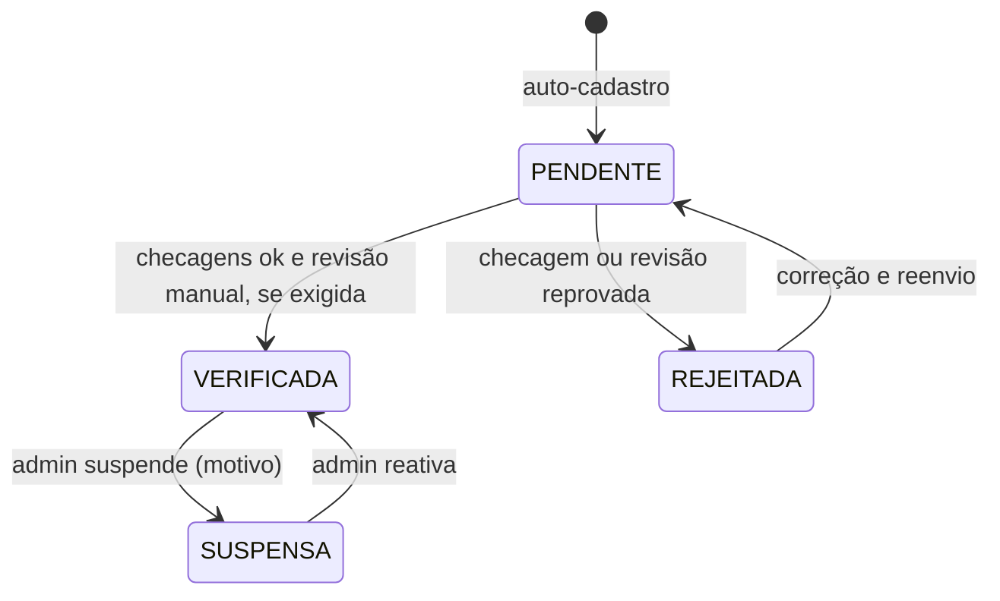
```mermaid
stateDiagram-v2
  [*] --> PENDENTE: auto-cadastro
  PENDENTE --> VERIFICADA: checagens ok e revisão manual, se exigida
  PENDENTE --> REJEITADA: checagem ou revisão reprovada
  REJEITADA --> PENDENTE: correção e reenvio
  VERIFICADA --> SUSPENSA: admin suspende (motivo)
  SUSPENSA --> VERIFICADA: admin reativa
```

- `PENDENTE` e `REJEITADA`: criam rascunhos de vagas, mas **não** publicam.
- `SUSPENSA`: vagas publicadas são **pausadas** automaticamente (regras de pausa, §7.3) e só voltam após a reativação.

## 6.1 Conectar o WhatsApp da empresa (instância Uazapi)

Etapa do onboarding, feita pela **própria empresa** (ADMIN_EMPRESA), em paralelo ou após a verificação.

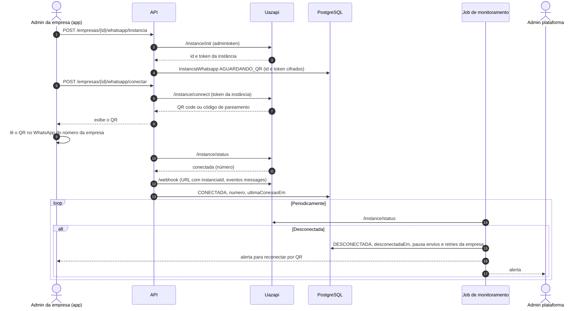
```mermaid
sequenceDiagram
  autonumber
  actor U as Admin da empresa (app)
  participant API as API
  participant UZ as Uazapi
  participant DB as PostgreSQL
  participant MON as Job de monitoramento
  actor AD as Admin plataforma
  U->>API: POST /empresas/{id}/whatsapp/instancia
  API->>UZ: /instance/init (admintoken)
  UZ-->>API: id e token da instância
  API->>DB: InstanciaWhatsapp AGUARDANDO_QR (id e token cifrados)
  U->>API: POST /empresas/{id}/whatsapp/conectar
  API->>UZ: /instance/connect (token da instância)
  UZ-->>API: QR code ou código de pareamento
  API-->>U: exibe o QR
  U->>U: lê o QR no WhatsApp do número da empresa
  API->>UZ: /instance/status
  UZ-->>API: conectada (número)
  API->>UZ: /webhook (URL com instanciaId, eventos messages)
  API->>DB: CONECTADA, numero, ultimaConexaoEm
  loop Periodicamente
    MON->>UZ: /instance/status
    alt Desconectada
      MON->>DB: DESCONECTADA, desconectadaEm, pausa envios e retries da empresa
      MON-->>U: alerta para reconectar por QR
      MON-->>AD: alerta
    end
  end
```

- Status da instância visível para a **empresa** (tela de WhatsApp e banner nas vagas) e para o **admin** (todas as empresas).
- **Bloqueio**: iniciar a 1ª fase exige instância `CONECTADA`. Sem ela, a candidatura aguarda em `INSCRITA` com alerta para a empresa ("conecte o WhatsApp para iniciar as triagens"); nenhuma tentativa é consumida.


# 7. Ciclo de vida da vaga: prazo, pausa e fechamento

## 7.1 Estados da vaga

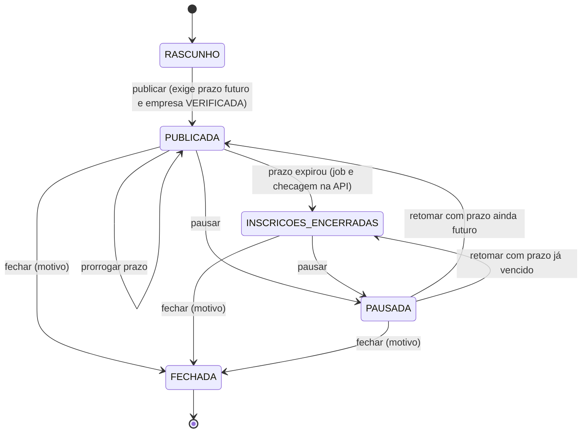
```mermaid
stateDiagram-v2
  [*] --> RASCUNHO
  RASCUNHO --> PUBLICADA: publicar (exige prazo futuro e empresa VERIFICADA)
  PUBLICADA --> PUBLICADA: prorrogar prazo
  PUBLICADA --> INSCRICOES_ENCERRADAS: prazo expirou (job e checagem na API)
  PUBLICADA --> PAUSADA: pausar
  INSCRICOES_ENCERRADAS --> PAUSADA: pausar
  PAUSADA --> PUBLICADA: retomar com prazo ainda futuro
  PAUSADA --> INSCRICOES_ENCERRADAS: retomar com prazo já vencido
  PUBLICADA --> FECHADA: fechar (motivo)
  INSCRICOES_ENCERRADAS --> FECHADA: fechar (motivo)
  PAUSADA --> FECHADA: fechar (motivo)
  FECHADA --> [*]
```

| Estado | Na lista de vagas / no match | Novas candidaturas | Fases dos inscritos |
|--------|:-:|:-:|---|
| `RASCUNHO` | não | não | — |
| `PUBLICADA` | sim | sim | seguem normalmente |
| `INSCRICOES_ENCERRADAS` | não | **não** | **seguem normalmente** |
| `PAUSADA` | não | não | **congeladas** (`EM_ESPERA`) |
| `FECHADA` | não | não | encerradas (`ENCERRADA_VAGA_FECHADA`) |

## 7.2 Prazo de inscrições obrigatório

- **A publicação exige `prazoInscricoes`** no futuro; o rascunho pode ficar sem prazo.
- O prazo é armazenado em **UTC**; a interface recebe e exibe em **America/Sao_Paulo** (o recrutador escolhe, por exemplo, "até 20/11, 23:59" no horário de Brasília e o backend converte).
- **Encerramento automático da entrada**: job atrasado em `vagas-prazos` agendado para `prazoInscricoes` (reagendado na prorrogação) **e** checagem na API em toda candidatura ou aceite de convite, como defesa caso o job atrase. Uma varredura periódica encontra vagas vencidas sem job.
- Ao expirar: `status = INSCRICOES_ENCERRADAS` e `inscricoesEncerradasEm` = agora (UTC); a vaga sai da lista e do match; convites ainda não aceitos expiram; **os inscritos seguem as fases**.
- **Prorrogação** pela empresa enquanto a vaga está `PUBLICADA` (o novo prazo deve ser maior que o atual).
- Em aberto (§18): reabrir inscrições após expirar e congelar o prazo durante a pausa (**padrão: não congela**).

## 7.3 Pausar e retomar (suspensão temporária)

- Pausar (empresa dona ou admin): a vaga sai da lista e do match; **nenhuma candidatura é encerrada**.
- Candidaturas ativas vão para `EM_ESPERA`, guardando `statusAntesDaEspera` (a fase em que estavam).
- **Jobs de retry da 1ª fase são suspensos** e seus prazos **congelados**: o tempo de pausa não consome tentativas nem prazo total. Convites ainda não enviados não saem.
- **Entrevistas em curso terminam**: uma triagem já iniciada pode ser concluída e uma sessão de voz em andamento vai até o fim; depois disso, o candidato **não avança** de fase até a retomada.
- Nenhuma entrevista nova começa: o app bloqueia o início da 2ª fase com aviso de vaga pausada.
- Retomar: as candidaturas voltam ao `statusAntesDaEspera`, os retries são reagendados com o tempo restante e a vaga volta a `PUBLICADA` (ou a `INSCRICOES_ENCERRADAS`, se o prazo venceu durante a pausa).
- Candidatos ativos recebem notificações de pausa e de retomada; nenhuma notificação de "candidato novo" ou "match forte" é gerada para vaga pausada.
- Em aberto: duração máxima de pausa.

## 7.4 Fechar (encerramento definitivo)

- A qualquer momento, pela empresa dona ou pelo admin, com **motivo obrigatório** (`motivoFechamento`).
- A vaga sai da lista e do match; **jobs de convite e de retry são cancelados**.
- **Entrevistas em curso terminam a sessão atual e depois encerram**: na voz, a sessão vai até o fim; no WhatsApp, o bot recebe a resposta pendente, agradece e encerra.
- Candidaturas ativas viram `ENCERRADA_VAGA_FECHADA`, que **não é reprovação nem abandono**.
- Candidatos são notificados; os **dados são preservados** (respostas, avaliações, scores), conforme a retenção.
- Em aberto: reabertura de vaga fechada.

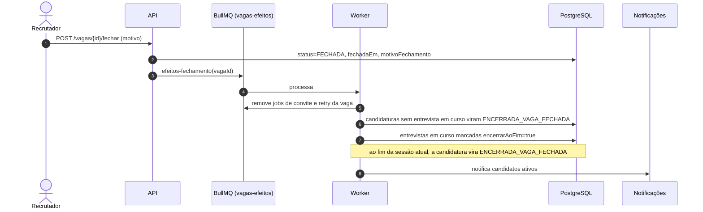
```mermaid
sequenceDiagram
  autonumber
  actor R as Recrutador
  participant API as API
  participant Q as BullMQ (vagas-efeitos)
  participant W as Worker
  participant DB as PostgreSQL
  participant N as Notificações
  R->>API: POST /vagas/{id}/fechar (motivo)
  API->>DB: status=FECHADA, fechadaEm, motivoFechamento
  API->>Q: efeitos-fechamento(vagaId)
  Q->>W: processa
  W->>Q: remove jobs de convite e retry da vaga
  W->>DB: candidaturas sem entrevista em curso viram ENCERRADA_VAGA_FECHADA
  W->>DB: entrevistas em curso marcadas encerrarAoFim=true
  Note over W,DB: ao fim da sessão atual, a candidatura vira ENCERRADA_VAGA_FECHADA
  W->>N: notifica candidatos ativos
```

# 8. Fluxos detalhados

## 8.1 Cadastro de vaga e perguntas (exigidas ou sugeridas por IA)

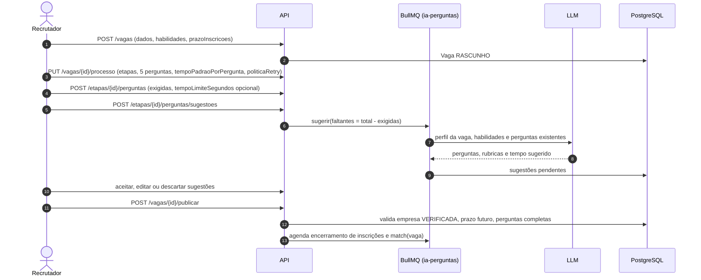
```mermaid
sequenceDiagram
  autonumber
  actor R as Recrutador
  participant API as API
  participant Q as BullMQ (ia-perguntas)
  participant LLM as LLM
  participant DB as PostgreSQL
  R->>API: POST /vagas (dados, habilidades, prazoInscricoes)
  API->>DB: Vaga RASCUNHO
  R->>API: PUT /vagas/{id}/processo (etapas, 5 perguntas, tempoPadraoPorPergunta, politicaRetry)
  R->>API: POST /etapas/{id}/perguntas (exigidas, tempoLimiteSegundos opcional)
  R->>API: POST /etapas/{id}/perguntas/sugestoes
  API->>Q: sugerir(faltantes = total - exigidas)
  Q->>LLM: perfil da vaga, habilidades e perguntas existentes
  LLM-->>Q: perguntas, rubricas e tempo sugerido
  Q->>DB: sugestões pendentes
  R->>API: aceitar, editar ou descartar sugestões
  R->>API: POST /vagas/{id}/publicar
  API->>DB: valida empresa VERIFICADA, prazo futuro, perguntas completas
  API->>Q: agenda encerramento de inscrições e match(vaga)
```

- O total de perguntas por etapa é `numeroPerguntas` (padrão 5). As exigidas entram primeiro; a IA completa as faltantes conforme o perfil da vaga (ex.: arquiteto → decisões de arquitetura, trade-offs, escalabilidade).
- Cada pergunta tem rubrica e, na 2ª fase, tempo-limite (padrão do processo ou override).
- A publicação só ocorre depois da aprovação humana de todas as perguntas.

## 8.2 Candidatura direta

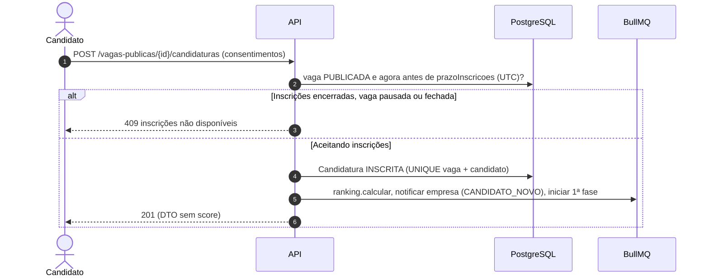
```mermaid
sequenceDiagram
  autonumber
  actor C as Candidato
  participant API as API
  participant DB as PostgreSQL
  participant Q as BullMQ
  C->>API: POST /vagas-publicas/{id}/candidaturas (consentimentos)
  API->>DB: vaga PUBLICADA e agora antes de prazoInscricoes (UTC)?
  alt Inscrições encerradas, vaga pausada ou fechada
    API-->>C: 409 inscrições não disponíveis
  else Aceitando inscrições
    API->>DB: Candidatura INSCRITA (UNIQUE vaga + candidato)
    API->>Q: ranking.calcular, notificar empresa (CANDIDATO_NOVO), iniciar 1ª fase
    API-->>C: 201 (DTO sem score)
  end
```

## 8.3 Fluxo de match

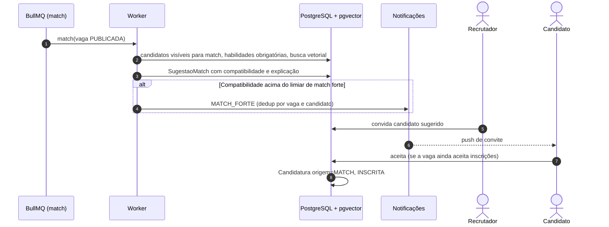
```mermaid
sequenceDiagram
  autonumber
  participant Q as BullMQ (match)
  participant W as Worker
  participant DB as PostgreSQL + pgvector
  participant N as Notificações
  actor R as Recrutador
  actor C as Candidato
  Q->>W: match(vaga PUBLICADA)
  W->>DB: candidatos visíveis para match, habilidades obrigatórias, busca vetorial
  W->>DB: SugestaoMatch com compatibilidade e explicação
  alt Compatibilidade acima do limiar de match forte
    W->>N: MATCH_FORTE (dedup por vaga e candidato)
  end
  R->>DB: convida candidato sugerido
  N-->>C: push de convite
  C->>DB: aceita (se a vaga ainda aceita inscrições)
  DB->>DB: Candidatura origem=MATCH, INSCRITA
```

- Vagas pausadas, com inscrições encerradas ou fechadas não entram no match.
- Até o aceite do convite, a empresa vê só um resumo do candidato.
- O candidato também recebe **vagas recomendadas** pelo mesmo cálculo.

## 8.4 Currículo: extração nativa e OCR local (Tesseract)

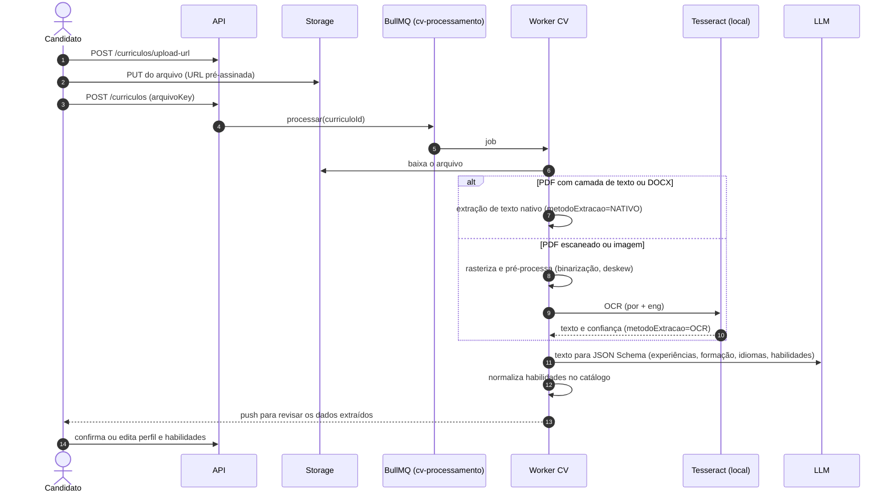
```mermaid
sequenceDiagram
  autonumber
  actor C as Candidato
  participant API as API
  participant S3 as Storage
  participant Q as BullMQ (cv-processamento)
  participant W as Worker CV
  participant T as Tesseract (local)
  participant LLM as LLM
  C->>API: POST /curriculos/upload-url
  C->>S3: PUT do arquivo (URL pré-assinada)
  C->>API: POST /curriculos (arquivoKey)
  API->>Q: processar(curriculoId)
  Q->>W: job
  W->>S3: baixa o arquivo
  alt PDF com camada de texto ou DOCX
    W->>W: extração de texto nativo (metodoExtracao=NATIVO)
  else PDF escaneado ou imagem
    W->>W: rasteriza e pré-processa (binarização, deskew)
    W->>T: OCR (por + eng)
    T-->>W: texto e confiança (metodoExtracao=OCR)
  end
  W->>LLM: texto para JSON Schema (experiências, formação, idiomas, habilidades)
  W->>W: normaliza habilidades no catálogo
  W-->>C: push para revisar os dados extraídos
  C->>API: confirma ou edita perfil e habilidades
```

- **OCR somente local**, com Tesseract na imagem Docker do worker; nenhum serviço de OCR em nuvem.
- O OCR roda **só para escaneados/imagens**. Em PDF misto, usa o texto nativo e faz OCR apenas nas páginas sem texto.
- Com baixa confiança do OCR, o candidato é avisado para revisar/editar manualmente.
- Nada é gravado no perfil sem confirmação do candidato.
- **LinkedIn**: apenas o campo `linkedinUrl` validado (`https://www.linkedin.com/in/...`), sem chamadas externas.

## 8.5 1ª fase — Triagem via WhatsApp (bot envia texto, candidato responde por áudio)

### 8.5.1 Princípios

- O bot **envia as perguntas por texto**; o candidato **responde por áudio**. O contato é só por mensagens.
- O envio sai sempre pela **instância Uazapi da empresa dona da vaga** (§4.6), ou seja, pelo número da própria empresa: texto livre e menus com botões, sem aprovação prévia de mensagens pelo provedor. A plataforma aplica **regras próprias de cadência e horário comercial** (§8.5.2) e rate limiting por instância, para reduzir o risco de bloqueio do número.
- Só há contato com **opt-in** registrado (WhatsApp + processamento de áudio).
- **Pré-condição**: instância da empresa `CONECTADA`. Sem ela, a 1ª fase não começa (bloqueio com alerta à empresa); se a instância cair durante a fase, envios e retries daquela empresa ficam pausados até a reconexão, **sem consumir tentativas do candidato**.
- **Marco de início = primeira resposta do candidato** a uma pergunta (áudio, ou texto aceito). Tocar em "Começar" no menu do convite (ou responder "1") ainda não é início.

### 8.5.2 Política de retry (antes de qualquer eliminação)

Se o candidato **ainda não começou**, o sistema reenvia automaticamente antes de marcar `SEM_RESPOSTA`. Os valores padrão abaixo são **SUGESTÃO** e configuráveis por processo. **A política final é ponto a detalhar na implementação (Fase 7).**

| Parâmetro | Padrão (SUGESTÃO) | Observação |
|-----------|-------------------|------------|
| Tentativas de retry após o convite | 3 | Total de 4 envios |
| Intervalo entre tentativas | 24 h | Se o próximo envio cair fora do horário comercial, é adiado |
| Prazo total da fase antes de `SEM_RESPOSTA` | 96 h | Congelado durante a pausa da vaga |
| Horário comercial para envios | seg–sex, 9h–18h (America/Sao_Paulo) | Envios fora da janela vão para o próximo horário válido |
| Cadência e limites de envio | Máx. de mensagens por minuto/hora por instância (valores a calibrar com o aquecimento do número), atraso aleatório de alguns segundos entre envios, sem rajadas para muitos candidatos ao mesmo tempo | Regras próprias da plataforma, aplicadas por instância |
| Textos de convite e lembrete | Variações de texto (`convite_triagem`, `lembrete_triagem`) com o nome da vaga e da empresa | Evita mensagens idênticas em massa |
| Prazo de inatividade após o início | 24 h desde a última interação | Ultrapassado → `ABANDONADA` |
| Lembrete de inatividade após o início | 1, na metade do prazo | Não reinicia a tentativa |

- Implementação com **jobs atrasados no BullMQ** (`triagem-retry`) e `jobId` determinístico por entrevista e tentativa. Os jobs são cancelados ao chegar resposta, suspensos na pausa (e reagendados com o tempo restante na retomada) e removidos no fechamento da vaga.
- `SEM_RESPOSTA` **não é reprovação automática**: a candidatura fica sinalizada para decisão humana.

### 8.5.3 Tentativa consumida e abandono

- O retry vale **só para quem ainda não começou**.
- Depois da primeira resposta, a tentativa está **consumida** e não há reinício. Inatividade além do prazo → `ABANDONADA`, e a avaliação usa as **respostas parciais** (perguntas não respondidas ficam sem nota e sinalizadas).
- Unicidade no backend: uma `Entrevista` por `(candidaturaId, etapaId)`; qualquer nova tentativa é rejeitada.
- A mensagem inicial avisa que a triagem não pode ser refeita depois de iniciada; o aceite (botão "Começar") é registrado.

### 8.5.4 Estados da entrevista da 1ª fase

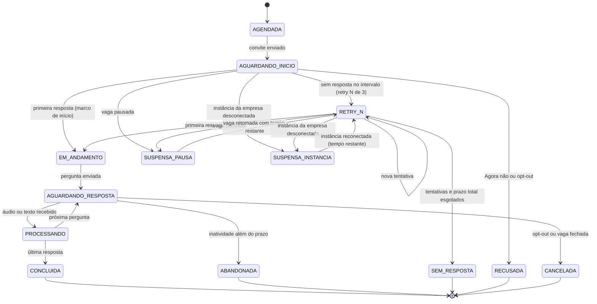
```mermaid
stateDiagram-v2
  [*] --> AGENDADA
  AGENDADA --> AGUARDANDO_INICIO: convite enviado
  AGUARDANDO_INICIO --> RETRY_N: sem resposta no intervalo (retry N de 3)
  RETRY_N --> RETRY_N: nova tentativa
  RETRY_N --> SEM_RESPOSTA: tentativas e prazo total esgotados
  AGUARDANDO_INICIO --> EM_ANDAMENTO: primeira resposta (marco de início)
  RETRY_N --> EM_ANDAMENTO: primeira resposta
  EM_ANDAMENTO --> AGUARDANDO_RESPOSTA: pergunta enviada
  AGUARDANDO_RESPOSTA --> PROCESSANDO: áudio ou texto recebido
  PROCESSANDO --> AGUARDANDO_RESPOSTA: próxima pergunta
  PROCESSANDO --> CONCLUIDA: última resposta
  AGUARDANDO_RESPOSTA --> ABANDONADA: inatividade além do prazo
  AGUARDANDO_INICIO --> SUSPENSA_PAUSA: vaga pausada
  RETRY_N --> SUSPENSA_PAUSA: vaga pausada
  SUSPENSA_PAUSA --> RETRY_N: vaga retomada com tempo restante
  AGUARDANDO_INICIO --> SUSPENSA_INSTANCIA: instância da empresa desconectada
  RETRY_N --> SUSPENSA_INSTANCIA: instância da empresa desconectada
  SUSPENSA_INSTANCIA --> RETRY_N: instância reconectada (tempo restante)
  AGUARDANDO_INICIO --> RECUSADA: Agora não ou opt-out
  AGUARDANDO_RESPOSTA --> CANCELADA: opt-out ou vaga fechada
  CONCLUIDA --> [*]
  ABANDONADA --> [*]
  SEM_RESPOSTA --> [*]
  RECUSADA --> [*]
  CANCELADA --> [*]
```

### 8.5.5 Sequência

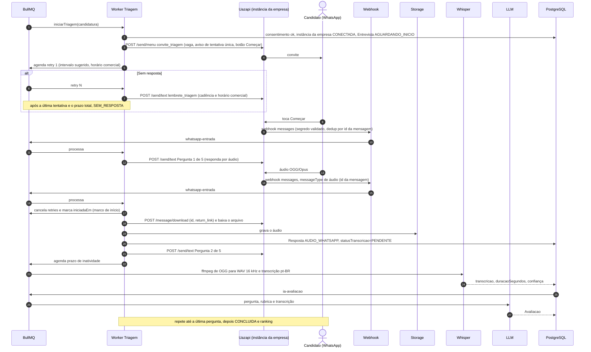
```mermaid
sequenceDiagram
  autonumber
  participant Q as BullMQ
  participant W as Worker Triagem
  participant WA as Uazapi (instância da empresa)
  actor C as Candidato (WhatsApp)
  participant WH as Webhook
  participant S3 as Storage
  participant STT as Whisper
  participant LLM as LLM
  participant DB as PostgreSQL
  Q->>W: iniciarTriagem(candidatura)
  W->>DB: consentimento ok, instância da empresa CONECTADA, Entrevista AGUARDANDO_INICIO
  W->>WA: POST /send/menu convite_triagem (vaga, aviso de tentativa única, botão Começar)
  WA->>C: convite
  W->>Q: agenda retry 1 (intervalo sugerido, horário comercial)
  alt Sem resposta
    Q->>W: retry N
    W->>WA: POST /send/text lembrete_triagem (cadência e horário comercial)
    Note over W,Q: após a última tentativa e o prazo total, SEM_RESPOSTA
  end
  C->>WA: toca Começar
  WA->>WH: webhook messages (segredo validado, dedup por id da mensagem)
  WH->>Q: whatsapp-entrada
  Q->>W: processa
  W->>WA: POST /send/text Pergunta 1 de 5 (responda por áudio)
  C->>WA: áudio OGG/Opus
  WA->>WH: webhook messages, messageType de áudio (id da mensagem)
  WH->>Q: whatsapp-entrada
  Q->>W: processa
  W->>Q: cancela retries e marca iniciadaEm (marco de início)
  W->>WA: POST /message/download (id, return_link) e baixa o arquivo
  W->>S3: grava o áudio
  W->>DB: Resposta AUDIO_WHATSAPP, statusTranscricao=PENDENTE
  W->>WA: POST /send/text Pergunta 2 de 5
  W->>Q: agenda prazo de inatividade
  Q->>STT: ffmpeg de OGG para WAV 16 kHz e transcrição pt-BR
  STT-->>DB: transcricao, duracaoSegundos, confiança
  DB->>Q: ia-avaliacao
  Q->>LLM: pergunta, rubrica e transcrição
  LLM-->>DB: Avaliacao
  Note over W,C: repete até a última pergunta, depois CONCLUIDA e ranking
```

### 8.5.6 Tratamentos

| Situação | Comportamento |
|----------|---------------|
| Resposta em **texto** em vez de áudio | Configurável. Padrão: pedir áudio uma vez e, se vier texto de novo, aceitar (`TEXTO_WHATSAPP`, sinalizado). "Ok", "oi" e dúvidas não contam como resposta |
| Vários áudios para a mesma pergunta | Agregados em uma resposta se chegarem numa janela curta configurável |
| Áudio curto demais | Pede para repetir (não consome a pergunta) |
| Mídia inválida (imagem, vídeo, documento) | Informa que só aceita áudio/texto e repete a pergunta |
| Transcrição falhou ou baixa confiança | Retentativa; persistindo, revisão humana com o áudio, **sem penalidade automática** |
| Candidato em várias triagens | Empresas diferentes usam números diferentes, então as triagens de empresas distintas correm em paralelo. Na mesma empresa, uma conversa ativa por candidato de cada vez; cada mensagem identifica a vaga; as demais aguardam, e o retry delas não corre enquanto aguardam |
| Opt-out ("PARAR") | Revoga o consentimento, cancela e confirma |
| Webhook duplicado (a Uazapi pode entregar o mesmo evento em pares) | Ignorado por `mensagemIdProvedor` único no banco + chave no Redis |
| Mensagens enviadas pela própria API (`wasSentByApi`/`fromMe`) | Ignoradas no processamento |
| Instância da empresa desconectada | Envios e retries **daquela empresa** ficam retidos/pausados (sem consumir tentativas nem prazo dos candidatos); **empresa e admin são alertados** para reconectar por QR; ao reconectar, a fila é retomada respeitando a cadência. As demais empresas não são afetadas |

## 8.6 2ª fase — Entrevista por voz em tempo real com IA (no app)

### 8.6.1 Arquitetura de voz

- **Transporte**: WebRTC entre o app e o servidor de mídia/sessão (ex.: **LiveKit**, self-hosted ou gerenciado: **em aberto**). Alternativa: WebSocket com chunks de áudio (mais simples, porém com maior latência e menos robusto a perda de pacotes).
- O **agente de voz** (processo Node.js dedicado) entra na sala como participante e conduz a entrevista.
- **Duas opções de pipeline (decisão em aberto, a definir pela POC):**

| Critério | A) STT streaming → LLM → TTS streaming | B) Modelo speech-to-speech realtime |
|----------|----------------------------------------|-------------------------------------|
| Latência | Soma das etapas; exige streaming em todas | Tende a ser menor (uma etapa) |
| Controle de roteiro, guardrails e tempo | Alto: texto intermediário inspecionável | Menor; depende das ferramentas do provedor |
| Transcrição para avaliação | Natural (sai do STT) | Exige transcrição em paralelo |
| Troca de provedor | Fácil, por componente | Acoplado ao provedor |
| Execução local | Possível por componente (ex.: Whisper streaming, TTS local) | Geralmente gerenciado |
| Custo | Variável por componente | Variável, por minuto de áudio |

- **Local × gerenciado** (STT, TTS, LLM, servidor de mídia): **em aberto**, a decidir com dados de latência, qualidade em pt-BR, custo e LGPD.
- **VAD e turnos**: detecção de atividade de voz para identificar o fim da fala; **barge-in** (se o candidato fala, o TTS é interrompido); tolerância ajustável a pausas de raciocínio.

### 8.6.2 Sequência

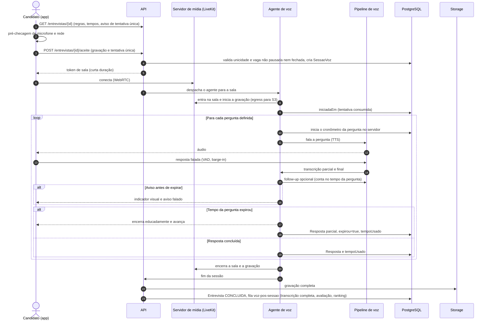
```mermaid
sequenceDiagram
  autonumber
  actor C as Candidato (app)
  participant API as API
  participant LK as Servidor de mídia (LiveKit)
  participant AG as Agente de voz
  participant P as Pipeline de voz
  participant DB as PostgreSQL
  participant S3 as Storage
  C->>API: GET /entrevistas/{id} (regras, tempos, aviso de tentativa única)
  C->>C: pré-checagem de microfone e rede
  C->>API: POST /entrevistas/{id}/aceite (gravação e tentativa única)
  API->>DB: valida unicidade e vaga não pausada nem fechada, cria SessaoVoz
  API-->>C: token de sala (curta duração)
  C->>LK: conecta (WebRTC)
  API->>AG: despacha o agente para a sala
  AG->>LK: entra na sala e inicia a gravação (egress para S3)
  AG->>DB: iniciadaEm (tentativa consumida)
  loop Para cada pergunta definida
    AG->>DB: inicia o cronômetro da pergunta no servidor
    AG->>P: fala a pergunta (TTS)
    P-->>C: áudio
    C->>P: resposta falada (VAD, barge-in)
    P->>AG: transcrição parcial e final
    AG->>P: follow-up opcional (conta no tempo da pergunta)
    alt Aviso antes de expirar
      AG-->>C: indicador visual e aviso falado
    end
    alt Tempo da pergunta expirou
      AG-->>C: encerra educadamente e avança
      AG->>DB: Resposta parcial, expirou=true, tempoUsado
    else Resposta concluída
      AG->>DB: Resposta e tempoUsado
    end
  end
  AG->>LK: encerra a sala e a gravação
  AG->>API: fim da sessão
  API->>S3: gravação completa
  API->>DB: Entrevista CONCLUIDA, fila voz-pos-sessao (transcrição completa, avaliação, ranking)
```

O pipeline de voz é STT → LLM → TTS ou speech-to-speech, conforme a decisão em aberto.

### 8.6.3 Orçamento de latência (estimativas)

Objetivo: **resposta percebida abaixo de ~1 s** entre o fim da fala do candidato e o início da fala da IA. Os valores por etapa são **estimativas** a validar na POC.

| Etapa | Meta estimada |
|-------|---------------|
| Detecção de fim de fala (VAD/turno) | ~200–300 ms |
| STT final após o fim da fala | ~100–200 ms |
| LLM até o primeiro token | ~250–400 ms |
| TTS até o primeiro áudio | ~100–200 ms |
| Rede/transporte (ida e volta) | ~50–150 ms |
| **Total percebido** | **< ~1 s** (p50); p95 a definir na POC |

- Técnicas: streaming em todas as etapas, frases curtas, pré-geração da próxima pergunta enquanto o candidato fala, hospedagem em região próxima dos usuários e reuso de conexões.
- **POC de latência cedo**, em paralelo às primeiras fases, comparando as opções A e B e as variantes local × gerenciada.

### 8.6.4 Limite de tempo por pergunta

| Item | Regra |
|------|-------|
| Escopo | Limite **por pergunta**, não por entrevista |
| Padrão | `ProcessoSeletivo.tempoPadraoPorPergunta`; **sugestão: 180 s** |
| Override | `Pergunta.tempoLimiteSegundos` / `EtapaPergunta.tempoLimiteSegundos`; **sugestão: entre 60 s e 600 s** |
| Follow-ups | **Contam no tempo da pergunta** |
| Cronômetro | No **servidor** (agente de voz); o app só exibe o valor sincronizado |
| Indicador | Barra/contador visível e **aviso antes de expirar** (sugestão: 30 s antes, visual + frase curta da IA) |
| Ao expirar | A IA encerra a pergunta educadamente ("Obrigado, vamos para a próxima"), salva a resposta **parcial** com `expirou = true` e `tempoUsado`, e avança |
| Eliminação | **Nenhuma eliminação automática** por expiração; a avaliação considera o conteúdo respondido |

### 8.6.5 Tentativa consumida, saída e reconexão

- Antes de iniciar, há uma tela de **aviso e aceite** ("a entrevista só pode ser feita uma vez; sair encerra a tentativa") com o consentimento de gravação.
- **Sair ou fechar o app** (saída voluntária) consome a tentativa: a entrevista vira `ABANDONADA` e é avaliada com as respostas parciais.
- **Queda involuntária** (rede, app suspenso pelo sistema): há uma janela curta de **reconexão na mesma sessão** (sugestão: 60 s, em `janelaReconexaoSegundos`). Ao reconectar, a entrevista continua **de onde parou**, com o cronômetro da pergunta pausado durante a queda (sugestão a confirmar na implementação). Passada a janela → `ABANDONADA`.
- Voluntária × involuntária: botão "Encerrar" ou fechamento explícito = voluntária; perda de conexão sem sinal de saída = involuntária. A heurística fica registrada em `SessaoVoz.motivoFim`.
- **Em aberto**: exceção manual por admin/empresa para queda involuntária (`Entrevista.excecaoConcedida`), com auditoria.
- Unicidade no backend por `(candidaturaId, etapaId)`; o token de sala só é emitido para a sessão ativa ou para a reconexão dentro da janela.

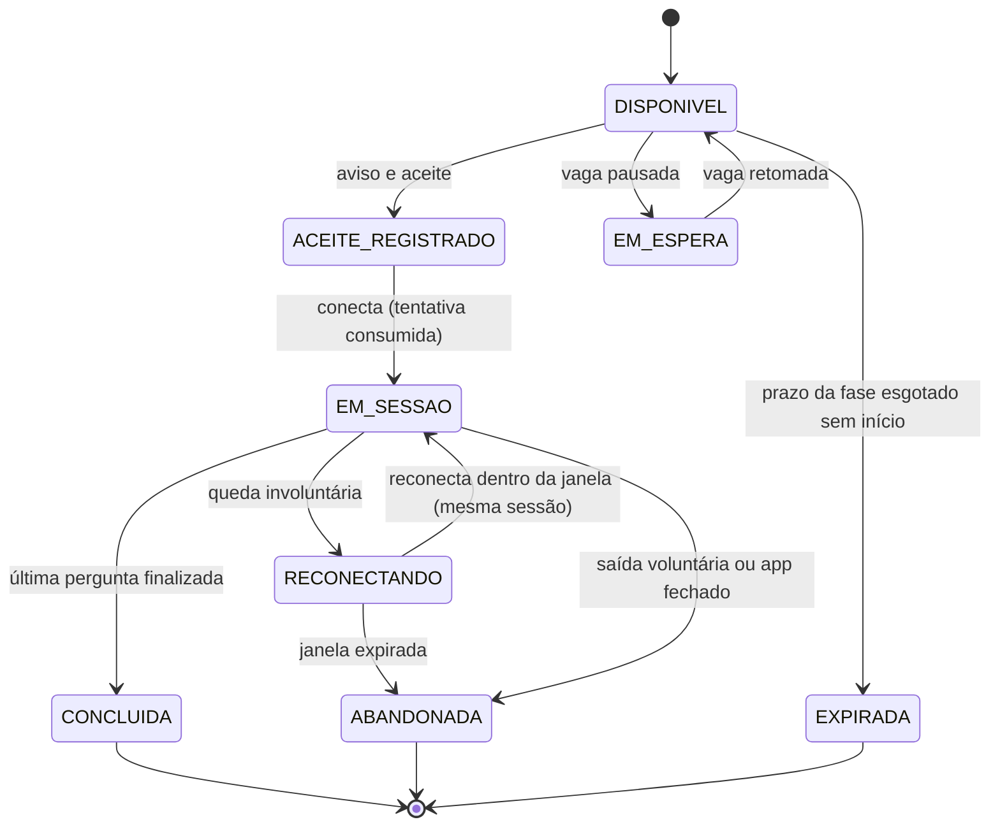
```mermaid
stateDiagram-v2
  [*] --> DISPONIVEL
  DISPONIVEL --> ACEITE_REGISTRADO: aviso e aceite
  ACEITE_REGISTRADO --> EM_SESSAO: conecta (tentativa consumida)
  EM_SESSAO --> RECONECTANDO: queda involuntária
  RECONECTANDO --> EM_SESSAO: reconecta dentro da janela (mesma sessão)
  RECONECTANDO --> ABANDONADA: janela expirada
  EM_SESSAO --> ABANDONADA: saída voluntária ou app fechado
  EM_SESSAO --> CONCLUIDA: última pergunta finalizada
  DISPONIVEL --> EXPIRADA: prazo da fase esgotado sem início
  DISPONIVEL --> EM_ESPERA: vaga pausada
  EM_ESPERA --> DISPONIVEL: vaga retomada
  CONCLUIDA --> [*]
  ABANDONADA --> [*]
  EXPIRADA --> [*]
```

### 8.6.6 Gravação, transcrição, rede e dispositivo

- **Gravação completa** da sessão (áudio dos dois lados) e **transcrição completa**, marcada por pergunta e com timestamps, armazenadas no S3 e no banco; acesso por URL pré-assinada e auditado.
- **Consentimento de gravação** obrigatório antes do aceite.
- Requisitos (sugestão): microfone funcional com permissão concedida, conexão estável (teste de banda e latência na pré-checagem), fone recomendado para reduzir eco, cancelamento de eco do WebRTC ativo.
- **Escalabilidade de sessões simultâneas**: servidor de mídia escalável horizontalmente; agentes de voz em pool com limite por instância; fila de admissão quando o limite for atingido ("aguarde, sua entrevista começa em instantes"); cotas por tenant.

## 8.7 Notificações à empresa

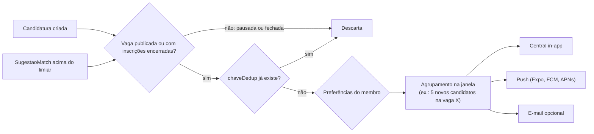
```mermaid
flowchart LR
  E1[Candidatura criada] --> F{Vaga publicada ou com inscrições encerradas?}
  E2["SugestaoMatch acima do limiar"] --> F
  F -- "não: pausada ou fechada" --> X[Descarta]
  F -- sim --> D{chaveDedup já existe?}
  D -- sim --> X
  D -- não --> P{Preferências do membro}
  P --> G["Agrupamento na janela<br/>(ex.: 5 novos candidatos na vaga X)"]
  G --> C1[Central in-app]
  G --> C2["Push (Expo, FCM, APNs)"]
  G --> C3[E-mail opcional]
```

| Item | Regra |
|------|-------|
| Tipos para a empresa | `CANDIDATO_NOVO` e `MATCH_FORTE`, além de operacionais (verificação aprovada/rejeitada, inscrições encerradas) |
| Limiar de match forte | Configurável por empresa/vaga; **sugestão: compatibilidade ≥ 80/100** |
| Deduplicação | `chaveDedup` única por tipo + vaga + candidato |
| Agrupamento anti-spam | Janela configurável (**sugestão: 15 min**); acima de N eventos, envia um resumo |
| Canais | Push (Expo Push → FCM/APNs), central in-app (sempre) e e-mail opcional |
| Preferências | Por membro, tipo e canal (`PreferenciaNotificacao`) |
| Vagas pausadas/fechadas | **Nada é enviado** |
| Dispositivos | `DispositivoPush` com token; tokens inválidos são removidos após falha do provedor |
| Candidato | Recebe só eventos de status/fase da própria candidatura (nunca posição ou score) |

# 9. Ranqueamento

## 9.1 Componentes do score (todos os dados do MVP)

| Componente | Fonte | Cálculo (0–100) | Peso padrão (SUGESTÃO, configurável por vaga) |
|------------|-------|-----------------|:-:|
| Perfil | Dados do perfil | Aderência a senioridade, modelo/localidade, disponibilidade e idiomas exigidos | 10% |
| Habilidades | `CandidatoHabilidade` × `VagaHabilidade` | Cobertura ponderada por peso e nível mínimo; obrigatória ausente vira sinal destacado | 25% |
| Currículo (OCR) | `Curriculo.dadosExtraidos` | Experiência relevante: anos nas habilidades da vaga, similaridade semântica CV × vaga, evidências confirmadas | 10% |
| LinkedIn | `linkedinUrl` | **Só a presença do link** no MVP (100 se presente e válido, 0 se ausente) | 2% |
| 1ª fase (triagem WhatsApp) | Avaliações das respostas | Média ponderada das notas por pergunta | 23% |
| 2ª fase (voz) | Avaliações das respostas | Média ponderada das notas por pergunta | 30% |

- Pesos em `Vaga.pesosRanking` (soma = 100, validada); a empresa ajusta por vaga.
- Fórmula: `scoreFinal = Σ(peso_i × score_i) / Σ(peso_i dos componentes disponíveis)`.

## 9.2 Dados ausentes e recálculo

- Componente ainda indisponível (fase não ocorreu): fica fora da soma e o score é **renormalizado**; o ranking mostra a **completude** (ex.: "parcial — 4 de 6 componentes").
- Exceção: LinkedIn ausente vale **0**, porque é um sinal de presença com peso mínimo.
- Fase `ABANDONADA` ou com perguntas expiradas: usa as respostas parciais; perguntas sem resposta valem 0 naquela fase, com sinalização. `SEM_RESPOSTA` na 1ª fase: componente zerado e sinalizado para decisão humana.
- Transcrição sem qualidade: a resposta fica fora da média até a revisão humana.
- **Recálculo** por eventos (perfil/CV atualizados, resposta avaliada, revisão humana, mudança de pesos), com **debounce por vaga**; `Score` versionado (`versaoAlgoritmo`).

## 9.3 Explicabilidade

`Score.explicacao` guarda a contribuição de cada componente e habilidade; a nota e a justificativa por pergunta, com trechos citados da transcrição; flags (expirou, parcial, texto em vez de áudio); e as versões de modelo, prompt e algoritmo. Exemplo na visão empresa: *"78/100 (completo) — Habilidades 85 (Node.js ✔, AWS ✔, Kubernetes parcial); CV 70; Triagem 72; Voz 80 (forte em design de APIs; Pergunta 3 expirou)."*

## 9.4 Ranking invisível ao candidato

- Posição, score e componentes ficam visíveis só para a **empresa dona da vaga** e para o **admin**.
- O candidato vê **apenas status e fase** da própria candidatura: sem número de concorrentes, percentil ou posição.
- DTOs dedicados (`CandidaturaCandidatoDto`) com lista branca de campos; **nunca** expõem score.
- **Teste automatizado** (contrato/E2E) percorre todos os endpoints acessíveis ao papel `CANDIDATO` e falha se aparecer qualquer campo de score ou ranking (`score*`, `posicao`, `ranking`, `percentil`, `totalCandidatos`).
- As notificações ao candidato também não mencionam posição.
- **Em aberto**: como atender o art. 20 da LGPD (direito de solicitar revisão de decisões tomadas com base em tratamento automatizado) sem expor o ranking. Exemplo: canal de solicitação de revisão e explicação dos critérios gerais.

## 9.5 Revisão humana e viés

- O sistema recomenda; avanço e reprovação são **decisões humanas**. A nota humana substitui a da IA.
- Atributos sensíveis (foto, idade, gênero, estado civil, endereço completo) ficam fora dos prompts e do score; avaliação cega opcional.
- A IA avalia conteúdo, não sotaque, dicção ou qualidade do áudio.
- Auditoria periódica: distribuição de notas, concordância IA × humano e efeito das expirações.

# 10. Máquina de estados da candidatura

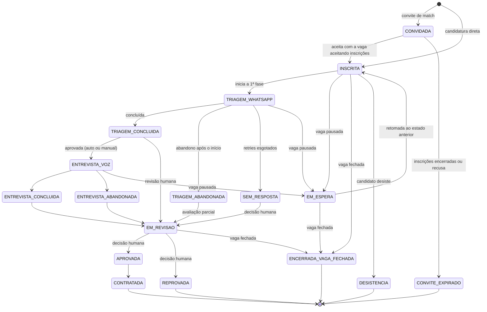
```mermaid
stateDiagram-v2
  [*] --> CONVIDADA: convite de match
  CONVIDADA --> INSCRITA: aceita com a vaga aceitando inscrições
  CONVIDADA --> CONVITE_EXPIRADO: inscrições encerradas ou recusa
  [*] --> INSCRITA: candidatura direta
  INSCRITA --> TRIAGEM_WHATSAPP: inicia a 1ª fase
  TRIAGEM_WHATSAPP --> TRIAGEM_CONCLUIDA: concluída
  TRIAGEM_WHATSAPP --> TRIAGEM_ABANDONADA: abandono após o início
  TRIAGEM_WHATSAPP --> SEM_RESPOSTA: retries esgotados
  TRIAGEM_CONCLUIDA --> ENTREVISTA_VOZ: aprovada (auto ou manual)
  TRIAGEM_CONCLUIDA --> EM_REVISAO: revisão humana
  TRIAGEM_ABANDONADA --> EM_REVISAO: avaliação parcial
  SEM_RESPOSTA --> EM_REVISAO: decisão humana
  ENTREVISTA_VOZ --> ENTREVISTA_CONCLUIDA
  ENTREVISTA_VOZ --> ENTREVISTA_ABANDONADA
  ENTREVISTA_CONCLUIDA --> EM_REVISAO
  ENTREVISTA_ABANDONADA --> EM_REVISAO
  EM_REVISAO --> APROVADA: decisão humana
  EM_REVISAO --> REPROVADA: decisão humana
  APROVADA --> CONTRATADA
  INSCRITA --> EM_ESPERA: vaga pausada
  TRIAGEM_WHATSAPP --> EM_ESPERA: vaga pausada
  ENTREVISTA_VOZ --> EM_ESPERA: vaga pausada
  EM_ESPERA --> INSCRITA: retomada ao estado anterior
  INSCRITA --> ENCERRADA_VAGA_FECHADA: vaga fechada
  EM_ESPERA --> ENCERRADA_VAGA_FECHADA: vaga fechada
  EM_REVISAO --> ENCERRADA_VAGA_FECHADA: vaga fechada
  INSCRITA --> DESISTENCIA: candidato desiste
  REPROVADA --> [*]
  CONTRATADA --> [*]
  DESISTENCIA --> [*]
  ENCERRADA_VAGA_FECHADA --> [*]
  CONVITE_EXPIRADO --> [*]
```

- `EM_ESPERA` guarda `statusAntesDaEspera` e volta exatamente a ele na retomada (o diagrama mostra um exemplo).
- `ENCERRADA_VAGA_FECHADA` pode ser alcançado a partir de qualquer estado ativo e não é reprovação nem abandono.
- As transições ficam num serviço único (`CandidaturaStateMachine`), com validação, autor, motivo e `HistoricoStatus`, e controle otimista de concorrência.
- **Não existe reprovação automática**.
- O candidato vê um **rótulo amigável** do status/fase (ex.: "Triagem pelo WhatsApp", "Em análise pela empresa"), nunca informações de ranking.

# 11. Multiprocesso, multi-tenant e escalabilidade

## 11.1 Multiprocesso

- Muitas empresas, vagas e processos simultâneos; o candidato pode estar em vários processos de empresas diferentes ao mesmo tempo.
- Cada candidatura tem suas próprias entrevistas por fase; não há estado global por candidato.
- WhatsApp: cada empresa envia pelo próprio número (instância própria), então empresas diferentes não competem pelo mesmo número. Na mesma empresa, uma triagem ativa por candidato de cada vez, com mensagens que identificam a vaga; os retries das triagens em espera não correm.
- Voz: no máximo uma sessão de voz ativa por candidato (lock por candidato).

## 11.2 Isolamento multi-tenant

| Camada | Mecanismo |
|--------|-----------|
| Banco | `empresaId` + **Row-Level Security** (`app.empresa_id`); **bypass apenas** com `app.is_admin = true` (admin + MFA), sempre auditado em acessos sensíveis |
| Aplicação | `TenantGuard` e extensão do Prisma que injeta `empresaId`; DTOs por papel |
| Candidato | Perfil global; a empresa acessa via candidatura/convite; dados de avaliação de uma empresa nunca vão para outra |
| Arquivos | Prefixo por empresa no S3; URLs pré-assinadas curtas; acesso auditado |
| Filas | `empresaId` em todo payload; o worker restabelece o contexto |
| Testes | Suítes de isolamento (acesso cruzado → 403/404), de bypass do admin (permitido e auditado) e de DTO do candidato sem score |

## 11.3 Concorrência e escala

- Webhooks: resposta 200 imediata, processamento assíncrono e dedup por `mensagemIdProvedor`.
- Ordem por conversa: lock no Redis por `entrevistaId`; controle otimista (`versao`) contra corrida entre timeout/retry e resposta.
- Prazos e retries: jobs atrasados + varreduras de reconciliação.
- API stateless; workers separados por tipo de carga (OCR/STT em CPU/GPU; IA/WhatsApp em I/O); autoscaling por tamanho de fila.
- Voz: servidor de mídia e agentes em pool, com autoscaling por sessões ativas, fila de admissão e cotas por tenant.
- Rate limits por tenant (API, IA, WhatsApp, sessões de voz), por instância Uazapi (cadência humana) e por provedor (token bucket no Redis).
- Índices: `(empresaId, vagaId, status)`, `(vagaId, scoreFinal DESC)`, `(status, prazoInscricoes)` e HNSW para embeddings.

# 12. APIs principais (REST)

Prefixo `/api/v1`; JWT Bearer; rotas da visão empresa com `X-Empresa-Id`; rotas `/admin/*` exigem `ADMIN_PLATAFORMA` + MFA. O OpenAPI é gerado pelo NestJS e o cliente TS do app é gerado a partir dele.

| Método | Endpoint | Descrição | Papel |
|--------|----------|-----------|-------|
| POST | `/auth/cadastro`, `/auth/login`, `/auth/refresh`, `/auth/logout` | Sessão | público/autenticado |
| POST | `/auth/mfa/configurar`, `/auth/mfa/verificar` | MFA TOTP | autenticado (obrigatório para admin) |
| GET / PATCH | `/me`, `/me/visao` | Papéis, empresas, visão | autenticado |
| POST | `/empresas/cadastro` | **Auto-cadastro** da empresa | autenticado |
| POST | `/empresas/{id}/verificacao/email`, `/verificacao/dominio`, `/verificacao/reenviar` | Verificações | ADMIN_EMPRESA |
| GET | `/empresas/{id}/verificacao` | Status da verificação | ADMIN_EMPRESA |
| GET / POST / DELETE | `/empresas/{id}/membros` | Membros | ADMIN_EMPRESA |
| GET | `/admin/empresas?status=PENDENTE` | Fila de verificação | ADMIN |
| POST | `/admin/empresas/{id}/aprovar`, `/rejeitar`, `/suspender`, `/reativar` | Decisão (com motivo) | ADMIN |
| GET | `/admin/auditoria` | Trilha de auditoria | ADMIN |
| GET / POST | `/vagas` | Vagas da empresa | RECRUTADOR+ |
| GET / PATCH | `/vagas/{id}` | Detalhe/edição (inclui `prazoInscricoes`) | RECRUTADOR+ |
| PUT | `/vagas/{id}/habilidades` | Habilidades requeridas | RECRUTADOR+ |
| PUT | `/vagas/{id}/processo` | Etapas, nº de perguntas, `tempoPadraoPorPergunta`, `politicaRetry` | RECRUTADOR+ |
| PUT | `/vagas/{id}/pesos-ranking` | Pesos do score | RECRUTADOR+ |
| POST | `/vagas/{id}/publicar` | Exige prazo e empresa verificada | RECRUTADOR+ |
| POST | `/vagas/{id}/prorrogar` | Novo prazo de inscrições | RECRUTADOR+ |
| POST | `/vagas/:id/pausar` | Pausa | RECRUTADOR+, ADMIN |
| POST | `/vagas/:id/retomar` | Retomada | RECRUTADOR+, ADMIN |
| POST | `/vagas/:id/fechar` | Fechamento (motivo obrigatório) | RECRUTADOR+, ADMIN |
| GET / POST | `/etapas/{id}/perguntas` | Perguntas exigidas (com `tempoLimiteSegundos`) | RECRUTADOR+ |
| POST / PATCH | `/etapas/{id}/perguntas/sugestoes[/{sid}]` | Sugestões da IA | RECRUTADOR+ |
| GET | `/vagas/{id}/ranking` | Ranking com componentes e explicação | Empresa dona, ADMIN |
| GET / POST | `/vagas/{id}/sugestoes-match`, `/sugestoes-match/{id}/convidar` | Match | RECRUTADOR+ |
| GET | `/candidaturas/{id}` | Detalhe (respostas, áudios, gravação, notas) | Empresa dona, ADMIN |
| POST | `/candidaturas/{id}/transicoes` | Decisão humana | RECRUTADOR+ |
| POST | `/respostas/{id}/revisao` | Revisão humana | AVALIADOR+ |
| GET | `/respostas/{id}/audio`, `/entrevistas/{id}/gravacao`, `/entrevistas/{id}/transcricao` | URLs pré-assinadas (**auditado**) | Empresa dona, ADMIN |
| GET | `/vagas-publicas`, `/vagas-publicas/{id}` | Só vagas aceitando inscrições | CANDIDATO |
| GET / PUT | `/candidatos/me`, `/candidatos/me/habilidades` | Perfil (inclui `linkedinUrl`) | CANDIDATO |
| POST | `/curriculos/upload-url`, `/curriculos`, `/curriculos/{id}/confirmar` | CV com OCR local | CANDIDATO |
| POST | `/vagas-publicas/{id}/candidaturas` | Candidatura direta | CANDIDATO |
| GET | `/candidatos/me/candidaturas` | **Só status/fase** (sem score) | CANDIDATO |
| POST | `/convites/{id}/aceitar`, `/convites/{id}/recusar` | Convites de match | CANDIDATO |
| POST | `/candidatos/me/consentimentos` | Consentimentos | CANDIDATO |
| POST | `/candidatos/me/whatsapp/verificar` | Verificação do número (método em aberto, Q21) | CANDIDATO |
| GET | `/entrevistas/{id}` | Regras, tempos e status (sem score) | CANDIDATO |
| POST | `/entrevistas/{id}/aceite` | Aviso/aceite da tentativa única + gravação | CANDIDATO |
| POST | `/entrevistas/{id}/sessao` | Token da sala de voz (sessão ativa ou reconexão) | CANDIDATO |
| POST | `/entrevistas/{id}/encerrar` | Saída voluntária (consome a tentativa) | CANDIDATO |
| POST | `/entrevistas/{id}/excecao` | Exceção por queda involuntária (**em aberto**) | ADMIN / empresa |
| GET / POST | `/notificacoes`, `/notificacoes/{id}/lida` | Central in-app | autenticado |
| GET / PUT | `/preferencias-notificacao` | Preferências | autenticado |
| POST / DELETE | `/dispositivos-push` | Registro de token | autenticado |
| POST | `/webhooks/whatsapp/uazapi/{instanciaId}` | Eventos `messages` da instância (texto, áudio, botões), roteados para a empresa dona da instância | Uazapi (segredo no header `x-webhook-secret` + token da instância) |
| POST | `/empresas/{id}/whatsapp/instancia` | Cria a instância da empresa (`/instance/init`) | ADMIN_EMPRESA |
| POST | `/empresas/{id}/whatsapp/conectar` | Gera QR/código de pareamento (`/instance/connect`) | ADMIN_EMPRESA, ADMIN |
| GET | `/empresas/{id}/whatsapp/status` | Status, número, última conexão | Empresa, ADMIN |
| POST | `/empresas/{id}/whatsapp/desconectar` | Desconecta/troca de número (`/instance/disconnect`) | ADMIN_EMPRESA, ADMIN |
| GET | `/admin/whatsapp/instancias` | Todas as instâncias com status | ADMIN |
| POST | `/lgpd/exportar`, `/lgpd/excluir` | Direitos do titular | autenticado |

# 13. Segurança

- TLS; criptografia em repouso (banco e S3); segredos em cofre.
- Senhas com Argon2; JWT curto + refresh rotativo; Expo SecureStore no app.
- **MFA obrigatório para admin**; reautenticação em ações sensíveis; sessões curtas.
- RBAC + tenancy no backend + RLS no banco; bypass só para admin, auditado.
- Webhook da Uazapi autenticado por segredo compartilhado (header `x-webhook-secret`) e rate limit; tokens de instância e o admintoken da Uazapi só no cofre de segredos; uploads validados (tipo, tamanho, antivírus).
- Tokens de sala de voz de curta duração, vinculados à entrevista e ao usuário.
- Proteção contra prompt injection: CV, respostas e falas tratados como dados; saídas validadas por schema.
- **Auditoria** imutável de acessos a áudios, gravações e transcrições (admin e empresa) e de ações administrativas.

# 14. LGPD e privacidade

| Consentimento | Momento |
|---------------|---------|
| Termos e privacidade | Cadastro |
| Contato por WhatsApp (opt-in) | Verificação do número / candidatura; revogável com "PARAR" |
| Processamento e transcrição de áudio (1ª fase) | Antes da 1ª fase |
| **Gravação** da entrevista por voz (2ª fase) | Tela de aceite, antes da sessão |
| Avaliação automatizada por IA com revisão humana | Candidatura |
| Visibilidade para match | Configuração do perfil (padrão em aberto) |

- **Retenção** configurável por empresa, com padrão da plataforma (prazos a definir com o jurídico), para CVs, áudios, gravações e transcrições; expurgo por job + ciclo de vida no S3; auditoria com retenção própria.
- Exportação e exclusão de dados; anonimização do que precisa permanecer.
- Papéis LGPD (controladora/operadora) a validar juridicamente.
- O OCR local reduz transferência de dados; STT/TTS/LLM gerenciados exigem contrato sem uso dos dados para treinamento e análise de transferência internacional.
- **Art. 20**: revisão de decisões automatizadas (ver §9.4 e §18).
- Viés e revisão humana: §9.5.

# 15. Observabilidade

| Pilar | Itens |
|-------|-------|
| Logs | JSON com `traceId`, `empresaId`, `candidaturaId`, `entrevistaId`, `sessaoId`; sem PII nem conteúdo de respostas |
| Métricas | API; filas (tamanho, idade, falhas); WhatsApp (entrega, leitura, retries, `SEM_RESPOSTA`, abandonos); STT (tempo, falhas, confiança); OCR (tempo, confiança, % OCR × nativo); voz (**latência por etapa p50/p95**, sessões simultâneas, quedas, reconexões, expirações por pergunta); IA (tokens, custo por empresa); vagas (encerramentos automáticos, pausas); notificações (enviadas, agrupadas, falhas de push) |
| Traces | OpenTelemetry da API aos workers e ao agente de voz |
| Erros | Sentry (backend e app) |
| Alertas | Fila acumulando; job de prazo atrasado; falhas de webhook; **instância Uazapi de uma empresa desconectada** (para a empresa e o admin); taxa de falhas de envio por empresa; latência de voz acima da meta; custo de IA acima da cota; acessos atípicos de admin |
| Qualidade da IA | Concordância IA × humano; distribuição de notas; erros de schema |

# 16. Fases de implementação (resumo)

As 10 fases estão detalhadas no **[Plano de Implementação Orquestrado](plano-implementacao.md)** (tarefas, agentes, paralelismo, critérios de aceite e riscos). Os tamanhos relativos são **estimativas**, sem datas.

| # | Fase | Escopo principal | Estimativa |
|---|------|------------------|:-:|
| 1 | Setup do repo e ambientes | Monorepo, CI, Docker Compose, esqueletos de API/app/workers, ambientes; contas externas e conta Uazapi | M |
| 2 | Modelo de dados | Schema Prisma completo, RLS, bypass do admin, seeds | M |
| 3 | Auth e papéis | Auth, RBAC, auto-cadastro e verificação da empresa, **conexão do WhatsApp da empresa (instância Uazapi por QR)**, admin, MFA do admin, auditoria, navegação por papel | G |
| 4 | CRUD de vagas com perguntas e prazo | Vagas, habilidades, perguntas exigidas/sugeridas por IA, tempo por pergunta, política de retry, prazo obrigatório, pausar/fechar | G |
| 5 | Perfil do candidato com OCR local | Perfil, habilidades, LinkedIn (campo), upload, extração nativa + Tesseract, consentimentos | M |
| 6 | Candidatura e notificações | Direta + match, máquina de estados, push + central in-app | G |
| 7 | Entrevista WhatsApp | Envio pelo número da empresa (Uazapi), adapter portado do sof, roteamento do webhook por instância, monitoramento/alertas, texto/áudio, transcrição, avaliação, retry com cadência própria, tentativa consumida/abandono | G |
| 8 | Entrevista IA por voz em tempo real | POC de latência (cedo), WebRTC/LiveKit, agente de voz, tempo por pergunta, reconexão, gravação | GG |
| 9 | Ranqueamento | Score composto, pesos, explicabilidade, ranking invisível ao candidato com teste | M |
| 10 | Multiprocesso | Concorrência, isolamento, escala, testes de carga | G |

LGPD e observabilidade são **trilhas transversais** a todas as fases.

# 17. Riscos e mitigação

| Risco | Mitigação |
|-------|-----------|
| **Bloqueio/banimento do número** (Uazapi não é API oficial do WhatsApp) | **Risco isolado por empresa** (cada uma tem o próprio número): um bloqueio não afeta as demais. Mitigação: orientar a empresa a usar número dedicado e aquecido; cadência humana; rate limiting por instância; apenas candidatos com opt-in; opt-out fácil; textos variados; fallback de convite por push/e-mail enquanto a empresa troca o número |
| **Limites de envio** e degradação da reputação do número | Limites conservadores por minuto/hora/dia por instância, distribuição de envios ao longo do horário comercial, monitoramento de falhas e respostas negativas |
| **Aquecimento do número** novo da empresa | Rampa gradual de volume por instância nas primeiras semanas (valores a definir na Fase 7), aplicada automaticamente a instâncias recém-conectadas |
| **Desconexão da instância** da empresa (sessão do aparelho expira, troca de aparelho) | Monitoramento de status, alerta à empresa e ao admin, reconexão por QR pela empresa; envios e retries pausados sem consumir tentativas |
| Empresa sem WhatsApp conectado atrasa triagens | Etapa de conexão no onboarding, banner nas vagas e bloqueio com alerta ao tentar iniciar a 1ª fase |
| Mudanças na API da Uazapi ou no WhatsApp | Adapter isolado atrás de `WhatsappProvider`, testes de contrato com payloads reais anonimizados, possibilidade de trocar de provedor |
| Latência da voz acima de ~1 s | POC cedo; streaming ponta a ponta; região próxima; opção speech-to-speech |
| Quedas de rede na entrevista por voz | Janela de reconexão na mesma sessão; pré-checagem de rede; exceção manual (em aberto) |
| Percepção de injustiça na tentativa única | Aviso e aceite explícitos; avaliação parcial; revisão humana |
| Retry percebido como spam | Horário comercial, cadência humana, limite de tentativas, opt-out fácil |
| Transcrição ruim (ruído, termos técnicos) | Vocabulário técnico; limiar de confiança → revisão humana; sem penalidade automática |
| OCR fraco em layouts complexos | Texto nativo primeiro; pré-processamento; revisão pelo candidato |
| Vazamento do ranking ao candidato | DTOs dedicados + teste automatizado em todos os endpoints do candidato |
| Abuso do acesso total do admin | MFA, motivo obrigatório, auditoria imutável, alertas de acessos atípicos |
| Fraude no auto-cadastro de empresa | Verificação de e-mail/domínio/CNPJ, revisão manual configurável, suspensão |
| Corrida entre prazos, pausas e respostas | Jobs idempotentes, controle otimista, reconciliação periódica |
| Viés algorítmico | Rubricas, atributos sensíveis fora, auditoria, decisão humana |
| Custo de IA/voz | Cotas por tenant, componentes locais quando viável, monitoramento de custo |

# 18. Questões em aberto e decisões pendentes

| # | Questão | Bloqueia a fase |
|---|---------|:-:|
| Q2 | STT da 1ª fase: Whisper local (faster-whisper/whisper.cpp) × API | 7 |
| Q3 | Voz: pipeline STT→LLM→TTS × speech-to-speech; componentes locais × gerenciados; LiveKit self-hosted × gerenciado (decidido pela POC) | 8 |
| Q4 | Provedor/modelo de LLM (qualidade em pt-BR, custo, retenção de dados) | 4 |
| Q5 | Fonte de dados para validação do CNPJ | 3 |
| Q6 | Política de revisão manual de empresas (sempre / só em falha / nunca) | 3 |
| Q7 | Política final de retry da 1ª fase (valores sugeridos em §8.5.2) | 7 |
| Q8 | Resposta em texto na triagem: aceitar após pedir áudio × exigir áudio | 7 |
| Q9 | Janela de reconexão e pausa do cronômetro durante a queda | 8 |
| Q10 | Exceção manual (admin/empresa) para queda involuntária | 8 |
| Q11 | Reabrir inscrições após o prazo expirar | 4 |
| Q12 | Congelar o prazo de inscrições durante a pausa (padrão: não congela) | 4 |
| Q13 | Duração máxima de pausa | 4 |
| Q14 | Reabertura de vaga fechada | 4 |
| Q15 | Pesos padrão do ranking e limiar de match forte | 9 (limiar: 6) |
| Q16 | LGPD art. 20: revisão de decisão automatizada sem expor o ranking | 9 |
| Q17 | Visibilidade para match: opt-in × opt-out | 6 |
| Q18 | Prazos de retenção (CV, áudio, gravação, transcrição, auditoria) | Trilha LGPD (antes do piloto) |
| Q19 | Avanço da 1ª para a 2ª fase: automático por nota mínima × manual | 7 |
| Q20 | Hospedagem/região e necessidade de GPU (STT local, voz) | 1 (provisionamento) / 8 |
| Q21 | Verificação do WhatsApp do candidato sem número da plataforma: OTP por SMS × confirmação no primeiro contato pela instância da empresa (o candidato responde confirmando) | 7 |

Decisão já tomada (fora desta lista): **um número/instância Uazapi por empresa** (§4.6 e §6.1).
