# Plano Técnico e de Produto — Sistema de Candidatura a Vagas com IA

**Recrutamento com triagem por WhatsApp e entrevista conduzida por IA**

*Autor: Renato Souza (Product Owner / Desenvolvimento)*

> Diagramas em Mermaid (renderizados pelo GitHub). Versões PNG de referência em [`diagramas/`](diagramas/).

# 1. Visão geral e objetivos

## 1.1 Contexto

O sistema é uma plataforma de recrutamento com duas visões dentro de um **único aplicativo React Native**:

- **Visão da empresa** (quem contrata): cadastra vagas, define habilidades requeridas, monta o processo seletivo (com perguntas próprias ou sugeridas por IA), acompanha as fases e consulta o ranqueamento dos candidatos.
- **Visão do candidato**: navega pelas vagas, preenche o perfil, envia o currículo (com OCR e extração automática), informa o link do LinkedIn, cadastra habilidades e acompanha suas candidaturas.

O processo seletivo padrão tem duas fases automatizadas:

1. **1ª fase — Triagem via WhatsApp**: um bot envia as perguntas **por mensagem de texto** no WhatsApp cadastrado pelo candidato, e o candidato responde **por áudio** (mensagens de voz). Os áudios são transcritos (speech-to-text) e avaliados pela IA. **Não há ligação telefônica.**
2. **2ª fase — Entrevista conduzida por IA**: a IA conduz a entrevista com as perguntas definidas para a vaga (geralmente 5), com perguntas de aprofundamento, e gera uma avaliação estruturada.

## 1.2 Objetivos

| # | Objetivo | Como medir (indicador sugerido) |
|---|----------|---------------------------------|
| O1 | Reduzir o esforço manual de triagem | Tempo do recrutador por candidato triado |
| O2 | Padronizar a avaliação técnica | % de candidaturas avaliadas com as mesmas perguntas e rubrica |
| O3 | Dar transparência ao candidato | % de candidaturas com status atualizado e feedback disponível |
| O4 | Explicar o ranqueamento | 100% dos scores com detalhamento por critério |
| O5 | Suportar muitos processos simultâneos | Processos ativos por empresa e por candidato sem degradação |
| O6 | Conformidade com LGPD | Consentimentos registrados; política de retenção aplicada |

> As metas numéricas de cada indicador devem ser definidas pelo Renato após o piloto; este documento não assume valores.

## 1.3 Fora do escopo (nesta versão)

- Integração real com o LinkedIn (apenas o campo de URL é armazenado).
- Ligações telefônicas/voz em tempo real pelo WhatsApp.
- Contratação, admissão e folha de pagamento.
- Builds separados de app para empresa e candidato (há **um único app**).

# 2. Personas, papéis e permissões

## 2.1 Personas

| Persona | Descrição | Principais necessidades |
|---------|-----------|-------------------------|
| **Admin da empresa** | Responsável pela conta da empresa (tenant) | Gerenciar usuários, configurações, consentimentos, integrações |
| **Recrutador** | Cria e conduz processos seletivos | Cadastrar vagas, definir perguntas, acompanhar fases e ranking |
| **Gestor / Avaliador técnico** | Avalia candidatos de uma vaga | Ver respostas, transcrições, scores e registrar revisão humana |
| **Candidato** | Pessoa que se candidata | Encontrar vagas, manter perfil, responder entrevistas, acompanhar status |
| **Admin da plataforma** | Operação do produto (time do Renato) | Suporte, auditoria, gestão de tenants, monitoramento |

## 2.2 Modelo de papéis (um usuário, vários papéis)

- Um **Usuário** possui uma conta única (e-mail/telefone).
- Ele pode ter um **PerfilCandidato** (papel global `CANDIDATO`) e, ao mesmo tempo, um ou mais vínculos **MembroEmpresa** (papéis `ADMIN_EMPRESA`, `RECRUTADOR`, `AVALIADOR` em uma empresa específica).
- No app, o usuário com mais de um papel alterna entre as visões (seletor de visão/empresa). O backend **sempre** valida o papel e o tenant em cada requisição; a interface apenas reflete isso.

## 2.3 Matriz de permissões

| Ação | Candidato | Avaliador | Recrutador | Admin empresa | Admin plataforma |
|------|:-:|:-:|:-:|:-:|:-:|
| Ver vagas publicadas | ✔ | ✔ | ✔ | ✔ | ✔ |
| Editar o próprio perfil / CV / habilidades | ✔ | — | — | — | — |
| Candidatar-se a vaga | ✔ | — | — | — | — |
| Criar/editar vaga e processo seletivo | — | — | ✔ | ✔ | — |
| Gerar/aprovar perguntas com IA | — | — | ✔ | ✔ | — |
| Ver candidaturas e ranking da vaga | — | ✔ (vagas atribuídas) | ✔ | ✔ | auditoria |
| Mover candidatura de etapa / decidir | — | sugere | ✔ | ✔ | — |
| Revisão humana de score | — | ✔ | ✔ | ✔ | — |
| Gerenciar membros da empresa | — | — | — | ✔ | ✔ |
| Configurar WhatsApp/IA do tenant | — | — | — | ✔ | ✔ |

# 3. Requisitos funcionais

## 3.1 Visão da empresa

| ID | Requisito | Detalhes |
|----|-----------|----------|
| RF-E01 | Cadastro de empresa e membros | Admin convida membros por e-mail; papéis por empresa |
| RF-E02 | Cadastro de vaga | Título, descrição, senioridade, modelo (remoto/híbrido/presencial), localidade, tipo de contrato, faixa salarial (opcional), benefícios, quantidade de posições, prazo, status (rascunho, publicada, pausada, encerrada) |
| RF-E03 | Habilidades requeridas | Seleção de habilidades do catálogo (linguagens, plataformas de cloud, bancos, frameworks, ferramentas, soft skills), com **nível mínimo**, **peso** e flag **obrigatória/desejável** |
| RF-E04 | Processo seletivo | Criado por vaga a partir de um modelo padrão (Triagem WhatsApp → Entrevista IA → Revisão humana), com etapas configuráveis e ordenáveis |
| RF-E05 | Número de perguntas | Definido por etapa por quem cria a vaga (padrão: **5**) |
| RF-E06 | Perguntas exigidas pela empresa | Recrutador cadastra perguntas obrigatórias antecipadamente (texto, critério de avaliação/rubrica, peso) |
| RF-E07 | Perguntas sugeridas por IA | A IA sugere perguntas com base no perfil da vaga (ex.: vaga de arquiteto → perguntas de arquitetura, trade-offs, escalabilidade). Recrutador aceita, edita ou descarta; perguntas obrigatórias completam o total definido |
| RF-E08 | Banco de perguntas | Perguntas reutilizáveis por empresa, com tags de habilidade |
| RF-E09 | Candidatura direta | Recebe candidaturas feitas pelo candidato na página da vaga |
| RF-E10 | Fluxo de match | Sistema sugere candidatos compatíveis (com perfil público/opt-in); recrutador convida; candidato aceita ou recusa o convite |
| RF-E11 | Ranqueamento | Lista de candidatos por vaga ordenada por score composto, com explicação por critério e filtros |
| RF-E12 | Acompanhamento das fases | Kanban/lista por etapa, status de cada entrevista (enviada, em andamento, aguardando resposta, concluída, expirada), transcrições e avaliações |
| RF-E13 | Revisão humana | Avaliador pode ajustar nota, comentar e aprovar/reprovar; toda decisão final é humana |
| RF-E14 | Comunicação | Notificações ao candidato em mudanças de etapa (push no app, e-mail; WhatsApp apenas com template aprovado e consentimento) |

## 3.2 Visão do candidato

| ID | Requisito | Detalhes |
|----|-----------|----------|
| RF-C01 | Lista de vagas | Busca e filtros (habilidade, senioridade, modelo, localidade); indicador de compatibilidade com o perfil |
| RF-C02 | Perfil | Dados pessoais, contato, **WhatsApp** (com verificação), localidade, pretensão, disponibilidade, resumo, experiências, formação, idiomas |
| RF-C03 | Upload de currículo com OCR | PDF, DOCX ou imagem; extração de texto (OCR quando necessário) e preenchimento sugerido do perfil, que o candidato revisa e confirma |
| RF-C04 | Link do LinkedIn | Apenas campo de URL validado (sem integração nesta versão) |
| RF-C05 | Habilidades | Cadastro de habilidades do catálogo com nível autodeclarado e anos de experiência; sugestões vindas do CV |
| RF-C06 | Candidatura | Candidatar-se a uma vaga, aceitar convites do fluxo de match e desistir |
| RF-C07 | Consentimentos | Aceite explícito para contato por WhatsApp, processamento de áudio/transcrição e avaliação por IA, por candidatura |
| RF-C08 | Acompanhamento | Ver todas as candidaturas em andamento (multiprocesso), etapa atual, prazos e pendências |
| RF-C09 | Entrevista por IA | Realizar a 2ª fase dentro do app (chat; voz opcional em fase posterior) |
| RF-C10 | Privacidade | Exportar e excluir dados; controlar visibilidade do perfil para o match |

## 3.3 Requisitos não funcionais

| ID | Requisito |
|----|-----------|
| RNF01 | Multi-tenant com isolamento de dados por empresa (ver §8) |
| RNF02 | Processamento assíncrono (OCR, transcrição, IA, WhatsApp) com retentativas e idempotência |
| RNF03 | Rastreabilidade: toda avaliação de IA guarda modelo, versão do prompt e entradas |
| RNF04 | Disponibilidade e escalabilidade horizontal dos workers |
| RNF05 | Acessibilidade e internacionalização (pt-BR inicialmente) no app |
| RNF06 | LGPD: consentimento, minimização, retenção, direitos do titular |

# 4. Arquitetura

## 4.1 Visão de componentes

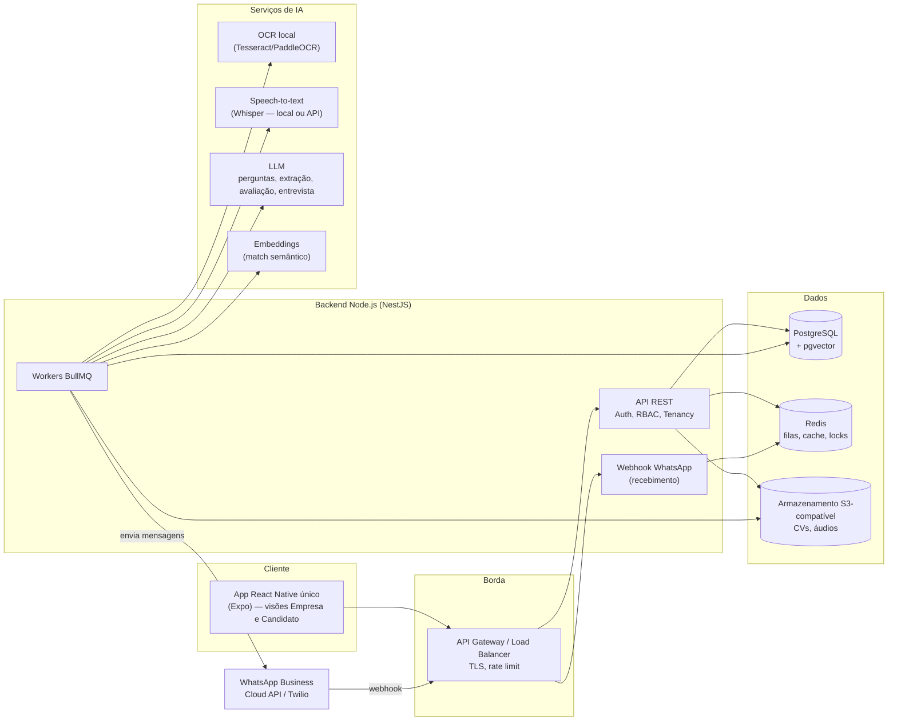

## 4.2 Stack sugerida e justificativa

| Camada | Escolha sugerida | Justificativa |
|--------|------------------|---------------|
| App (frontend) | **React Native com Expo** (TypeScript), **Expo Router**, TanStack Query, Zustand, React Hook Form + Zod | Um único código para iOS e Android (e web via react-native-web, se desejado); roteamento por arquivos facilita separar as visões por grupos de rotas; tipagem compartilhada com o backend |
| Backend | **Node.js + NestJS** (TypeScript) | Modularidade (módulos por domínio), injeção de dependência, guards para RBAC/tenancy, integração nativa com BullMQ |
| ORM | **Prisma** | Migrações versionadas, tipagem forte, produtividade; suporte a extensões (ex.: pgvector via SQL bruto) |
| Banco | **PostgreSQL** + **pgvector** | Relacional robusto, JSONB para dados semiestruturados (extração do CV, rubricas), Row-Level Security para multi-tenant, busca vetorial no mesmo banco |
| Filas / cache | **Redis + BullMQ** | Jobs assíncronos com retentativa, backoff, atraso (lembretes/timeouts), prioridade e concorrência controlada |
| Arquivos | **S3-compatível** (AWS S3, Cloudflare R2, MinIO local) | CVs e áudios fora do banco; URLs pré-assinadas; ciclo de vida para retenção |
| OCR | **Local**: extração de texto nativo de PDF/DOCX primeiro; OCR com **Tesseract** ou **PaddleOCR** para imagens/PDF escaneado | Dados sensíveis não saem da infraestrutura; custo previsível |
| Extração do CV | LLM com saída estruturada (JSON Schema) sobre o texto extraído | Mapeia experiências, formação e habilidades para o catálogo |
| Speech-to-text | **Whisper** — local (**faster-whisper** ou **whisper.cpp**) ou API gerenciada | Boa qualidade em pt-BR; execução local mantém coerência com o OCR local (**decisão em aberto**, §16) |
| LLM | Provedor via camada de abstração (`LlmProvider`) | Trocar de modelo/provedor sem alterar domínio; versionar prompts |
| WhatsApp | **WhatsApp Business Cloud API** (Meta) ou **Twilio** (BSP) | API oficial com templates, webhooks e mídia; Twilio simplifica onboarding e faturamento (**decisão em aberto**) |
| Áudio | **ffmpeg** nos workers | Converter OGG/Opus para WAV 16 kHz mono para o STT; medir duração |
| Notificações | Expo Push Notifications + e-mail transacional | Avisos de etapas e prazos no app |
| Infra | Containers (Docker), deploy em serviço gerenciado; IaC (Terraform) | Workers escalam separadamente da API |
| Observabilidade | OpenTelemetry, logs estruturados (pino), Prometheus/Grafana ou equivalente, Sentry | Ver §12 |

## 4.3 Módulos do backend (NestJS)

| Módulo | Responsabilidade |
|--------|------------------|
| `auth` | Login (e-mail + senha / OTP), JWT de acesso + refresh, verificação de telefone |
| `tenancy` | Resolução do tenant ativo, guards, contexto de RLS |
| `usuarios` / `membros` | Usuário, papéis, convites, vínculo com empresas |
| `empresas` | Dados e configurações do tenant (WhatsApp, IA, retenção) |
| `vagas` | CRUD de vagas, habilidades da vaga, publicação |
| `habilidades` | Catálogo, sinônimos, normalização (ex.: "JS" → "JavaScript") |
| `processos` | Processo seletivo, etapas, perguntas, banco de perguntas |
| `candidatos` | Perfil, habilidades do candidato, consentimentos |
| `curriculos` | Upload, OCR, extração, revisão |
| `candidaturas` | Candidatura direta, convites de match, máquina de estados |
| `entrevistas-whatsapp` | Orquestração da 1ª fase (envio, webhook, áudio, transcrição) |
| `entrevistas-ia` | Condução da 2ª fase |
| `avaliacao` | Avaliação por IA, rubricas, revisão humana |
| `match-ranking` | Embeddings, cálculo de compatibilidade e score composto |
| `notificacoes` | Push, e-mail, templates WhatsApp |
| `auditoria` / `lgpd` | Trilhas de auditoria, exportação/exclusão, retenção |

## 4.4 Filas (BullMQ)

| Fila | Jobs | Observações |
|------|------|-------------|
| `cv-processamento` | extrair texto, OCR, extração estruturada, gerar embedding | Concorrência limitada pela CPU dos workers de OCR |
| `ia-perguntas` | sugerir perguntas para vaga | Baixa latência desejada (recrutador aguardando) |
| `whatsapp-saida` | enviar template / mensagem de texto | Rate limit por número remetente; idempotência por `mensagemId` |
| `whatsapp-entrada` | processar evento de webhook | Ordem por conversa (chave de grupo = telefone + entrevista) |
| `audio-transcricao` | baixar mídia, converter, transcrever | Workers com CPU/GPU dedicados se STT local |
| `ia-avaliacao` | avaliar resposta, consolidar entrevista | Retentativa com backoff; resultado versionado |
| `entrevista-timers` | lembretes, timeouts, expiração | Jobs com atraso (`delay`), cancelados ao receber resposta |
| `ranking` | recalcular score da candidatura e posição na vaga | Debounce por vaga |
| `match` | sugerir candidatos para vaga / vagas para candidato | Executado ao publicar vaga e ao atualizar perfil |
| `notificacoes` | push, e-mail | — |

## 4.5 App React Native único: estrutura, navegação e controle de acesso

O app é **um só binário** (iOS/Android). As visões de empresa e candidato são grupos de rotas dentro do mesmo app, e a visão exibida depende dos papéis do usuário logado.

**Estrutura de pastas sugerida (Expo Router):**

```text
app/
  _layout.tsx                 # providers: auth, query client, tema, i18n
  (auth)/                     # login, cadastro, OTP, recuperação
  (onboarding)/               # escolha inicial: "Quero me candidatar" / "Sou empresa"
  (candidato)/                # guard: possui PerfilCandidato
    _layout.tsx               # tabs: Vagas | Candidaturas | Perfil
    vagas/index.tsx, vagas/[id].tsx
    candidaturas/index.tsx, candidaturas/[id].tsx
    entrevista/[id].tsx       # 2ª fase (chat com IA)
    perfil/ (dados, curriculo, habilidades, linkedin, privacidade)
  (empresa)/                  # guard: possui MembroEmpresa na empresa ativa
    _layout.tsx               # tabs: Vagas | Candidatos | Processos | Configurações
    vagas/nova.tsx, vagas/[id]/(editar|perguntas|ranking|kanban).tsx
    candidaturas/[id].tsx     # respostas, áudios, transcrições, avaliações
    configuracoes/ (membros, whatsapp, ia)  # somente ADMIN_EMPRESA
  trocar-visao.tsx            # seletor de visão/empresa
src/
  features/ (vagas, candidaturas, perfil, entrevistas, ranking...)
  api/ (cliente gerado a partir do OpenAPI)
  auth/ (sessão, papéis, hook usePermissao)
  ui/ (design system compartilhado)
```

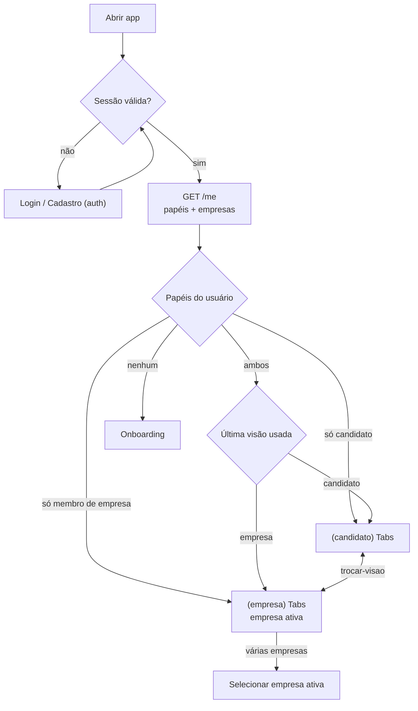

**Regras de controle de acesso no app:**

- `GET /me` retorna `papeisGlobais` (ex.: `CANDIDATO`), `membros: [{empresaId, nome, papeis}]` e `visaoPreferida`.
- A empresa ativa é enviada em todas as chamadas da visão empresa (header `X-Empresa-Id`); o backend valida o vínculo e aplica o tenant.
- Layouts de grupo (`(empresa)/_layout.tsx`, `(candidato)/_layout.tsx`) redirecionam se o papel não existir; componentes usam `usePermissao('vaga:editar')` para ocultar ações. **A interface não é a barreira de segurança** — o backend rejeita com 403.
- Ao trocar de visão/empresa, o cache do TanStack Query é segmentado por `empresaId` para não exibir dados de outro tenant.
- Deep links (ex.: convite de match, link de entrevista) levam à rota correta e solicitam troca de visão se necessário.
- Recursos exclusivos de recrutador que exigem tela grande (ex.: kanban detalhado) podem ganhar versão web via react-native-web em fase posterior, sem novo app.

# 5. Modelo de dados

## 5.1 Diagrama ER

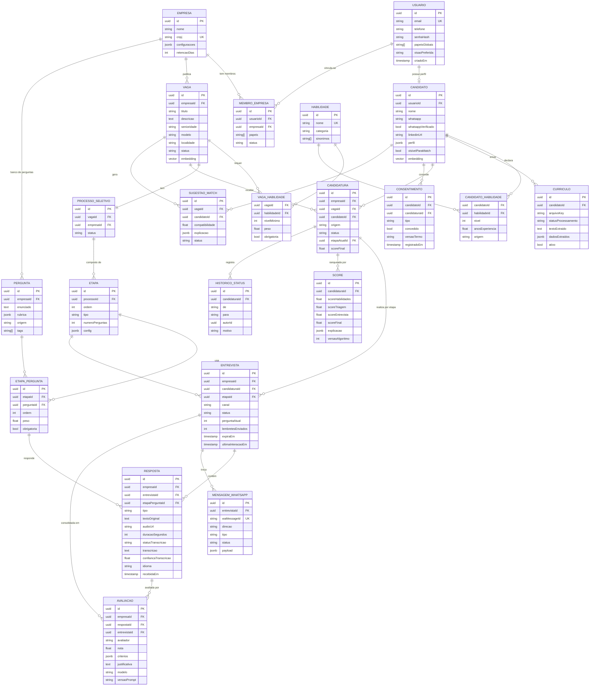

## 5.2 Notas sobre entidades

| Entidade | Notas |
|----------|-------|
| `Usuario` | Conta única. `papeisGlobais` inclui `CANDIDATO` e `ADMIN_PLATAFORMA`. `visaoPreferida` lembra a última visão usada no app |
| `MembroEmpresa` | Vínculo usuário ↔ empresa com papéis `ADMIN_EMPRESA`, `RECRUTADOR`, `AVALIADOR`; `status` (convidado, ativo, removido). Um usuário pode estar em várias empresas |
| `Candidato` | Perfil do candidato, **global** (não pertence a um tenant). Empresas só veem o perfil via candidatura ou se `visivelParaMatch = true` |
| `Habilidade` | Catálogo global com categoria (`LINGUAGEM`, `CLOUD`, `BANCO_DADOS`, `FRAMEWORK`, `FERRAMENTA`, `SOFT_SKILL`...) e sinônimos para normalização |
| `CandidatoHabilidade.origem` | `DECLARADA`, `EXTRAIDA_CV` (confirmada pelo candidato), `INFERIDA_ENTREVISTA` (apenas informativa) |
| `Etapa.tipo` | `TRIAGEM_WHATSAPP`, `ENTREVISTA_IA`, `REVISAO_HUMANA`, `PERSONALIZADA` |
| `Pergunta.origem` | `EMPRESA` (exigida antecipadamente) ou `IA` (sugerida e aprovada); `rubrica` descreve o que é uma boa resposta |
| `Candidatura.origem` | `DIRETA` ou `MATCH` (convite) |
| `Resposta.tipo` | `AUDIO`, `TEXTO`, `CHAT_IA` |
| `Resposta.statusTranscricao` | `NAO_APLICAVEL`, `PENDENTE`, `PROCESSANDO`, `CONCLUIDA`, `FALHOU`, `BAIXA_CONFIANCA` |
| `Resposta.audioUrl` | Chave/URL do objeto no S3 (acesso apenas por URL pré-assinada de curta duração) |
| Tabelas com `empresaId` | Todas as tabelas de dados do processo (vaga, processo, etapa, candidatura, entrevista, resposta, avaliação, score) carregam `empresaId` para RLS e índices |

# 6. Fluxos detalhados

## 6.1 Cadastro de vaga e geração de perguntas por IA

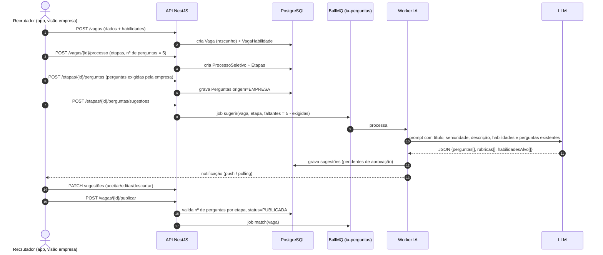

**Regras:**

- O total de perguntas da etapa é `numeroPerguntas` (padrão 5). Perguntas exigidas pela empresa entram primeiro; a IA sugere apenas as faltantes.
- O prompt orienta a IA pelo perfil da vaga: ex. *Arquiteto de Software* → perguntas sobre decisões de arquitetura, trade-offs, escalabilidade, integração; *Dev Backend Node.js + AWS* → perguntas sobre Node, filas, serviços AWS citados.
- Cada pergunta sugerida vem com rubrica (critérios e o que diferencia respostas fracas/médias/fortes) e habilidades-alvo.
- Perguntas da 1ª fase (WhatsApp) devem ser adequadas a resposta por áudio curto; a 2ª fase admite perguntas mais profundas.
- A vaga só pode ser publicada com todas as etapas completas e perguntas aprovadas por um humano.

## 6.2 Candidatura direta

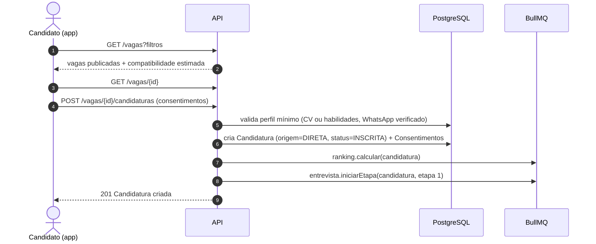

- Unicidade: um candidato tem no máximo uma candidatura ativa por vaga (`UNIQUE (vagaId, candidatoId)`).
- Se faltar consentimento de WhatsApp, a candidatura fica em `PENDENTE_CONSENTIMENTO` e a 1ª fase não é iniciada.

## 6.3 Fluxo de match

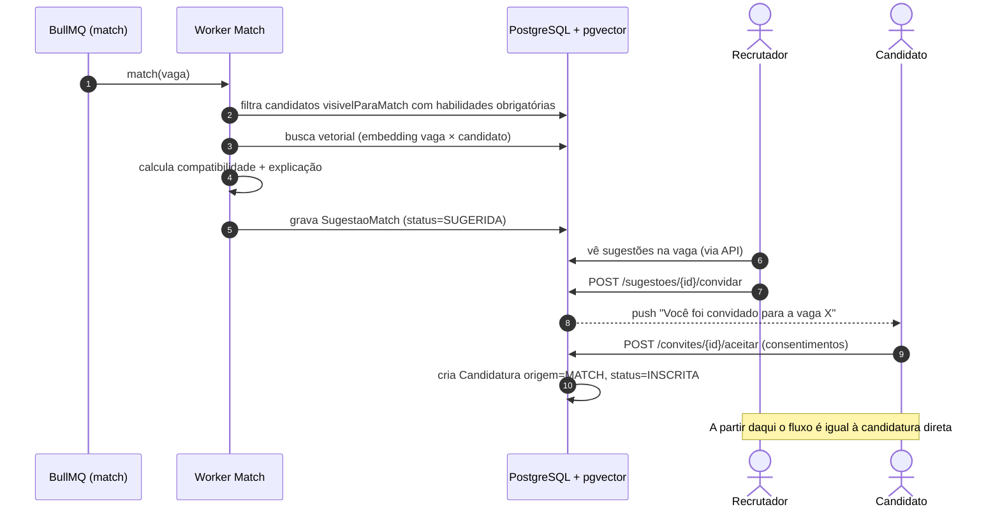

- Sentido inverso: o candidato vê **vagas recomendadas** com base no mesmo cálculo.
- A empresa só vê dados do candidato sugerido em formato resumido (habilidades, senioridade, localidade) até ele aceitar o convite; os dados completos aparecem após a candidatura.

## 6.4 Upload de currículo com OCR e extração

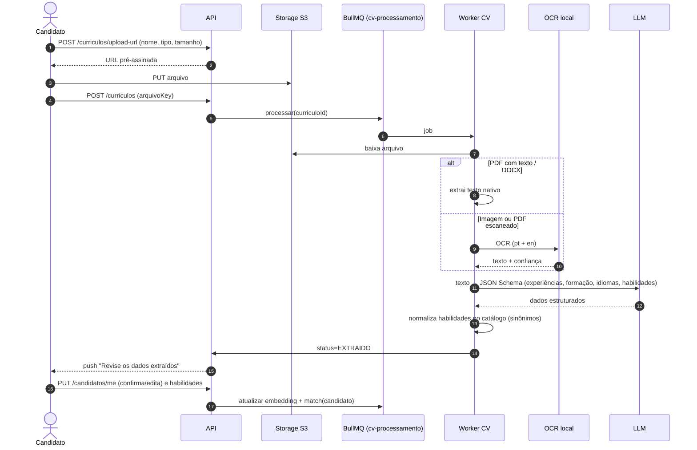

- Formatos: PDF, DOCX, PNG/JPG; limite de tamanho a definir (ex.: alguns MB). Antivírus/validação de tipo MIME antes de processar.
- Nada extraído é gravado no perfil sem confirmação do candidato.
- Campo **LinkedIn**: apenas URL validada (`https://www.linkedin.com/in/...`), sem chamadas externas.

## 6.5 1ª fase — Triagem via WhatsApp (bot envia texto, candidato responde por áudio)

**Princípios:**

- O bot **envia as perguntas em mensagens de texto**; o candidato **responde por mensagens de voz**. Não há ligação.
- Iniciar conversa fora da janela de atendimento de 24 horas exige **template aprovado** (mensagem modelo) pela Meta; dentro da janela, mensagens de texto livres são permitidas. Cada resposta do candidato reabre a janela de 24 h.
- O contato só ocorre com **opt-in** registrado (consentimento de contato por WhatsApp e de processamento de áudio).

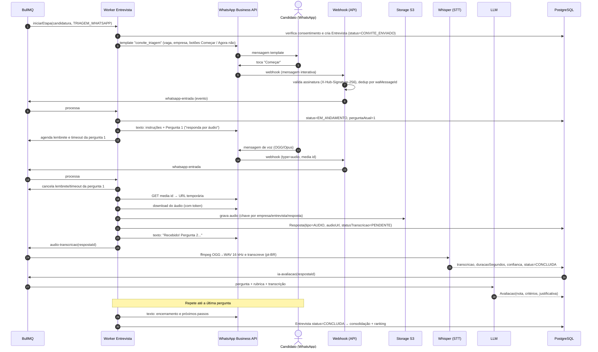

**Estado da entrevista por candidato** (`Entrevista.status`, `perguntaAtual`, `ultimaInteracaoEm`, `lembretesEnviados`, `expiraEm`):

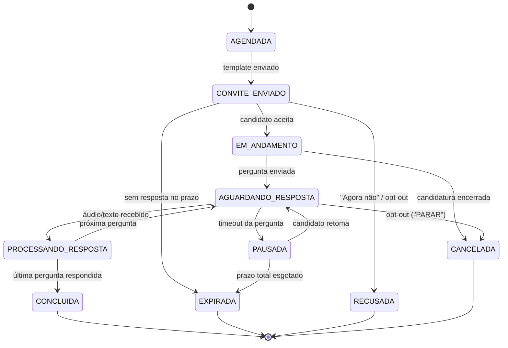

**Regras de tratamento:**

| Situação | Comportamento |
|----------|---------------|
| Candidato responde em **texto** em vez de áudio | Configurável por empresa: (a) **padrão**: aceitar o texto como resposta (`tipo=TEXTO`, `statusTranscricao=NAO_APLICAVEL`) e sinalizar na avaliação; ou (b) pedir gentilmente que reenvie por áudio, aceitando texto após a segunda tentativa. Mensagens curtas como "ok", "oi" ou dúvidas não contam como resposta: o bot reexplica e repete a pergunta |
| Vários áudios para a mesma pergunta | Aguarda uma janela curta (ex.: alguns segundos, configurável) após o último áudio e concatena as transcrições em uma única resposta |
| Áudio muito curto/longo | Abaixo do mínimo: pede para repetir; acima do máximo configurado: aceita e trunca a avaliação ao limite, informando o candidato |
| Transcrição falha ou baixa confiança | `statusTranscricao=FALHOU` / `BAIXA_CONFIANCA`; retentativa automática; persistindo, marca para revisão humana (o áudio fica disponível ao avaliador) e **não** penaliza automaticamente o candidato |
| Outro tipo de mídia (imagem, documento, vídeo) | Responde que apenas áudio ou texto é aceito e repete a pergunta |
| **Lembretes** | Job atrasado após X horas sem resposta (dentro da janela de 24 h, texto livre); fora da janela, template de lembrete aprovado. Máximo de lembretes configurável |
| **Timeout** | Sem resposta após o prazo da pergunta → `PAUSADA`; após prazo total da etapa → `EXPIRADA` e candidatura segue regra da empresa (encerrar ou revisão manual) |
| **Retomada** | Candidato envia qualquer mensagem (ou toca botão "Continuar" do template de retomada) → bot reenvia a pergunta pendente (`perguntaAtual`) e o progresso ("Pergunta 3 de 5") |
| Candidato em **vários processos** | Cada conversa é ligada à `Entrevista`. Se houver mais de uma triagem ativa para o mesmo número, o bot conduz **uma por vez** (fila por telefone) e identifica a vaga em cada mensagem; as demais aguardam até a atual terminar ou pausar |
| Opt-out ("PARAR", "SAIR") | Registra revogação do consentimento de contato, cancela a entrevista e confirma por mensagem |
| Idempotência | Eventos de webhook deduplicados por `waMessageId`; jobs com `jobId` determinístico |
| Status de entrega | Webhooks de status (enviada, entregue, lida, falha) atualizam `MensagemWhatsapp.status`; falhas de envio vão para retentativa e alerta |

**Pipeline de áudio:** download da mídia pela API (a URL temporária expira; baixar imediatamente) → armazenamento S3 com criptografia → `ffmpeg` (OGG/Opus → WAV 16 kHz mono) → Whisper (idioma `pt`) → transcrição com segmentos e confiança → avaliação pela IA contra a rubrica.

## 6.6 2ª fase — Entrevista conduzida por IA

Ocorre **no app** (chat), após aprovação na 1ª fase (automática por nota mínima ou manual, conforme configuração da etapa).

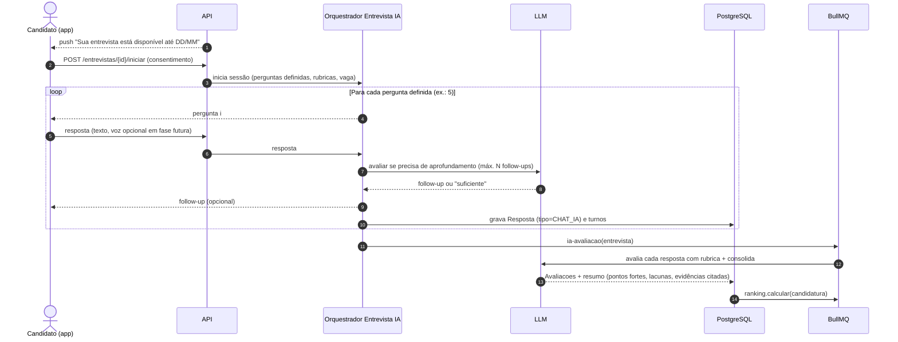

- A IA **não improvisa perguntas fora do escopo**: segue as perguntas definidas, e os follow-ups são limitados em número e restritos ao tema da pergunta.
- Guardrails: o prompt proíbe perguntas sobre características protegidas (idade, gênero, religião, estado civil, saúde etc.) e conselhos fora do contexto; filtros validam a saída antes de enviar.
- Sessão retomável: o candidato pode sair e voltar até o prazo; o estado fica no banco (não em memória).
- Avaliador humano vê a conversa completa, notas por critério e justificativas.

## 6.7 Ranqueamento

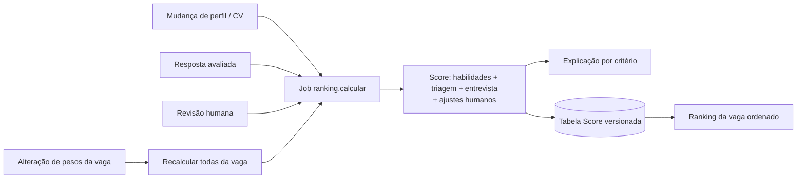

# 7. Algoritmo de match e ranqueamento

## 7.1 Score de habilidades (S_hab), 0–100

Para cada habilidade *h* requerida pela vaga, com peso *w_h*, nível mínimo *n_min* e nível do candidato *n_c* (0 se ausente):

- `cobertura_h = min(n_c / n_min, 1)` (com bônus limitado se `n_c > n_min`, ex.: até +10%).
- Habilidade obrigatória ausente → **flag eliminatória sugerida** (não reprova automaticamente; aparece destacada para o recrutador).
- Nível considerado: declarado pelo candidato, ajustado por evidência do CV (anos de experiência, menções) — habilidades confirmadas no CV têm fator de confiança maior.
- `S_hab = 100 × Σ(w_h × cobertura_h × confiança_h) / Σ w_h`

## 7.2 Similaridade semântica (S_sem), 0–100

- Cosseno entre o embedding da vaga (descrição + habilidades) e do candidato (resumo + experiências + habilidades), normalizado para 0–100.
- Usada principalmente no **match** (descoberta) e como componente menor no ranking.

## 7.3 Scores das fases

- **S_triagem** (1ª fase) e **S_entrevista** (2ª fase): média ponderada das notas por pergunta (`peso` de `EtapaPergunta`), cada nota em 0–100 conforme a rubrica.
- Se uma resposta tiver revisão humana, a nota humana **substitui** a da IA.
- Respostas não avaliáveis (transcrição falhou) ficam fora da média e são sinalizadas — não contam como zero.

## 7.4 Score composto

| Componente | Peso padrão (**estimativa inicial, configurável por vaga**) | Disponível quando |
|------------|:-:|---|
| S_hab (habilidades) | 35% | Desde a candidatura |
| S_sem (semântico) | 5% | Desde a candidatura |
| S_triagem (1ª fase) | 25% | Após 1ª fase |
| S_entrevista (2ª fase) | 35% | Após 2ª fase |

- **Renormalização**: enquanto uma fase não ocorreu, o score é calculado só com os componentes disponíveis, e o ranking exibe a **completude** (ex.: "parcial — 2 de 4 componentes").
- **Match (descoberta)** usa `0,7 × S_hab + 0,3 × S_sem` (**estimativa**, a calibrar no piloto) após filtro de habilidades obrigatórias e preferências (localidade/modelo).
- Os pesos padrão devem ser revisados com dados do piloto.

## 7.5 Explicabilidade

Cada `Score.explicacao` (JSONB) armazena:

- Contribuição de cada componente e de cada habilidade (atendida, parcial, ausente).
- Por pergunta: nota, critérios da rubrica atendidos, justificativa e trechos (citações da transcrição/resposta) que sustentam a nota.
- Versão do algoritmo, modelo de IA e versão do prompt usados.

Exemplo de exibição no app (visão empresa): *"78/100 — Habilidades 85 (Node.js ✔, AWS ✔, Kubernetes parcial); Triagem 72; Entrevista 76 (forte em design de APIs; lacuna em observabilidade)."*

## 7.6 Revisão humana e viés

- O sistema **recomenda**; a decisão de avançar ou reprovar é sempre de um humano.
- Dados sensíveis (foto, idade, gênero, estado civil, endereço completo) **não** entram nos prompts de avaliação nem no score.
- Modo opcional de **avaliação cega** (oculta nome/foto até a revisão).
- Auditoria periódica de distribuição de scores (ver §11.4).

# 8. Máquina de estados da candidatura

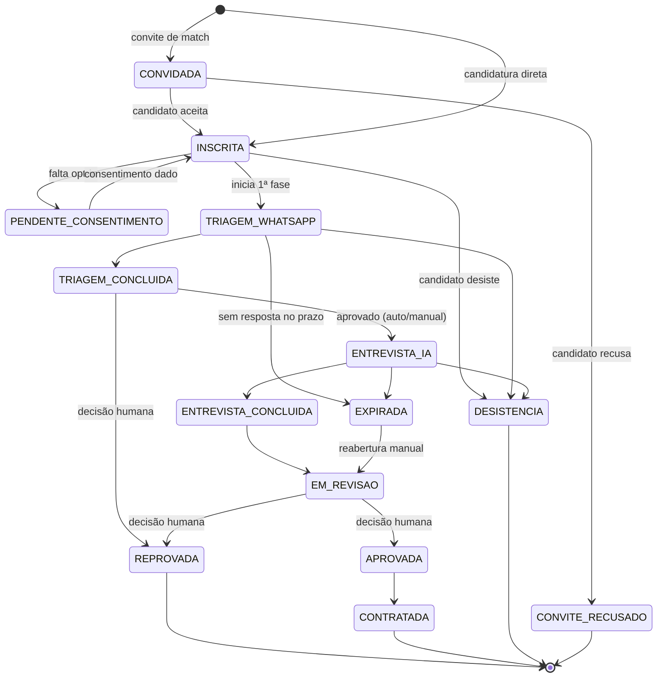

- Transições implementadas num serviço de domínio único (`CandidaturaStateMachine`), com validação de transição, autor, motivo e registro em `HistoricoStatus`.
- Vaga encerrada → candidaturas ativas vão para `ENCERRADA_PELA_VAGA` (estado terminal adicional), com notificação ao candidato.
- Reprovação automática **não** é permitida; a IA pode apenas sugerir.

# 9. Multiprocesso, multi-tenant e escalabilidade

## 9.1 Multiprocesso

- Uma empresa pode ter **N vagas** e **N processos** ativos; um candidato pode ter **N candidaturas** simultâneas em empresas diferentes.
- Cada candidatura tem sua própria instância de entrevista por etapa; não há estado global por candidato.
- No WhatsApp, triagens ativas para o mesmo número são serializadas (uma conversa ativa por vez, ver §6.5), com cada mensagem identificando a vaga.
- O candidato vê todas as candidaturas na aba **Candidaturas**, com etapa, prazos e pendências.

## 9.2 Isolamento de dados (multi-tenant)

| Camada | Mecanismo |
|--------|-----------|
| Banco | Modelo compartilhado com coluna `empresaId` + **Row-Level Security** do PostgreSQL (`SET app.empresa_id` por transação) como segunda barreira |
| Aplicação | `TenantGuard` no NestJS resolve a empresa ativa (`X-Empresa-Id`) e valida o vínculo `MembroEmpresa`; extensão do Prisma injeta `empresaId` em todas as consultas de tabelas com tenant |
| Perfil do candidato | Global; a empresa acessa somente via candidatura/convite. Notas e avaliações de uma empresa **nunca** são visíveis para outra |
| Arquivos | Prefixo por tenant no S3 (`empresas/{empresaId}/entrevistas/...`), URLs pré-assinadas de curta duração |
| Filas | Payload sempre com `empresaId`; worker reestabelece o contexto de tenant |
| Configurações | Número de WhatsApp, templates, limites de IA e retenção por empresa |
| Testes | Testes automatizados de isolamento (tentar ler dados de outra empresa deve retornar 404/403) |

## 9.3 Concorrência e consistência

- **Webhooks**: resposta 200 imediata, processamento assíncrono; dedup por `waMessageId` (índice único).
- **Ordem por conversa**: processamento serial por entrevista (lock no Redis por `entrevistaId` ou grupos do BullMQ).
- **Transições de estado**: controle otimista (coluna `versao`) para evitar corrida entre timeout e resposta chegando ao mesmo tempo.
- **Ranking**: debounce por vaga para evitar recálculos em rajada.

## 9.4 Escalabilidade

- API stateless, escala horizontal atrás do load balancer.
- Workers separados por tipo de carga (OCR/STT intensivos em CPU/GPU; IA e WhatsApp intensivos em I/O) com autoscaling por tamanho de fila.
- Rate limits: por tenant (API e IA), por número de WhatsApp (limites da Meta), por provedor de LLM (token bucket no Redis).
- Custos de IA controlados por cotas por empresa e cache de sugestões.
- Índices: `(empresaId, vagaId, status)`, `(vagaId, scoreFinal DESC)`, índice vetorial (HNSW) para embeddings.

# 10. APIs principais (REST)

Prefixo `/api/v1`. Autenticação Bearer JWT; rotas da visão empresa exigem `X-Empresa-Id`. Documentação OpenAPI gerada pelo NestJS e usada para gerar o cliente TypeScript do app.

| Método | Endpoint | Descrição | Papel |
|--------|----------|-----------|-------|
| POST | `/auth/cadastro` | Cria usuário | público |
| POST | `/auth/login` · `/auth/refresh` · `/auth/logout` | Sessão | público/autenticado |
| POST | `/auth/telefone/verificar` | Envia/valida OTP do WhatsApp | autenticado |
| GET | `/me` | Usuário, papéis, empresas, visão preferida | autenticado |
| PATCH | `/me/visao` | Atualiza visão preferida/empresa ativa | autenticado |
| POST | `/empresas` | Cria empresa (usuário vira ADMIN_EMPRESA) | autenticado |
| GET/PATCH | `/empresas/{id}` | Dados/configurações | ADMIN_EMPRESA |
| GET/POST/PATCH/DELETE | `/empresas/{id}/membros` | Gestão de membros/convites | ADMIN_EMPRESA |
| GET | `/habilidades?busca=` | Catálogo | autenticado |
| GET/POST | `/vagas` (empresa) | Lista/cria vagas da empresa | RECRUTADOR |
| GET/PATCH/DELETE | `/vagas/{id}` | Detalhe/edição | RECRUTADOR |
| PUT | `/vagas/{id}/habilidades` | Define habilidades requeridas | RECRUTADOR |
| POST | `/vagas/{id}/publicar` · `/pausar` · `/encerrar` | Ciclo de vida | RECRUTADOR |
| GET/PUT | `/vagas/{id}/processo` | Processo seletivo e etapas | RECRUTADOR |
| GET/POST | `/etapas/{id}/perguntas` | Perguntas da etapa (exigidas) | RECRUTADOR |
| POST | `/etapas/{id}/perguntas/sugestoes` | Solicita sugestões à IA (assíncrono) | RECRUTADOR |
| PATCH | `/etapas/{id}/perguntas/sugestoes/{sid}` | Aceitar/editar/descartar | RECRUTADOR |
| GET/POST | `/perguntas` | Banco de perguntas da empresa | RECRUTADOR |
| GET | `/vagas/{id}/candidaturas?etapa=&status=&ordem=score` | Ranking/lista | RECRUTADOR, AVALIADOR |
| GET | `/vagas/{id}/sugestoes-match` | Candidatos sugeridos | RECRUTADOR |
| POST | `/sugestoes-match/{id}/convidar` | Envia convite | RECRUTADOR |
| GET | `/candidaturas/{id}` | Detalhe (respostas, transcrições, avaliações, score) | RECRUTADOR, AVALIADOR |
| POST | `/candidaturas/{id}/transicoes` | Muda etapa/status (com motivo) | RECRUTADOR |
| POST | `/respostas/{id}/revisao` | Revisão humana da nota | AVALIADOR+ |
| GET | `/respostas/{id}/audio` | URL pré-assinada do áudio | AVALIADOR+ |
| GET | `/vagas-publicas?filtros` · `/vagas-publicas/{id}` | Vagas para candidatos | CANDIDATO |
| GET | `/candidatos/me/vagas-recomendadas` | Vagas por match | CANDIDATO |
| GET/PUT | `/candidatos/me` | Perfil (inclui `linkedinUrl`) | CANDIDATO |
| PUT | `/candidatos/me/habilidades` | Habilidades | CANDIDATO |
| POST | `/curriculos/upload-url` · `/curriculos` | Upload de CV | CANDIDATO |
| GET | `/curriculos/{id}` | Status e dados extraídos | CANDIDATO |
| POST | `/curriculos/{id}/confirmar` | Aplica dados revisados ao perfil | CANDIDATO |
| POST | `/vagas-publicas/{id}/candidaturas` | Candidatura direta | CANDIDATO |
| GET | `/candidatos/me/candidaturas` | Minhas candidaturas | CANDIDATO |
| POST | `/convites/{id}/aceitar` · `/recusar` | Convites de match | CANDIDATO |
| POST | `/candidaturas/{id}/desistir` | Desistência | CANDIDATO |
| POST/GET | `/candidatos/me/consentimentos` | Registrar/consultar consentimentos | CANDIDATO |
| POST | `/entrevistas/{id}/iniciar` · `/mensagens` · GET `/entrevistas/{id}` | 2ª fase (chat IA) | CANDIDATO |
| GET | `/webhooks/whatsapp` | Verificação do webhook (hub.challenge) | provedor |
| POST | `/webhooks/whatsapp` | Mensagens e status | provedor (assinatura) |
| POST | `/lgpd/exportar` · `/lgpd/excluir` | Direitos do titular | autenticado |

# 11. Segurança, LGPD e privacidade

## 11.1 Segurança

- TLS em todo tráfego; criptografia em repouso (banco e S3); segredos em cofre (ex.: AWS Secrets Manager/Vault), nunca no app.
- Senhas com Argon2/bcrypt; JWT de curta duração + refresh rotativo; armazenamento seguro no app (Expo SecureStore).
- RBAC + tenancy no backend (guards) + RLS no banco.
- Validação de assinatura dos webhooks do WhatsApp; verificação de tipo e tamanho dos uploads; varredura antivírus.
- Proteção contra prompt injection: conteúdo do CV e das respostas é tratado como dado, delimitado no prompt; saídas da IA validadas por schema.
- Rate limiting e proteção contra abuso; auditoria de acessos a dados sensíveis (ex.: quem ouviu um áudio).

## 11.2 Consentimento

| Consentimento | Quando | Observação |
|---------------|--------|------------|
| Termos de uso e política de privacidade | Cadastro | Versão registrada |
| Contato por WhatsApp (opt-in) | Cadastro do número e/ou candidatura | Exigência da política do WhatsApp Business; revogável com "PARAR" |
| Envio, armazenamento e transcrição de áudio | Antes da 1ª fase | Explicar finalidade e prazo de retenção |
| Avaliação automatizada por IA | Na candidatura | Informar que há revisão humana e direito de solicitar revisão (art. 20 da LGPD) |
| Visibilidade para match | Configuração do perfil | Desligado por padrão (**decisão em aberto**) |

## 11.3 Retenção e direitos do titular

- Retenção configurável por empresa, com padrão definido pela plataforma (**valor a decidir com assessoria jurídica**). Exemplo de política: áudios e transcrições removidos X meses após o encerramento da vaga; perfil do candidato mantido enquanto a conta estiver ativa.
- Jobs de expurgo periódicos + regras de ciclo de vida no S3.
- Exportação de dados (JSON/PDF) e exclusão de conta, com anonimização dos registros que precisam permanecer para auditoria.
- Papéis LGPD: em regra, a empresa contratante tende a ser **controladora** dos dados do processo e a plataforma **operadora**; para o perfil global do candidato, a plataforma tende a ser controladora (**validar juridicamente**).
- Provedores de IA/WhatsApp: contratos de processamento, verificação de transferência internacional e de uso de dados para treinamento (preferir opções sem retenção/treinamento). STT e OCR locais reduzem esse risco.

## 11.4 Viés da IA e revisão humana

- Rubricas explícitas por pergunta; a IA avalia o conteúdo técnico, não sotaque, dicção ou qualidade de áudio.
- Remover atributos sensíveis dos prompts; avaliação cega opcional.
- Revisão humana obrigatória antes de reprovar ou aprovar.
- Amostragem periódica de avaliações para comparar IA × humano (concordância) e detectar desvios.
- Monitorar a qualidade da transcrição por perfil de áudio; baixa confiança → revisão humana, nunca penalidade automática.
- Registro de modelo e versão de prompt em cada avaliação, permitindo reprodutibilidade e auditoria.

# 12. Observabilidade

| Pilar | O que coletar |
|-------|---------------|
| Logs | Estruturados (JSON) com `traceId`, `empresaId`, `candidaturaId`, `entrevistaId`; **sem** PII ou conteúdo de respostas nos logs |
| Métricas | Latência/erros da API; tamanho e idade das filas; jobs falhos; taxa de entrega/leitura WhatsApp; tempo de transcrição; taxa de falha/baixa confiança do STT; tempo e confiança do OCR; tokens e custo de IA por empresa; taxa de conclusão por etapa; tempo médio de resposta do candidato |
| Traces | OpenTelemetry da API até workers (propagação de contexto nos jobs) |
| Erros | Sentry no backend e no app React Native |
| Painéis | Bull Board para filas; dashboards de funil (convite → início → conclusão) por vaga |
| Alertas | Fila acumulando; falhas de webhook/envio; erros do provedor de IA; custo de IA acima da cota; expiração de template/token do WhatsApp |
| Qualidade da IA | Concordância IA × revisão humana; distribuição de notas por vaga; avaliações com erro de schema |

# 13. Fases de implementação

> Estimativas em **tamanho relativo** (P, M, G, GG) — são **estimativas** a refinar com o time, sem datas fixas. P < M < G < GG.

## Fase 0 — Fundação (Estimativa: M)

- **Escopo**: monorepo (backend NestJS, app Expo, pacote de tipos compartilhados), CI, ambientes, PostgreSQL + Prisma, Redis + BullMQ, S3 (MinIO local), autenticação, modelo `Usuario`/`MembroEmpresa`/papéis, `GET /me`, guards de RBAC e tenancy, RLS, esqueleto do app único com grupos `(auth)`, `(candidato)`, `(empresa)` e troca de visão.
- **Entregáveis**: repositório, pipelines, ambiente de desenvolvimento com Docker Compose, app navegável com login e troca de visão.
- **Critérios de aceite**: um usuário com os dois papéis alterna entre visões no mesmo app; acesso a dados de outra empresa retorna 403/404 em testes automatizados; CI roda lint, testes e migrações.

## Fase 1 — MVP Empresa + Candidato (Estimativa: G)

- **Escopo**: catálogo de habilidades; CRUD de vagas com habilidades (nível, peso, obrigatória); processo seletivo com etapas e número de perguntas (padrão 5); perguntas exigidas pela empresa; sugestão de perguntas por IA com aprovação; perfil do candidato, habilidades, campo LinkedIn; upload de CV com extração de texto + OCR local + extração estruturada com revisão; lista de vagas e candidatura direta; consentimentos; score de habilidades e ranking inicial explicável; máquina de estados da candidatura.
- **Entregáveis**: fluxos 6.1, 6.2 e 6.4 funcionando ponta a ponta no app; ranking por vaga com S_hab.
- **Critérios de aceite**: recrutador publica vaga com 5 perguntas (mistura de exigidas e sugeridas); candidato envia CV escaneado e vê dados extraídos para revisão; candidatura direta aparece no ranking com explicação por habilidade; nenhum dado extraído é salvo sem confirmação.

## Fase 2 — 1ª fase: triagem por WhatsApp (texto → áudio) (Estimativa: G)

- **Escopo**: integração WhatsApp Business (Cloud API ou Twilio), templates de convite/lembrete/retomada aprovados, verificação do número, opt-in/opt-out, webhook com validação de assinatura, envio de perguntas por texto, recebimento de áudio (OGG/Opus), download e armazenamento, conversão com ffmpeg, transcrição com Whisper, avaliação por IA, tratamento de respostas em texto e mídia inválida, lembretes/timeouts/retomada, serialização de conversas por número, estado da entrevista, tela de acompanhamento com áudio + transcrição + nota.
- **Entregáveis**: fluxo 6.5 completo; S_triagem no ranking; painel de filas.
- **Critérios de aceite**: candidato recebe template, responde 5 perguntas por áudio e a entrevista fica `CONCLUIDA` com transcrições e notas; resposta em texto é tratada conforme configuração; sem resposta, lembrete e depois `PAUSADA`/`EXPIRADA` ocorrem nos prazos configurados; retomada continua na pergunta pendente; webhook duplicado não gera resposta duplicada; "PARAR" revoga o consentimento.

## Fase 3 — 2ª fase: entrevista conduzida por IA (Estimativa: G)

- **Escopo**: orquestrador de entrevista no app (chat), follow-ups limitados, guardrails, sessão retomável, avaliação consolidada com evidências, revisão humana por resposta, transição automática/manual entre fases, S_entrevista e score composto com renormalização.
- **Entregáveis**: fluxo 6.6; tela de revisão para avaliadores; ranking com score composto.
- **Critérios de aceite**: candidato aprovado na triagem conclui a entrevista com as perguntas definidas; cada nota tem justificativa e trechos citados; avaliador altera nota e o ranking é recalculado; IA não faz perguntas fora das definidas além dos follow-ups permitidos.

## Fase 4 — Match e multiprocesso em escala (Estimativa: M)

- **Escopo**: embeddings (pgvector), sugestões de candidatos por vaga e de vagas por candidato, convites, visibilidade do perfil para match, cotas e rate limits por tenant, autoscaling de workers, otimização de índices, testes de carga com muitos processos simultâneos.
- **Entregáveis**: fluxo 6.3; painéis de capacidade.
- **Critérios de aceite**: ao publicar vaga, sugestões aparecem com explicação; candidato com várias candidaturas simultâneas é conduzido corretamente (uma triagem WhatsApp por vez); testes de carga sem perda de mensagens ou corrida de estado.

## Fase 5 — LGPD, governança de IA e operação (Estimativa: M)

- **Escopo**: exportação/exclusão de dados, expurgo por retenção, auditoria de acessos, relatórios de concordância IA × humano e distribuição de notas, avaliação cega, alertas de custo, hardening de segurança (pentest), observabilidade completa.
- **Entregáveis**: processos de privacidade operando; painéis de qualidade da IA.
- **Critérios de aceite**: solicitação de exclusão remove/anonimiza dados em todas as camadas (banco, S3, filas); expurgo automático comprovado em ambiente de teste; relatório de viés gerado para uma vaga piloto.

## Fase 6 — Evoluções (Estimativa: GG, incremental)

- Entrevista por voz no app (2ª fase), versão web do app para recrutadores (react-native-web), integração real com LinkedIn (sujeita às políticas da plataforma), integrações com ATS/calendário, analytics de funil, templates de processo por cargo.

> **Sugestão de piloto**: liberar Fases 0–2 para uma ou poucas empresas parceiras antes da Fase 3, para calibrar perguntas, pesos e tempos de lembrete/timeout com dados reais.

# 14. Riscos e mitigação

| Risco | Impacto | Mitigação |
|-------|---------|-----------|
| Aprovação de templates e da conta WhatsApp Business demora ou é negada | Bloqueia a 1ª fase | Iniciar o processo de verificação cedo; templates simples e transacionais; fallback temporário (convite por push/e-mail com link para responder no app) |
| Restrições/limites de mensagens do WhatsApp (janela 24 h, limites de envio, qualidade do número) | Mensagens não entregues | Respeitar janela, templates para reabrir; monitorar qualidade do número; rate limit |
| Qualidade da transcrição (ruído, sotaques, termos técnicos) | Avaliação injusta | Whisper com vocabulário/prompt técnico; limiar de confiança → revisão humana; nunca penalizar automaticamente |
| Candidato prefere texto ou não envia áudio | Abandono | Aceitar texto como fallback configurável; instruções claras; lembretes |
| Alucinação/inconsistência do LLM na avaliação | Scores pouco confiáveis | Rubricas, saída por schema, temperatura baixa, evidências citadas obrigatórias, revisão humana, amostragem IA × humano |
| Viés algorítmico | Discriminação, risco legal | §11.4; remover atributos sensíveis; auditoria periódica |
| Prompt injection via CV ou resposta | Manipulação do score | Delimitação de conteúdo, instruções de sistema, validação, detecção de padrões |
| Custo de IA/STT acima do previsto | Margem | STT/OCR locais, cache, cotas por tenant, modelos menores para tarefas simples |
| Vazamento entre tenants | Grave (LGPD, confiança) | Guards + extensão Prisma + RLS + testes automatizados de isolamento |
| OCR ruim em CVs com layout complexo | Perfil incompleto | Texto nativo primeiro; revisão obrigatória pelo candidato; edição manual |
| Complexidade do app único com duas visões | Bugs de permissão/estado | Grupos de rota isolados, cache segmentado por empresa, testes E2E por papel |
| Concorrência (timeout × resposta simultânea, webhooks duplicados) | Estado inconsistente | Locks por entrevista, controle otimista, idempotência |

# 15. Questões em aberto / decisões pendentes

| # | Questão | Opções / observações |
|---|---------|----------------------|
| Q1 | Provedor WhatsApp | Cloud API direta (Meta) vs. Twilio (BSP): custo, onboarding, suporte, ferramentas |
| Q2 | STT local vs. API | faster-whisper/whisper.cpp local (coerente com OCR local, privacidade, custo fixo, exige CPU/GPU) vs. API gerenciada (simplicidade, custo variável, transferência de dados). Definir modelo (tamanho) conforme qualidade × latência |
| Q3 | Provedor/modelo de LLM | Critérios: qualidade em pt-BR, saída estruturada, custo, políticas de retenção de dados, região |
| Q4 | Motor de OCR | Tesseract vs. PaddleOCR (qualidade em layouts complexos × facilidade de operação) |
| Q5 | Resposta em texto na triagem | Aceitar por padrão ou exigir áudio? Peso diferente para texto? |
| Q6 | Avanço entre fases | Automático por nota mínima ou sempre manual? Nota mínima padrão? |
| Q7 | Prazos | Prazo por pergunta, prazo total da etapa, número e intervalo de lembretes |
| Q8 | Pesos padrão do score | Valores iniciais em §7.4 são estimativas; calibrar no piloto |
| Q9 | Visibilidade do candidato para match | Opt-in (padrão desligado) ou opt-out? |
| Q10 | Retenção de dados | Prazos para áudios, transcrições e CVs; validar com jurídico |
| Q11 | Papéis LGPD | Controladora/operadora por tipo de dado; contratos com empresas clientes |
| Q12 | Versão web | Recrutadores precisarão de web desde o MVP (react-native-web) ou o app basta? |
| Q13 | 2ª fase por voz | Manter só chat no MVP ou incluir voz no app? |
| Q14 | Modelo de cobrança | Por vaga, por candidatura ou assinatura — impacta cotas e métricas |
| Q15 | Hospedagem | Nuvem/região (preferência por dados no Brasil?) e necessidade de GPU para STT local |
